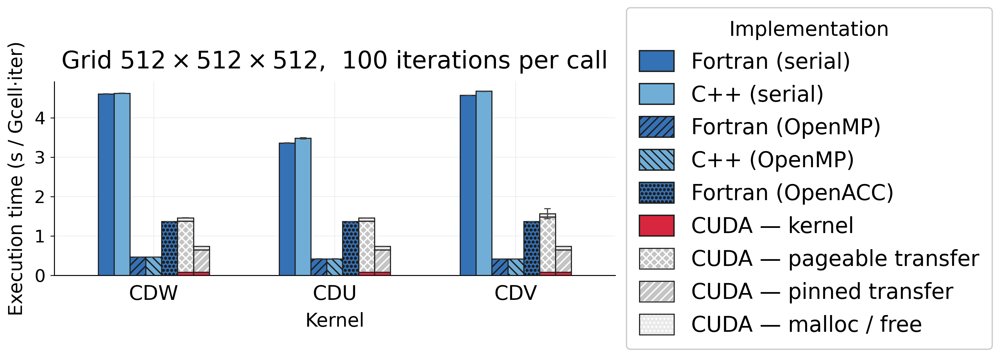

# Automatic GPU Offloading of Fortran Stencil Kernels

A source-to-source compiler that translates annotated Fortran stencil modules into
CUDA and C++ implementations, together with a comprehensive benchmark suite and a
proof-of-concept framework for transparent lazy GPU memory management.

The project demonstrates that serial Fortran stencil code can be automatically
offloaded to a GPU — with the generated kernel running **~40–60× faster** than serial
Fortran — and identifies host↔device data transfer as the dominant remaining
bottleneck, motivating the memory framework work.

---

## Repository Structure

```
path-to-this-repository/
│
├── compiler/               ← source-to-source compiler (Python package)
│   └── README.md           ← full compiler documentation
│
├── fortran-stencils/       ← annotated Fortran input files for the compiler
│   ├── elmm_cdu.f90        ← zonal momentum advection (U)
│   ├── elmm_cdw.f90        ← vertical momentum advection (W)
│   └── elmm_cdv.f90        ← meridional momentum advection (V)
│
├── benchmarks/             ← full benchmark suite (7 variants × 3 kernels)
│   └── README.md           ← build, run, test, and plotting documentation
│
├── memory-framework/       ← proof-of-concept: transparent lazy GPU memory
│   └── README.md           ← concept, state machine, and PoC documentation
│
├── requirements.txt        ← Python dependencies (fparser, islpy, matplotlib)
└── README.md               ← this file
```

---

## Setup

```bash
# 1. Create and activate a virtual environment
python -m venv venv
source venv/bin/activate

# 2. Install Python dependencies
pip install -r requirements.txt
```

Hardware requirements for the full benchmark suite:

| Component        | Requirement                                                |
| ---------------- | ---------------------------------------------------------- |
| Fortran compiler | gfortran 10+ (or equivalent)                               |
| C++ compiler     | g++ 10+ with C++17                                         |
| GPU + CUDA       | CUDA Toolkit 11+ and `nvcc` on `PATH` (`CUDA` / `CUDA-pinned`) |
| OpenMP           | supported by the Fortran/C++ compiler (`Fortran-OMP` / `CPP-OMP`) |
| OpenACC          | NVIDIA HPC SDK `nvfortran` by default for `Fortran-ACC` |

---

## Quick Start

### 1 — Compile a Fortran kernel to CUDA + C++

The compiler reads an annotated Fortran module and generates three files: a CUDA
kernel, a plain C++ kernel, and a Fortran `iso_c_binding` wrapper.

```bash
# Generate all output files for the CDU momentum kernel
python -m compiler \
    --input  fortran-stencils/elmm_cdu.f90 \
    --kernel CDU \
    --output-dir out/

# Output:
#   out/generated_code.cu         ← CUDA __global__ kernels + host wrapper
#   out/generated_cpp_impl.cpp    ← plain C++ (same algorithm, no GPU)
#   out/generated_interface.f90   ← Fortran iso_c_binding wrapper module
#   out/common_functions.cuh      ← shared indexing + timing header
```

The Fortran kernel is preserved exactly: the entry subroutine keeps its name and
signature.  No changes to the calling Fortran code are required.

See [`compiler/README.md`](compiler/README.md) for the full CLI reference, input
file format, and architecture description.

### 2 — Regenerate all benchmark sources

The `CPP`, `CPP-OMP`, and `CUDA` benchmark variants use files produced by the
compiler. `CUDA-pinned` reuses the same generated CUDA sources and only changes
the build by enabling pinned host memory support; it does not have a separate
source directory. `Fortran-ACC` is maintained as a handwritten OpenACC variant.
To regenerate the generated sources from the Fortran originals:

```bash
python -m benchmarks.harness.generate

# Per-case output:
#   benchmarks/generated/CDU/CUDA/generated_code.cu
#   benchmarks/generated/CDU/CUDA/cdu.f90          ← Fortran interface
#   benchmarks/generated/CDU/CPP-OMP/generated_cpp_impl.cpp
#   benchmarks/generated/CDU/CPP/generated_cpp_impl.cpp   ← #pragma omp lines stripped
#   ... (same for CDW, CDV)
```

### 3 — Build and run a single benchmark

```bash
# Serial Fortran, default 64×64×64 grid
make -C benchmarks CASE=CDU VARIANT=Fortran
./benchmarks/bin/CDU_Fortran_NX64_NY64_NZ64_NITER100_NWARMUP5/benchmark

# OpenACC Fortran, default grid
make -C benchmarks CASE=CDU VARIANT=Fortran-ACC

# CUDA, 256×256×256 grid
make -C benchmarks CASE=CDU VARIANT=CUDA NX=256 NY=256 NZ=256 CUDA_ARCH=sm_80
./benchmarks/bin/CDU_CUDA_NX256_NY256_NZ256_NITER100_NWARMUP5/benchmark

# CUDA with pinned host memory, using the same CUDA sources
make -C benchmarks CASE=CDU VARIANT=CUDA-pinned NX=256 NY=256 NZ=256 CUDA_ARCH=sm_80
./benchmarks/bin/CDU_CUDA-pinned_NX256_NY256_NZ256_NITER100_NWARMUP5/benchmark
```

### 4 — Run the full benchmark sweep → CSV

```bash
python -m benchmarks.harness.run > benchmarks/results/latest.csv   # progress on stderr, clean CSV on stdout
```

### 5 — Run correctness tests

```bash
python -m benchmarks.harness.check       # all three cases
python -m benchmarks.harness.check CDU   # single case
```

Expected output:

```
=== CDU ===
  [REF ] Fortran         4096 values
  [PASS] Fortran-OMP     max_abs_diff=0.000e+00  (tol=1e-10)
  [PASS] Fortran-ACC     max_abs_diff=0.000e+00  (tol=1e-10)
  [PASS] CPP             max_abs_diff=0.000e+00  (tol=1e-10)
  [PASS] CPP-OMP         max_abs_diff=0.000e+00  (tol=1e-10)
  [PASS] CUDA            max_abs_diff=0.000e+00  (tol=1e-10)
  [PASS] CUDA-pinned     max_abs_diff=0.000e+00  (tol=1e-10)

All tests PASSED.
```

The current correctness script checks `Fortran`, `Fortran-OMP`, `Fortran-ACC`,
`CPP`, `CPP-OMP`, `CUDA`, and `CUDA-pinned`.

### 6 — Generate figures

```bash
python -m benchmarks.harness.plot --results benchmarks/results/latest.csv
# → benchmarks/results/figures/grid_512x512x512_niter100.{png,pdf}
```

---

## Key Results

**Test machine:** single-socket AMD EPYC 9454 (48 cores), NVIDIA RTX PRO 6000
Blackwell GPU; GCC 15.2.0 (`gfortran` / `g++`), CUDA 13.1.  Benchmarks were run
on a 512×512×512 grid, 100 timed iterations per call.

| Variant                      | CDU (ms)  | CDW (ms)  | CDV (ms)  |
| ---------------------------- | --------- | --------- | --------- |
| Fortran (serial)             | 45 144    | 61 873    | 61 347    |
| C++ (serial)                 | 46 782    | 62 079    | 62 789    |
| Fortran-OMP                  | 5 625     | 6 234     | 5 561     |
| C++-OMP                      | 5 635     | 6 231     | 5 591     |
| Fortran-ACC                  | 18 310    | 18 320    | 18 314    |
| **CUDA kernel only**         | **1 051** | **1 050** | **1 050** |
| CUDA total (incl. transfers) | 19 591    | 19 611    | 21 028    |
| CUDA-pinned total            | 9 836     | 9 858     | 9 864     |

Serial C++ matches Fortran within measurement noise.  OpenMP achieves a
**~8–11× speedup** depending on the kernel, while the handwritten OpenACC
variant reaches roughly **~2.5–3.4×** over serial Fortran. The CUDA kernel
itself remains **~40–60× faster** than serial Fortran, but end-to-end runtime
is still dominated by allocation and host/device transfers. Enabling pinned
host memory cuts total CUDA wall-clock time by about half and raises transfer
bandwidth from roughly **33/26 GB/s** (H→D/D→H) to about **76/57 GB/s**,
improving observed end-to-end speedup to roughly **~4.6–6.3×** over serial
Fortran.



---

## Components

### `compiler/` — Source-to-Source Compiler

A Python package (`python -m compiler`) built on `fparser` and `islpy`. It lowers
annotated Fortran into an immutable computation IR, proves each loop nest safe
for parallel execution, and emits both backends from one ordered execution plan.
Unsafe regions are rejected; this milestone performs no fusion or rescheduling.

- **CUDA** — each source loop nest becomes a `__global__` kernel; the host wrapper
  handles memory allocation, H→D upload, kernel launch, D→H download.
- **C++ (with/without OpenMP)** — all sub-kernels inlined into a single flat
  function; the `#pragma omp` line is present in the OMP variant and stripped for
  the plain CPP variant.
- **Fortran interface** — `iso_c_binding` module that exposes the C function under
  the original Fortran subroutine name, keeping every call site unchanged.

→ Full documentation: [`compiler/README.md`](compiler/README.md)

### `benchmarks/` — Benchmark Suite

Seven implementation variants of three momentum-advection stencil kernels
(`Fortran`, `Fortran-OMP`, `Fortran-ACC`, `CUDA`, `CUDA-pinned`, `CPP`,
`CPP-OMP`) across CDU, CDW, and CDV, driven by a unified GNU Make build system.
Maintained sources live in `cases/`, compiler output in `generated/`, shared
measurement code in `harness/`, and small external-tool recipes in `tools/`.
Includes:

- Automated runner (`harness/run.py`) that sweeps grids, builds on demand, and
  writes structured CSV output.
- Correctness test runner (`harness/check.py`) with deterministic inputs and
  element-wise comparison against the serial Fortran reference.
- Figure generator (`harness/plot.py`).
- `harness/generate.py` — regenerates all CUDA/C++ sources from the Fortran
  originals via the compiler.
- A [Loki/PSyclone comparison](benchmarks/docs/tool-comparison.md) with shared
  correctness/timing drivers, fused Fortran/OpenACC and archived measurements.

→ Full documentation: [`benchmarks/README.md`](benchmarks/README.md)

### `memory-framework/` — Lazy GPU Memory Management (PoC)

The benchmark results show that memory transfers, not computation, are the
bottleneck.  This component explores a transparent solution: instead of changing
how Fortran allocates memory, the framework uses `mprotect(2)` to withdraw the
process's own access rights to GPU-owned pages.  Any Fortran read or write then
raises `SIGSEGV`, which a custom handler intercepts to perform the lazy transfer
and restore access — entirely invisibly to the Fortran code.

The `proof-of-concept/` subdirectory demonstrates the mechanism without CUDA
using a simple integer-doubling computation.

→ Full documentation: [`memory-framework/README.md`](memory-framework/README.md)

### `fortran-stencils/` — Input Kernels

Three annotated Fortran source files that serve as the canonical inputs to the
compiler and the reference implementations in the benchmark suite.  Each
implements one component of a momentum-advection operator used in atmospheric
modelling.

---

## Input File Format (Summary)

The compiler requires the Fortran source to follow a simple convention:

```fortran
! kernels                      ← first line: marks this file for the compiler
module MomentumAdvection
  implicit none
  private
  public CDU

contains

  ! kernel                     ← marks each subroutine to be compiled
  subroutine set(arr, val, Unx, Uny, Unz)
    real(knd), contiguous, intent(out) :: arr(:,:,:)
    integer, intent(in) :: Unx, Uny, Unz
    ...
  end subroutine

  ! kernel
  subroutine CDU(U2, U, V, W, dxmin, dymin, dzmin, Unx, Uny, Unz)
    real(knd) :: zero
    ! entry point — calls set, CDUdiv, CDUadv, multiply
    zero = 0.0_knd
    call set(U2, zero, Unx, Uny, Unz)
    call CDUdiv(...)
    call CDUadv(...)
  end subroutine CDU

end module
```

The entry kernel is specified via `--kernel CDU`; the compiler inlines all
transitively called `! kernel` subroutines automatically.
