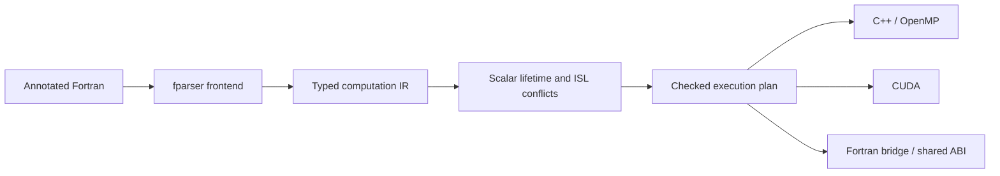

# Fortran-to-CUDA/C++ compiler

The compiler lowers annotated Fortran into an immutable computation IR, proves
that each loop nest can execute independently with `islpy`, and emits C++, CUDA,
and a Fortran bridge from the same ordered execution plan.



Each source outer loop remains a separate region. Host assignments and regions
retain source order. A rectangular perfect prefix maps to parallel iterations;
its remaining ordered body can contain assignments and sequential inner loops.
Fusion, tiling, automatic scheduling, persistent device storage, and sequential
fallback for rejected regions are unsupported.
See [CODE_MAP.md](CODE_MAP.md) for the implementation and extension points.

## Implementation layout

The only Python modules at the package root are the package marker and
`python -m compiler` entry point. Implementation code is grouped by pipeline stage:

```text
compiler/
├── driver/                  CLI, pipeline orchestration, output publication
├── frontend/                Fortran parsing and lowering
├── ir/                      Immutable computation nodes and execution plans
├── analysis/                Scalar lifetimes and parallel-legality checks
├── emission/
│   ├── driver.py            Generate all sources from one shared ABI
│   ├── common/              ABI descriptors, expressions, loops, runtime header
│   ├── c/                   C declarations and serial/OpenMP C++ generation
│   ├── cuda/                Device kernels, launches, transfers, host wrapper
│   └── fortran/             C bindings and public Fortran bridge
├── tests/                   Python and native acceptance tests
└── debugging/               Standalone fparser tree viewer
```

The frontend and analyzer depend on the IR. Emitters consume the IR and checked
execution plan without importing fparser or ISL. Shared emission helpers do not
import backends; each backend owns its language-specific rendering. The runtime
header is a resource under `emission/common/templates/`, loaded by the emission
package rather than located by the CLI.

Package entry points remain `compiler.frontend.lower_file`,
`compiler.analysis.build_execution_plan`, and `compiler.emission.generate_sources`.

## Quick start

Run from the repository root with Python 3.10 or newer:

```bash
python -m pip install -r requirements.txt
python -m compiler --input fortran-stencils/elmm_cdu.f90 --kernel CDU --output-dir out --verbose
```

Runtime dependencies include `fparser` and **`islpy==2026.2.2`**. Generated C++ uses
C++17; add `-fopenmp` to enable its verified OpenMP loops. Compile without that
flag for serial execution of the same generated implementation. CUDA uses one
kernel per accepted source outer loop, 256 threads per block, and maps the
innermost parallel index first. Empty domains skip the launch. CDU, CDV, and CDW each produce four
CUDA kernels.

## CLI and outputs

```bash
python -m compiler --input FILE --kernel NAME [options]
```

| Option | Default | Meaning |
| --- | --- | --- |
| `--input`, `-i` | required | Annotated Fortran source file |
| `--kernel`, `-k` | required | Entry subroutine, matched case-insensitively |
| `--output-dir`, `-o` | current directory | Destination directory |
| `--cuda-output` | `generated_code.cu` | CUDA kernels and host C wrapper |
| `--cpp-output` | `generated_cpp_impl.cpp` | C++ implementation with OpenMP annotations |
| `--fortran-output` | `generated_interface.f90` | Original module/procedure interface using `iso_c_binding` |
| `--common-header` | `common_functions.cuh` | Shared indexing and timing header |
| `--no-common-header` | off | Use a separately supplied shared header |
| `--verbose`, `-v` | off | Normalized IR, region boundaries, scalar privacy, ISL relations, and legality results |

The ABI preserves the original dummy argument order, public names, and
`cpp_<procedure>` C symbol. Array extents follow their array pointer in dimension
order. The generated bridge keeps `knd` mapped to binary64 and retains
`start_hot`/`finish_hot` timing hooks. These three public names are reserved for
that generated API. All sources are generated and validated before destination
files are written; an unsupported or unsafe input leaves existing outputs intact.

CUDA allocates device arrays, uploads `intent(in)` and `intent(inout)` data,
executes ordered launches, downloads outputs, and frees device arrays on each
wrapper call. `USE_PINNED_MEMORY` enables optional pinned-memory support. Host
array reads and writes between launches synchronize affected arrays:
a read sees previous device updates, and a partial host write preserves other
device-produced cells before uploading the changed array. Array-valued launch
bounds and strides also see previous device writes. These extra transfers are
included in timing hooks. Unwritten `intent(inout)` cells are preserved. Unwritten portions of
`intent(out)` arrays have no promised values.

## Supported Fortran subset

The first line must be `! kernels`. Each reachable subroutine must be annotated
with `! kernel` in the same module:

```fortran
! kernels
module example
  implicit none
  integer, parameter :: knd = kind(1.0d0)
contains
  ! kernel
  subroutine scale(a, factor, n)
    real(knd), intent(inout) :: a(:)
    real(knd), intent(in) :: factor
    integer, intent(in) :: n
    integer :: i
    real(knd) :: tmp
    do i = 1, n
      tmp = a(i) * factor
      a(i) = tmp
    end do
  end subroutine scale
end module example
```

- Default `integer`, default `real` (binary32), and `real(knd)` (binary64)
  scalars and assumed-shape dummy arrays. Array rank and loop nesting depth
  follow native Fortran language/compiler limits.
- Explicit `intent(in/out/inout)` arrays. Omitted array intent is conservatively
  treated as `inout`; omitted scalar intent is treated as read-only input. Scalar
  argument writes remain unsupported. `contiguous` and `target` are accepted;
  pointers remain unsupported.
- Counted `do` loops with positive or negative integer strides, including
  invariant runtime stride expressions. Constant zero strides reject; a runtime
  zero stride diagnoses at loop entry. Empty domains do not launch.
- Perfect and imperfect nests. The analyzer maps a rectangular perfect prefix;
  assignments and remaining inner loops execute in their original order within
  each parallel iteration. Bounds may depend on outer indices in retained loops.
  Source order is retained rather than splitting or fusing imperfect nests.
- Host scalar and array element assignments before, between, or after nests.
  Private temporaries must be defined before each read in the mapped iteration
  and unused after the region. Retained sequential loops may carry a scalar
  initialized within that iteration; their final induction values are available
  within the iteration too.
- Grouped arithmetic `+`, `-`, `*`, `/`, unary signs, integer/real literals,
  `SIZE(array, literal_dimension)`, and `SIZE(array)` total element counts.
  Default real literals retain single precision; `D` exponent and `_knd`
  literals use binary64.
- Affine access relations and constant-stride congruences are modeled exactly.
  Invariant non-affine bounds are captured as symbolic parameters. Unknown
  subscript coordinates are conservatively unconstrained, allowing read-only
  indirect gathers and writes whose other coordinates already distinguish
  parallel iterations. Identical squared affine subscripts, such as `a(i*i)`,
  receive a simple injectivity proof when every access shares that expression
  and its operand is proven nonnegative or nonpositive throughout the region.
- Positional whole-variable calls to annotated helpers. Inlining creates fresh
  locals per call and preserves actual storage identities and case-insensitive
  Fortran name resolution.

Branches, local arrays, writable scalar arguments, recursion, slices/expression
call arguments, other intrinsics/operators, explicit lower array bounds, and
unsupported specification statements reject with a source location.
Reductions or scalar values carried across mapped iterations, scalar live-outs,
and final mapped induction values are unsupported. There is no serial-only
fallback. General nonlinear or indirect writes are accepted only when the
conservative relations prove mapped iterations independent; no runtime alias or
index-uniqueness checks are introduced.

## Legality and caller contract

For each region the analyzer constructs statement iteration domains,
multidimensional read/write access maps, and the original lexical schedule. It
composes access maps to find ordered read-after-write (RAW), write-after-read
(WAR), and write-after-write (WAW) conflicts. Every conflicting pair must have
identical **mapped iteration coordinates**, including every dimension assigned
to CUDA threads. Ordered same-cell updates and recurrences inside retained
sequential loops are accepted within one mapped iteration. Conflicts between
mapped iterations reject. A perfect rectangular nest maps all its dimensions;
an inner recurrence in such a mapped nest rejects.

A dependence error includes source/call provenance, affected accesses, the
symbolic conflict relation, and a conflicting-iteration witness. If unknown
indices or variable-stride congruences widen the model, the diagnostic labels
its relation and witness conservative: it shows why independence could not be
proved, rather than promising a collision for every caller's runtime data.
`--verbose` also displays exact/conservative modeling and retained loop counts.
Independent regions execute in original order, honoring cross-region dependencies.

Distinct array arguments must not overlap whenever either is written. The
compiler does not perform runtime overlap checks. Repeated actual arguments in
an inlined helper retain shared identity and are analyzed as aliases. Callers
must provide valid extents and sufficient storage for every accessed index;
general bounds checking and broader Fortran semantics are outside this subset.

## Development and validation

```bash
python -m venv .venv
source .venv/bin/activate
python -m pip install --upgrade "pip>=25.1"
python -m pip install --group ./compiler/pyproject.toml:dev

python -m pytest compiler/tests
python -m ruff check compiler
python -m ruff format --check compiler
```

Tests cover lowering, source ordering, inline aliases, scalar lifetimes, ISL
relations against brute-force ordered accesses, rejection without publication,
and deterministic generation. Native tests compile and compare original Fortran,
generated serial C++, OpenMP, and CUDA using deterministic nonuniform inputs and
absolute tolerance `1e-10` for real values and exact comparison for integers.
Coverage includes fill/scale, non-cubic/singleton/empty domains, sentinel halos,
CDU/CDV/CDW, signed/runtime strides, rank-5 integer arrays, rank-15 bridge
compilation, imperfect nests, fresh host/device values, indirect gathers,
squared indices, and default-real arithmetic. Native compiler absence skips the
corresponding capability; CUDA compilation requires `nvcc`, and execution also
requires a usable device. Once those capabilities are available, build or runtime
failures fail the tests. All builds and outputs use temporary directories.

```bash
# Parser/analysis checks without native builds:
python -m pytest compiler/tests -m "not native and not cuda"
```
