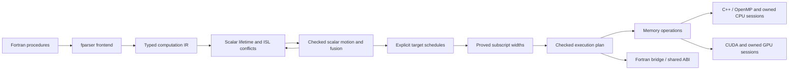

# Fortran-to-CUDA/C++ compiler

The compiler lowers selected Fortran procedures into immutable computation IR, validates
types and definite definitions, proves loop independence with `islpy`, and emits C++, CUDA,
and a Fortran bridge from checked execution, scheduling, addressing, and memory plans.

Generated numerical code publishes a versioned `numerical_contract` in the public
JSON `build_sources`, library generation metadata and scoped runtime descriptors.
The `separate-arithmetic-v1` contract requires CUDA `--fmad=false --ftz=false
--prec-div=true --prec-sqrt=true` and host C++ `-ffp-contract=off`; NVCC receives
the host requirement through `-Xcompiler`. Its SHA-256 covers the canonical
contract, and generated source/runtime hashes retain that identity. Independent
consumers must apply these options and record the actual command: NVCC does not
expose a verified predefined macro for every option. Original native Fortran
flags remain unchanged. This contract does not promise bitwise agreement for
all arithmetic, authorize IEEE flag observers, or change numerical tolerances.

Offline CUDA and generated-CPU calibration uses the same requirements and binds
them into its identities. Nonempty `NVCC_PREPEND_FLAGS` or `NVCC_APPEND_FLAGS`
is rejected before calibration work because hidden options can override the
recorded command. Historical profiles without the contract remain readable as
evidence; they cannot price the changed backend, and automatic placement uses
native execution until compatible calibration is supplied.



Proved scalar motion and loop fusion are enabled by default. Equal rectangular
loop domains fuse only when fresh dependence analysis proves the combined region
independent; inconclusive candidates retain their original passes. A rectangular
perfect prefix maps to parallel iterations; its remaining ordered body can contain
assignments, conditionals, and sequential inner loops. `--opt-level 0` retains the
source regions, source indexing, and source axis order unless overridden by
`--indexing` or `--schedule`. Automatic
axis ordering favors Fortran locality; spatial tiling is explicit through
`--tile-sizes`. Strict parallelization is the default; `--fallback host` executes
valid regions whose independence is unproved sequentially on the host. Explicit
sessions retain owned storage across calls, using the same Fortran interface for
CPU and CUDA backends.
See [CODE_MAP.md](CODE_MAP.md) for the implementation and extension points.

## Implementation layout

The only Python modules at the package root are the package marker and
`python -m compiler` entry point. Implementation code is grouped by pipeline stage:

```text
compiler/
├── driver/                  CLI, pipeline orchestration, output publication
├── frontend/                Fortran parsing and lowering
├── ir/                      Immutable computation nodes and execution plans
├── analysis/                Semantics, effects, dependence proofs, execution policy
├── transforms/              Checked scalar setup motion and greedy loop fusion
├── scheduling/              Locality ordering and explicit spatial tile plans
├── addressing/              Static integer ranges and proved subscript widths
├── memory/                  Explicit acquisition, coherence, and lifecycle plans
├── scopes/                  Bounded source scopes, native hooks, original-module clones
├── runtime/                 Numeric helpers, profiling, owned buffers, token registry
├── emission/
│   ├── driver.py            Generate all sources from one shared ABI
│   ├── common/              ABI, expressions, loops, session glue, runtime header
│   ├── c/                   C declarations and serial/OpenMP C++ generation
│   ├── cuda/                Device kernels, launches, memory-plan execution
│   └── fortran/             C bindings, public bridge, workspace procedures
├── tests/                   Python and native acceptance tests
└── debugging/               Standalone fparser tree viewer
```

The frontend and analyzer depend on the IR. Emitters consume the IR and checked
plans without importing fparser or ISL. `emission/driver.py` derives the memory plan
after scheduling and addressing, and shared session glue renders buffer ownership through the
runtime. Shared emission helpers do not import backends; each backend owns its language-specific rendering. The runtime
header combines the template under `emission/common/templates/` with numeric,
profiling, and storage units in `runtime/`, preserving a single distributable
support header and `--common-header` behavior.

Package entry points remain `compiler.frontend.lower_file`,
`compiler.analysis.build_execution_plan`, and `compiler.emission.generate_sources`.
`compiler.driver.pipeline.prepare_function(function, *, options=CompilerOptions())`
returns the optimized function and freshly checked plan with schedules and addressing decisions. The immutable
`CompilerOptions` in `compiler.driver.options` is shared by this pipeline and the
CLI; direct calls to `build_execution_plan` keep their existing analysis behavior.
Emitters accept these unscheduled plans using source axis order and source indexing. Schedule and addressing records
remain independent of fparser and ISL.

## Quick start

Run from the repository root with Python 3.10 or newer:

```bash
python -m pip install -r requirements.txt
python -m compiler --input fortran-stencils/elmm_cdu.f90 --kernel CDU --output-dir out --verbose
```

`! kernels` and `! kernel` markers are optional. Select a module subroutine with
`--kernel NAME`, or `--kernel MODULE::NAME` when several modules contain the same
name. Reachable helpers in the same module are discovered and inlined without
markers; unrelated unsupported routines remain untouched. The input must still
parse as Fortran 2008. Use `--require-markers` for the previous strict selection
contract, including markers on every reachable helper.

Inspect candidates without generating files:

```bash
python -m compiler --input ordinary.f90 --list-candidates --json
```

The list reports every module subroutine, its marker status, and either successful
generation eligibility or a rejection reason with source location. It runs the
same semantic, dependence, scheduling, and emission checks as normal compilation,
under the selected options. A rejected procedure is not a promise of automatic
host fallback; the application integration must retain its native implementation.
The Python `discover_file(path)` API reports the narrower frontend result in
`ProcedureCandidate.lowerable`; callers must still run `prepare_function` and
`generate_sources`. `lower_file(path, entry, require_markers=False)` preserves
explicit entry selection and supports the same module qualification.

Normal generation also accepts `--json`:

```bash
python -m compiler --input ordinary.f90 --kernel advance --fallback error \
  --output-dir out --json
```

Its stdout is one object with `kernel`, `supported`, `reason`, and `outputs`.
Successful generation additionally reports `parallel_regions` (including kernels
in conditional branches), `execution_plan`, and the ordinary pooled-call
`memory_plan`. The last two fields reuse the existing human-readable plan reports;
they are explanatory text, not serialized compiler IR. `outputs` lists the files
published in the output directory. Compilation rejection returns
`supported: false`, a diagnostic `reason`, an empty output list, and a nonzero exit
status; existing output files remain unchanged. With both `--verbose` and `--json`,
verbose diagnostics go to stderr so stdout remains valid JSON. Candidate-list
JSON retains its existing array format.

`supported` describes successful generation under the requested fallback policy.
Integrations that require GPU work should select `--fallback error` and require
`parallel_regions` greater than zero. The compiler proves each parallel region
separately and preserves dependence order between kernels; callers should not
require independent accesses across the entire entry.

Runtime dependencies include `fparser` and **`islpy==2026.2.2`**. Generated C++ uses
C++17; add `-fopenmp` to enable its verified OpenMP loops. Compile without that
flag for serial execution of the same generated implementation. CUDA uses one
kernel per accepted region and 256 threads per block. Axis order comes from the
schedule; bounded grids use grid-stride iteration to cover larger domains. Empty
domains skip the launch. CDU, CDV, and CDW each produce one CUDA kernel by default
and four with `--opt-level 0`.

## CLI and outputs

```bash
python -m compiler --input FILE --kernel NAME [options]
```

| Option | Default | Meaning |
| --- | --- | --- |
| `--input`, `-i` | required | Fortran source file |
| `--kernel`, `-k` | required except when listing | Entry subroutine or `module::name`, matched case-insensitively |
| `--require-markers` | off | Require legacy file and routine markers |
| `--list-candidates` | off | Report each module procedure's generation eligibility; write no files |
| `--json` | off | Machine-readable candidate list or generation result; verbose diagnostics use stderr |
| `--output-dir`, `-o` | current directory | Destination directory |
| `--cuda-output` | `generated_code.cu` | CUDA kernels and host C wrapper |
| `--cpp-output` | `generated_cpp_impl.cpp` | C++ implementation with OpenMP annotations |
| `--fortran-output` | `generated_interface.f90` | Original module/procedure interface using `iso_c_binding` |
| `--common-header` | `common_functions.cuh` | Shared indexing, numeric, storage, and timing header |
| `--no-common-header` | off | Use a separately supplied shared header |
| `--opt-level {0,1}` | `1` | Enable proved scalar motion, fusion, and wide addressing; `0` retains source passes |
| `--schedule {source,auto}` | `auto` at level 1, `source` at level 0 | Select axis ordering independently of fusion |
| `--indexing {source,auto}` | `auto` at level 1, `source` at level 0 | Select source INTEGER addressing or statically proved wide subscripts independently of fusion and scheduling |
| `--tile-sizes N[,N...]` | untiled | Positive tile sizes in scheduled fastest-to-slowest order; omitted axes use 1 |
| `--fallback {error,host}` | `error` | Reject unproved regions or run them sequentially on the host |
| `--gpu-policy {always,sections,auto,chunked,hybrid}` | `always` | Select the ordinary-call transfer and execution prototype |
| `--calibration-profile FILE` | none | Explicit reusable hardware calibration for automatic decisions |
| `--memory-model {call,scoped}` | `call` | Shared-buffer numerical entry prototype with `scoped`; requires sections/auto |
| `--scope-transfers {direct,pinned,pipelined,auto}` | `direct` | Scoped transfer choice, separate from CPU/GPU placement |
| `--scope-execution {bounded,reached}` | `bounded` | Opt-in reached ownership in original lexical procedures; requires `--form-scopes` |
| `--analyze-effects` | off | Bounded native source effects without requiring GPU lowering; writes no artifacts |
| `--form-scopes` | off | Emit bounded serial source scopes, original-module helpers, and public source/build manifests |
| `--scope-facts FILE` | none | Source-hash-bound capture, initialization, and caller facts; requires `--form-scopes` |
| `--source-file FILE` | none | Additional effect-analysis source; repeat for separate modules |
| `--effect-contracts FILE` | none | Versioned explicit contracts for opaque native calls; requires effect analysis |
| `--summary-cache DIRECTORY` | memory only | Optional source-summary disk cache for effect/scope analysis |
| `--host-threads N` | `4` | Total host thread budget, including hybrid GPU coordination |
| `--gpu-collective` | off | Require every thread of one existing OpenMP team to call the entry |
| `--verbose`, `-v` | off | Normalized IR, applied/skipped transformations, schedules, indexing decisions and reasons, region boundaries, scalar privacy, ISL relations, legality results, and memory operations |

### Opt-in CPU/GPU policies

`always` keeps the existing whole-array implementation. The alternatives apply
to ordinary calls; explicit-session coherence is unchanged. `sections` copies
physical rectangular read/write footprints synchronously, preserving separate
opposite faces and values in partially written outputs. Unknown sections use
whole-array transfers. Device storage retains the original logical layout.
Contiguous sections use flat copies; pitched rectangles use 2D or 3D copies.
An interior 3D rectangle takes one runtime copy call instead of one per plane;
higher ranks use one 3D copy per remaining coordinate. Transfer estimates count
these same calls. Disjoint faces stay separate and copyback never fills gaps.
Overlapping sections are reduced to an exact disjoint union when worthwhile,
with at most 32 rectangles and 1,024 intersection checks per array/direction.
The same rectangles feed execution, cost estimates, and transfer traces.
Without calibration, deduplication must reduce bytes without adding copy calls.
With calibration, extra calls are allowed only when saved transfer time exceeds
their latency cost. Ties, uncertain arithmetic, and excessive fragmentation
retain the original rectangles; no bounding volume replaces holes or faces.

`auto` compares native units with GPU intervals of up to four adjacent units
and the complete legal group. It retains units before optional fusion, respects
source control flow and synchronization boundaries, and requires a modeled 20% advantage
for GPU work. Dependent intervals execute in order, with host-visible outputs
at interval boundaries. Missing, uncertain, overflowing, or incompatible cost
estimates select native execution.
Conditional work whose count is only an upper bound currently selects native
execution as well; the compiler does not assume that every branch runs.
Entries mixing empty and active units also retain the original native block:
an empty unit can protect an undefined inner bound from the numerical value ABI.
Scalar inputs used only inside conditional branches or potentially empty retained
loops also keep the entry native, as do entirely unused scalar parameters. This
conservative rule applies to the forced `sections` and `chunked` controls too:
their numerical value ABI would otherwise read inputs that native execution can
leave untouched. Conditional holes using constants, indices, or scalar inputs
already required unconditionally remain supported.
For `sections` and `auto`, entries with host preparation additionally admit
local scalar assignments and host branches. Preparation may read scalar inputs,
descriptors, and arrays proved unchanged throughout the entry. Selected GPU
intervals retain their storage across these approved host nodes: inputs transfer
once for the union of active physical sections, and written sections return
before the following CPU interval. Host statements and branches still execute
in source order; each worker receives its current local scalar values.

The public query evaluates only the checked INTEGER/LOGICAL slice needed for
predicates, bounds, and footprints. It checks integer intermediates and immutable
array indices, preserves nested guards, and never computes numerical REAL setup.
REAL-dependent decision expressions, host array writes, preparation reading
arrays written by the entry, and sequential fallback regions remain native.
LOGICAL query conversion is permitted only for inputs unconditionally readable
at entry. Structured queries prove that every live by-value scalar is consumed
on their selected source path before accepting execution; unknown read coverage
retains the original native call. Completely unused scalars receive typed zeros
in the generated numerical bridge, preserving its public signature without
reading the original argument. This structured proof can admit inactive branches
alongside active kernels without exposing protected bounds. The original flat
policy guard rules and chunked/hybrid eligibility remain unchanged.
Public `offload.preparation` reports eligibility and reasons; decision traces
include `FORT_OFFLOAD_ACTIVE` with the ordered original region identities.
GPU intervals execute on the device checked during selection, restoring the
executing host thread's previous device afterward.

These prototypes currently retain unfused source units. The default whole-array
path retains normal compiler fusion, so comparisons can differ in kernel count
as well as transferred bytes.

`chunked` provides an asynchronous GPU-only control. `hybrid` additionally
selects a CPU/GPU split from fixed candidates using the same calibration. Only
entries with proven independent slabs across all grouped kernels qualify;
immutable input halos are allowed. Two pinned/device slots and non-default
streams keep upload, computation, and download ordered per slot. The initial
total pinned-memory budget is 64 MiB. Hybrid reserves one host thread to manage
GPU work, while remaining workers process disjoint CPU slabs. All work and
copyback complete before return. Cross-entry residency and dependent chunk
pipelines remain outside these prototypes.
The runtime retains one completed pair of slots, streams, and events between
calls, reusing sufficient capacity on the same device. Inputs are packed and
uploaded afresh on every call, including after host edits, shape changes, or
reallocation. This is scratch reuse, not cross-entry data residency. Concurrent
calls lease separate pairs; active and idle pinned capacity together remain
within the process-wide 64 MiB budget shared with scoped pinned transfers. In-progress
allocations also reserve their capacity. An incompatible idle pair is evicted before allocating or waiting
for budget. Allocation failure before execution selects native work once.
`FORT_RUNTIME_TRACE=1` reports `scratch_reuse` and its retained capacity.
Compact slabs retain
their complete nonslab dimensions; uploads preserve untouched halo elements
that share those slabs. Synchronous section transfers can omit uploads of
rectangles proved to be completely overwritten.

Create calibration independently of any application:

```bash
python -m compiler.offload.calibrate --output hardware.json \
  --threads 4 --precision 64 --cuda-host-cxx g++-14
python -m compiler --input ordinary.f90 --kernel advance --output-dir out \
  --gpu-policy auto --calibration-profile hardware.json --host-threads 4 --json
```

Calibration records launch, transfer, and packing costs, CPU/GPU compute and
memory rates, and CPU worker rates with the coordination thread reserved.
Runtime compatibility requires the calibrated CPU model, GPU UUID/compute
capability, GCC and NVCC version triples, CUDA runtime/driver versions, precision,
and thread budget. Unrecognized toolchain identity disables automatic selection.
No application profile or online timing tunes decisions.
Throughput is an approximation measured with the recorded calibration build
flags (`-O3` and host `-fopenmp`, matching the supplied benchmark workers).
Different application flags and instruction mixes can change realized
rates; retain the recorded flags and validate complete application time before
promoting a policy.

Non-default JSON includes an `offload` contract with analysis availability,
physical footprints, work and launch estimates, eligible intervals/strategies,
and a `native_fallback_query` name. Integrations import that generated Fortran
logical function and pass the original arguments only after allocation checks
and collective synchronization. A false result executes the original native
block and is a successful policy decision. The compiler owns placement and
scheduling; callers need not inspect compiler IR or CUDA text. Query scalar
arguments use references so guarded inner bounds are read only when needed.
Callers with protected inputs must honor a false query and execute their original
native block rather than call the numerical entry directly.
`FORT_OFFLOAD_TRACE=1` records placement decisions separately from CUDA activity;
disable tracing and phase profiling for timing and overlap measurements.

REAL precision is resolved from declarations rather than the spelling of a kind
name. The target kind model supports `REAL(4)`, `REAL(8)`, default `REAL`,
`DOUBLE PRECISION`, INTEGER parameter aliases and arithmetic, and `KIND` of
numeric or logical literals.
Intrinsic `iso_fortran_env` (`real32`, `real64`) and `iso_c_binding` (`c_float`,
`c_double`) kind imports are recognized, including `ONLY` renames. Unknown or
unsupported kinds are rejected. Local INTEGER kind parameters are allowed, but
general constant folding and external module resolution remain unsupported.

The ABI preserves the original dummy argument order, public names, and
`cpp_<procedure>` C symbol. Array extents follow their array pointer in dimension
order. The generated bridge keeps `knd` mapped to binary64 and retains
`start_hot`/`finish_hot` timing hooks. Profiling starts disabled: `start_hot` resets
and enables collection, and `finish_hot` reports and disables it. Ordinary
execution creates no profiling events or phase-by-phase profiling barriers.
Profiled public CUDA calls serialize through a shared profiling lock. Unprofiled
calls do not take that lock. The timing hooks delimit quiescent batches: start
profiling before starting concurrent callers and join them before finishing it.
`calls` counts entry runs, including empty and host-only runs; `kernel_launches`
counts actual launches. Kernel time excludes host execution and transfers.
These three public names are reserved for that generated API. All sources are generated and validated before destination
files are written; an unsupported or unsafe input leaves existing outputs intact.

The ordinary CUDA wrapper creates private owned state, uploads `intent(in)` and
`intent(inout)` data, executes the memory plan, downloads outputs, and releases the
state on each call. Ordinary calls do not use the session token registry, so
independent concurrent callers have independent storage. Ordinary calls remain
synchronous and host-visible. On supported CUDA devices, a private memory pool
reuses device allocation backing across calls; each call still transfers fresh
inputs and outputs. `USE_PINNED_MEMORY`
enables optional pinned-memory support. Host array reads and writes between launches synchronize affected arrays:
a read sees previous device updates, and a partial host write preserves other
device-produced cells before uploading the changed array. Array-valued launch
bounds and strides also see previous device writes. These extra transfers are
included in timing hooks. Unwritten `intent(inout)` cells are preserved. Unwritten portions of
`intent(out)` arrays have no promised values.

## Memory planning and runtime

Shared ownership extends call-local transfers to shared buffers and section
coherence across GPU entries and native CPU operations. The common runtime and
bounded source scopes are opt-in features. Their public interfaces and supported
boundaries are described below; eligibility alone does not establish a GPU
speedup in a complete application.

`compiler.memory.plan_memory(plan, parameters, *, acquisition_policy=None)` derives immutable acquisition,
caller uploads/downloads, host/device access, execution, write-invalidation, synchronization, and release
operations from an execution plan. It preserves conditional branches, counts
predicate and array-valued launch-bound reads, and requests current contents before
partial writes. `format_memory` describes these operations independently of
emission. Host/device access operations represent conditional transfers: a storage
runtime decides whether its current ownership state requires a copy.
Explicit uploads/downloads always transfer the selected caller arrays. Before
emission, `validate_memory` checks operation payloads, phase placement, array
ownership, and complete acquisition, input upload, output retrieval, and release.
Unsupported operations fail instead of being silently skipped.
Acquisition policy is `dedicated` or `pooled`; omitted metadata preserves dedicated
allocation. Default generation supplies dedicated session plans and pooled ordinary
CUDA plans. Explicit `generate_cuda(..., memory=...)` plans remain authoritative
for both APIs unless `ordinary_memory=` supplies a separate ordinary lifecycle.
Helpers are shared only when their operation sequences match.

`runtime/storage.hpp` provides owned fixed-shape CPU/CUDA buffers, lazy CUDA host
mirrors, selective updates, checked extent/byte products, scoped pinned-memory
registration, and a registry that diagnoses invalid or stale tokens. Buffers retain
no caller pointers. `runtime/allocation.hpp` owns dedicated and pooled CUDA
allocations separately from coherence state; `runtime/timing.hpp` contains opt-in
profiling. These units are assembled into the existing support header and tested
with instrumented CUDA calls.

Emission renders every lifecycle operation, including synchronization without an
array payload. State starts with empty buffer slots and fixed extent metadata;
planned acquisition constructs buffers and planned release destroys them, with
RAII as a cleanup backstop. Shared state helpers implement ordinary CUDA calls
and explicit sessions; the registry only owns states and validates tokens.
Host statements, branches, fallback regions, and array-valued launch bounds share
the coherence path. CPU sessions consume the same memory operations with both
address spaces mapped to owned host buffers; ordinary C++ calls use direct lowering.
Verbose output displays the
memory operations for both lifecycles; `FORT_RUNTIME_TRACE=1` logs successful GPU
allocation requests, transfers, kernel launches, and releases, with additional
events identifying pool operations. Allocation-request counts do not measure
physical backing allocations: native pool requests still occur on warm calls.

### Shared memory runtime foundation

Export the independently compiled runtime and its versioned manifest:

```bash
python -m compiler --emit-scoped-runtime --json --output-dir out/scoped
```

The output contains `scoped_runtime.h`, `scoped_entry.hpp`, `section_copy.hpp`, `staging.hpp`,
`scoped_regions.hpp`, `scoped_planning.hpp`,
`scoped_runtime.cu`, `fort_scoped_memory.f90`, and `scoped-runtime.json`. Compile and link the CUDA
runtime once per executable with host OpenMP support (`-Xcompiler=-fopenmp`) and compile the common Fortran interface before its
users. The manifest identifies the ABI, source hashes, source languages, and
build ordering. No input procedure is required for this operation.

The public C/Fortran API provides explicit contexts, canonical buffer handles,
host/device access begin/end, completion, and close. Buffers borrow stable
contiguous host allocations; host storage must remain valid until unregister or
close. Registrations use explicit identities and allocation generations, validate
layouts, and reject independently registered overlapping storage. Sections use
zero-based physical coordinates with exclusive upper bounds. Access descriptors
separate reads, possible writes, and proven overwrites.

`fort_scope_register_sections` accepts partially initialized host coverage.
`fort_scope_forget_definition` discards old defined/current coverage while
retaining the device allocation, preserving procedure-entry `INTENT(OUT)` events.
Neither re-registering a pointer nor keeping its allocation defines its contents.
`fort_scope_set_device_budget` limits live full-layout fields and cached scratch
payload bytes; set
it before CUDA initialization. Resource exhaustion before an operation starts
permits native continuation, including after earlier completed operations.

CPU reads retain device validity. CPU writes invalidate only affected sections;
GPU writes similarly invalidate host sections. On excess fragmentation, the
runtime reconciles current pieces before coarsening. Excess fragmented partial
initialization requests a boundary before execution. Contexts initialize CUDA
lazily, use one non-default stream and private pool where supported, and wait at
host boundaries. All-native and empty accesses initialize no CUDA resources.
Execution failures poison the context, preventing unsafe replay; abandoning a
failed context releases resources without claiming valid host results.

The additive [scratch ABI](runtime/SCOPED_SCRATCH_ABI.md) supplies one reusable,
context-owned device arena. Leases carry unique tokens, share the context stream,
and cannot publish host data. Zero-byte leases initialize no CUDA resources;
cached capacity counts against the device budget. Separate statistics expose
allocation reuse and combined field/scratch peaks. This storage interface does
not itself implement runtime snapshots or establish automatic placement costs.

Scoped transfers default to `direct`. The opt-in `pinned` control packs exact
sections into reusable pinned staging, copies against the existing full-layout
device buffers, waits for completion, and unpacks only downloaded sections.
Logical indices and array pitches are unchanged. This control is synchronous;
it does not claim transfer/kernel overlap. Two staging slots, streams and events
share the ordinary chunked/hybrid pool's 64 MiB pinned budget, including active,
allocating and cached storage. A scoped copy acquires a short lease without
waiting for another caller to release budget, and releases it before native
procedure execution. A pre-copy resource failure uses direct transfers with an
explicit reason; a failure after enqueue poisons the context and cannot replay
numerical work.

`--scope-transfers` requires scoped memory for nondefault modes and remains
independent of `--gpu-policy`. Forced `sections` can use `pinned` without a
calibration profile. Automatic GPU placement with explicit `pinned` requires
the additional scoped transfer calibration; pinned bandwidth alone omits
preparation, row packing and event costs. Older profiles remain valid for direct
execution and cannot supply missing transfer costs. Default direct placement
keeps its existing costs and behavior.

`pipelined` admits complete GPU subchains with a common, source-proven independent
slab partition. Two slots each enqueue upload, all subchain kernels, required
download and a completion event in that order on non-default streams. Reusing
a slot waits for its event and unpacks only its exact written output sections.
The executor retains full device-array layouts, original logical bounds and
pitches. Ordered definitions determine incoming reads: a GPU-produced
intermediate is never uploaded from undefined or stale host storage. Immutable
inputs with overlapping chunk reads have their exact required union established
on the device before any batch kernel; subsequent slot uploads exclude them.

Batch sizes come from the existing 256 KiB, 1 MiB, 4 MiB and 16 MiB payload
candidates using offline costs, including packing row overhead, resource
preparation, launches, completion events and pipeline fill/drain. Transfer
`auto` requires a modeled 20% advantage over the corresponding synchronous
transfer execution. Placement remains a separate decision; pipelining cannot
create a GPU placement that the conservative placement planner rejected.
Missing or incompatible calibration and unsupported slab proofs retain direct
execution with a public reason. Resources are acquired before numerical work;
an unapplied batch leaves the ordinary schedule available, and an error after
work starts forbids replay. One batch can be active per context, and both slots
complete before returning to a native boundary.

The additive batch interface publishes eligibility, selected payload and chunk
count, preparation work, modeled execution and terminal-cost change, and actual
completed transfers and launches. A complete-owner estimate becomes unavailable
when changed batch publication has not been repriced; direct estimates are not
reported as if they described pipelined execution. Initial source integration
uses direct numerical leaves in one reached straight-line segment. Native
operations, mutable control boundaries, unsupported wrappers, uncertain aliases
and cross-chunk dependencies retain synchronous execution. This eligibility is
not overlap or speed evidence: use separate Nsight diagnostics with the
synchronizing phase timer disabled and measure complete application wall time
before promoting a policy.

The additive `fort_scope_set_transfers` metadata operation configures a context
before registration/planning and initializes no CUDA resources. Generated
interfaces publish a `configure(context)` helper, and nondefault source owners
call it once before planning. Standalone callers use the public helper before
adding query operations. Complete pinned costs are installed by the additive
`fort_scope_set_transfer_costs_v1` after host/toolchain compatibility checks;
GPU identity is still checked before a GPU selection executes. The versioned
`fort_scope_batch_execute_v1` provides a metadata-only preview and a
synchronous-on-return pipelined executor. Its callbacks receive original
full-array views and the slot stream, and must not call context APIs while the
executor owns that context. `fort_scope_transfer_stats_get_v1` reports requested
and effective modes, fallback reasons, exact packing/transfer counts, staging
reuse, capacity and event statistics without changing the original stats ABI.
The runtime manifest describes the shared budget and supported modes. Common
and scoped runtime units must link into the same program with the published
default-linkage support header to share one pool; isolated loader namespaces
are not covered by that contract.

Emit a numerical entry that borrows common buffer handles:

```bash
python -m compiler --input input.f90 --kernel advance --gpu-policy sections \
  --memory-model scoped --json --output-dir out/scoped-entry
```

The additional shared CUDA source and Fortran interface are identified by public
JSON, including argument order, array types, execution modes, and runtime build
artifacts. Independently generated entries link one common runtime and borrow
handles registered by their caller. Existing ordinary and owned-session outputs
are preserved. Shared entries require read-only scalar parameters and default to
a serial coordinator. Native, forced GPU, and calibrated automatic execution are
available. Planning ABI version 1 exports side-effect-free `plan` queries and a
`choose` selector. Queries record physical effects and checked control values;
mode 2 consumes the resulting worker decisions in source order. Unknown work,
unsafe preparation, or absent/incompatible calibration selects native execution.
Effect-query availability is published separately from cost-estimate availability.
The common runtime's `fort_scope_plan_validate` checks ordered initialization and
preservation requirements without calibration, CUDA initialization, or changes to
live coverage. Source owners invoke it before numerical work for both `sections`
and `auto`; an unavailable or failed preflight retains the original native span.
Successful definition proofs and recorded query snapshots are reused only within
the same context's query and data-state generations. Query changes, registrations,
coherence/definition changes and execution invalidate them; read-only metadata
probes preserve them. Preview choices also check current driver state and exact
calibration costs. No application decision is cached by allocation address.
For a fresh host-current scope, a proven GPU startup lower bound can select native
execution after definition preflight without constructing a coherence simulation.
With `FORT_RUNTIME_TRACE=1`, planning diagnostics report construction, validation
and selection wall intervals and cache hits. The intervals are inclusive and can
nest; they must not be added together as independent costs. Startup-shortcut
evidence is explicitly aggregate-only. Tracing adds no CUDA synchronization.
Query inputs must remain safe and unchanged throughout their recorded planning
segment. The legacy `fort_scope_plan_reset` still plans a complete scope. The
additive `fort_scope_plan_reset_mode` accepts `FORT_SCOPE_PLAN_CONTINUE` to plan a
reached segment without closing its owner. Complete earlier work with
`fort_scope_wait` before resetting a consumed schedule. Successful continuation
selection installs CPU choices even when GPU estimates are unavailable; those
workers execute with access hooks and preserve earlier device results. A failed
query may run only the current segment through safe native hooks. Execution
failure never permits replay of an earlier segment or the owning region.

`fort_scope_plan_report_v2` separates incremental execution cost from hypothetical
publication and teardown. A continuation ranks execution plus the change in
terminal liability against native continuation from the same incoming state;
the ranking can be negative when native writes retire dirty device values.
Projected terminal operations do not execute between segments and do not count
as their transferred bytes. Owner estimates sum reached execution and one final
terminal cost. Creation and registrations are charged when incurred, and retained
allocations are charged only when newly allocated. Unknown or failed execution
invalidates the complete-owner estimate. Existing planning costs and decision
structures remain ABI version 1.
Shared numerical entry ABI version 2 accepts scalar pointers through its C
interface, with matching Fortran reference arguments. Binding those references
does not read their values. A scalar used only behind a conditional or possibly
empty retained loop keeps that worker native, preserving the original protection
before CUDA would capture its value. Other safe workers in the same entry can
still execute on the GPU. Public `region_execution` metadata explains each such
choice; the common memory runtime remains ABI version 1.
Protected CPU reads retain their original guards under host optimization. If a
physical section offset also uses a protected scalar, its native access uses
conservative whole-resource effects without evaluating that offset early.

Adding `--gpu-collective` emits an additive `run_team` interface in the same
Fortran module and an additional C entry identified by public `scoped.team` JSON.
Every member of the fixed host-budget team at OpenMP level one must call it with
the same context, buffer handles, mode, and immutable scalar bindings. This is an
explicit caller contract, not permission to rewrite arbitrary call sites. The
master performs preparation, access hooks and GPU work once; CPU workers use
the existing thread IDs and team size. Shared preparation and nested branch
choices are published at matching barriers. The entry returns a uniform status
after all workers finish; failures after work starts prohibit replay. Existing
serial entry names and behavior remain unchanged. Automatic team execution
requires the separately measured collective protocol described below; serial
calibration alone retains native execution with an explicit reason.

Explicit entries and the initial source scopes below remain opt-in. Complete
application evaluation and remaining lifetime/effect integration are tracked in
[the memory-model plan](MEMORY_MODEL_PLAN.md).

### Compiler-owned source scopes

```bash
python -m compiler --input application.f90 --kernel application::advance \
  --source-file helpers.f90 --form-scopes --scope-facts captures.json \
  --memory-model scoped --gpu-policy sections --json --output-dir out/scopes
```

The capture document has `schema_version: 1`, `participation: "serial"`, and
`sources` mapping every supplied absolute source path to its SHA-256 hash.
`captures` maps canonical identities such as `argument::a` or `module::field`
to `storage: "stable"`, `escapes: false`, `allocation_changes: false`, and
`initialized: "whole"`, `"none"`, or `"sections"`. Partial initialization adds
`sections`, a bounded list of `lower`/exclusive `upper` physical coordinates.
These are storage and source-definition assertions; they do not specify GPU
leaves or transfer recipes. An optional `device_budget_bytes` defaults to 256 MiB.

The compiler selects bounded source spans, generates source helpers in their
original modules, and passes explicit context/root handles down call-only helper
paths. Original native procedures remain available. Native operations execute
behind compiler-generated access hooks; numerical leaves retain physical section
transfers and borrow the same registered buffers. CPU reads retain a current GPU
mirror. Unknown calls, recursion, lifetime changes, uncertain effects, writable
aliases, and unsupported mappings are boundaries. Structured owners preserve
conditions and mutable scalar reads at their original execution points and plan
only reached straight-line segments after their inputs become available. Original
caller guards remain outside their replacements. Active OpenMP teams select the original native span
before descriptors are inspected; a runtime without OpenMP support also selects
native execution because caller participation is unknown.

Straight-line native assignment leaves can publish checked rectangular reads,
writes, and complete overwrites, including separate opposite faces. Queries and
execution hooks use the same physical mapping from the original dummy lower
bounds to full registered storage; staging layouts never change source indices.
The bounded subset admits whole axes, literal points and unit-stride ranges, and
checked same-array dimension inquiries. Dynamic specifications, uncertain
inquiry/function effects, unsupported bounds and aliased mappings retain
conservative whole-resource effects. A write-only partial native `INTENT(OUT)`
can discard old definitions and define its exact written sections; native reads
of that output or nested definition changes remain boundaries. The complete
ordered preflight rejects any undefined read or preservation requirement before
numerical execution, rather than discovering it after a preceding GPU write.
Native OpenMP helpers, including hidden callees, require proved completion.
Serial scopes admit bounded, matched plain `do` or `parallel do` directives,
whose work completes before the original helper returns. Other directives remain
boundaries; memory effects alone cannot show that asynchronous work is finished.
Proven joined inline native OpenMP operations may also remain in a structured
owner; they finish before its next segment. Array conditions receive their
required host coverage through hooks before evaluation, while unrelated device
copies remain valid. The original allocation bounds reach structured owner
dummies before assumed-shape association can rebase them. Unsupported exits,
allocation changes, unknown effects and unproved completion end ownership.
An original `ALLOCATED` predicate on a captured stable allocation may become a
known true value only after the original caller's allocation check. Unallocated
callers execute the unchanged source. This proof does not authorize allocation
changes or substitute ordinary view descriptors for allocatable arguments.

The public `scopes` JSON and saved `scope-manifest.json` identify approved source
replacements, original hashes, artifact hashes, runtime identity, and build roles.
Each scope publishes its synthetic owner parameters with canonical resources and
original actual names. Structured owners additionally publish their reached-segment
tree, native operations, retained resources and explicit ownership boundaries.
Capture dummies use private generated names so original
USE associations and re-exported module fields retain their source bindings.
Hidden mutable module scalars retain their original host or USE bindings rather
than acquiring a second dummy association. When an original native helper
accesses a captured module array through such a binding, the original array
must satisfy the `TARGET` aliasing proof; otherwise ownership ends at that call.
After the caller and contiguity checks, contiguous pointer views bind the original
storage. Context-aware helper calls use those views so `CONTIGUOUS` dummies do not
introduce array temporaries that diverge from the registered host buffers. Native
whole-span fallback retains the original arguments and their normal semantics.
For numerical leaves with writable hidden module arrays that lack `TARGET`, a
pre-execution fallback returns to the original caller before running that span.
Once a segment has started, native continuation uses its coherent workers and
cannot replay the owner.
Stable allocatable owning arrays can be borrowed through ordinary assumed-shape
helpers. A guard at the original caller checks serial participation, then
`ALLOCATED`, before associating synthetic owner arguments or querying their
descriptors. Unallocated and collective paths retain the exact original span;
original outer guards stay in place. Empty allocated arrays remain valid, and
the owning context closes before return or later reallocation. The guard forces
the intrinsic in its own block; conflicting captured/call names remain boundaries.
Context-aware clone array dummies also declare `TARGET`, making their association
with runtime access through the registered address explicit.
Native fallbacks after this storage proof also use the contiguous views, avoiding
whole-array temporaries when the original helper or wrapper declares `CONTIGUOUS`.
Stable module allocatable arrays can also participate in original native
operations behind conservative whole-resource hooks. Their exact canonical
roots need source-hash-bound stable, non-escaping capture facts; the compiler
checks these before effect analysis consumes them. Allocation agreement at the
original caller still precedes descriptor queries and owner association. The
unallocated path executes the original source, preserving its guards. Element
and explicit-section writes retain the original allocation and logical bounds.
Whole-variable allocatable assignment, explicit allocation changes, writable allocatable
formals, uncertain pointer effects, and unknown callees remain boundaries even
when stable storage is asserted. Standalone effect analysis without capture
authority remains conservative. Normalized numerical packages may borrow these
hidden allocations when they supply a unique `lower_bound_dimension` parameter
for every dimension of each dynamic resource. Runtime origins come from the
original allocation descriptor, after allocation agreement and before synthetic
assumed-shape arguments can rebase it. Collective callers use their agreed
original descriptors for the same mapping. The dispatch checks 64-bit `LBOUND`,
`UBOUND` and dimension `SIZE` against the existing 32-bit INTEGER ABI before
conversion; unsupported ranges retain original native execution. Resources used
only for descriptor inquiries still require capture and allocation guards.
The mapping preserves original logical indices, bounds and index-as-data
expressions while numerical buffers retain their full physical layout. Missing
origin mappings remain conservative boundaries; lifetime authority does not
establish an allocation's numerical bounds.
An adapter verifies these artifacts, applies replacements to an application copy,
and links the common runtime once. It does not inspect compiler IR or CUDA text.
No accepted scopes is a successful unchanged/native result.
The independent pipeline exposes this path through opt-in
`--memory-model scoped`, an explicit scope entry/source selection, and a capture
facts file. It exports configured and normalized source packages and consumes
these public build roles; it does not infer initialization from argument intents.
See [the pipeline interface](../elmm-pipeline/README.md) for its options.

### Qualified source callers on existing teams

Source scopes with `--gpu-collective` accept a separate capture schema version 2.
The `sources` and stable initialization facts retain their original meaning.
Array captures additionally assert `association: "shared_whole_storage"` and
`descriptor_uniform: true`; immutable scalar captures assert
`association: "shared_immutable_control"`. The compiler verifies source-backed
caller and worksharing roles independently of these assertions.

`participation` is an object with `kind: "omp_full_team"`,
`dispatch: "qualified_companion"`, the qualified `entry`,
`expected_omp_level: 1`, the fixed `host_threads`, and `call_sites`.
Each site supplies its original `source`, `first_line`, `last_line`, the exact
statement `span_sha256`, enclosing `team_first_line`/`team_last_line`, and
`uniform_guard: "unconditional"`. Optional source/team hashes and a qualified
`caller` assertion must agree with the original AST. The compiler resolves
renames and generic calls, requires an unconditional call in a plain lexical
parallel region, proves whole shared captures and immutable controls, and rejects
private/threadprivate captures, writable aliases, nested or partial participation,
and unsupported clauses. Original configured-source spans remain authoritative.

Initially the owning entry must contain only direct leaf calls and ordinary
formals; owning allocatable formals remain native so entry-time deallocation and
descriptor semantics cannot be bypassed, including for unused outputs. Each original
leaf must contain matched clause-free orphaned `do`/`end do` worksharing, with
no computation outside those loops, nested worksharing, calls, persistent state,
or external scalar writes. Activation-local scalar assignments may be admitted;
the numerical frontend independently proves private definitions and rejects
state carried between iterations. An optional `native_participation` map can assert an
original qualified leaf's source/hash, `kind: "existing_team_worksharing"` and
`completion: "all_participants_before_effect_commit"`; an assertion cannot create
a role the compiler cannot prove. This proof uses generic source structure.

Only the individually proved caller sites enter an additive owning companion.
The original entry and every other caller remain unchanged. Uniform level and
thread-budget checks precede new barriers. Allocation agreement at the original
caller precedes owner argument association, bounds, addresses and query inputs.
The companion compares all participants' extents, original lower bounds,
contiguity and empty-aware addresses, then creates one context and records and
validates the complete ordered definition query before computation. Descriptor
metadata has a one-MiB bound; controller failure or failed preflight before work
retains original execution. Required original native worksharing executes on the
whole team between coordinator access hooks and a completion barrier. The context
closes and all participants finish before capture reuse or return.

This source prototype supports forced `sections`. Automatic execution requires
the optional offline `scoped.collective` calibration for the actual persistent
team, emitted coordination protocol, hardware and toolchain. Without it, `auto`
produces a successful unchanged native result. The public
manifest publishes versioned `participation` proof even when no scopes qualify,
plus original-source role reasons. The independent adapter transports these
facts, applies public source edits and build roles, and performs no role inference
or kernel-text inspection.
Authority facts whose call or effect closure cannot be verified are rejected;
stable module allocation captures can participate in original native leaves
under the lifetime and allocation checks above. Normalized numerical packages
can also supply their original runtime origins under the same descriptor checks.

Add `--collective-costs --fortran gfortran-15` to `--scoped-costs` calibration
to measure original native throughput, generated persistent-team CPU throughput,
and exclusive owner, descriptor, entry, CPU/GPU-worker and native-call costs.
The fixture compiles the public source-scope artifacts, keeps the original team
alive during each measurement, checks complete numerical fields and validates
exclusive protocol costs using fixed 4K and 16K training shapes and an independent
8K warm validation shape. It also checks that public
automatic-mode decisions agree with execution; an all-native decision is valid.
These protocol checks exclude numerical computation and runtime API work, whose
costs are measured separately. Complete-application performance remains a separate
gate. Calibration does not time an application or tune live calls. Production
observation is disabled. The profile records the protocol source hashes and original Fortran
compiler version and semantic options; dispatch checks those identities and the
actual team level/width before reading descriptors. A cached preview cannot bypass
the actual-team check. A whole-native decision closes its metadata-only context
and executes the untouched original calls, using their separately measured rates.
In addition to each interval's margin, a fresh collective owner's complete GPU
or mixed schedule must beat the original whole-native estimate by at least 20%.
Unknown common native computation remains excluded from both estimates.
Repeated `--fortran-flag=FLAG` options replace the default
`-std=f2018 -O3 -fopenmp` list and must include `-fopenmp`. Use the application's
semantic flags in their original order. Only include/module/output location flags
are excluded from the compatibility comparison.

Independent source extractors may add `--numerical-sources package.json` to offer
normalized numerical leaves without selecting scopes or execution policies. The
compiler validates the package against the original sources and lowers each
offered leaf through its ordinary numerical frontend. This allows capture-safe
OpenMP removal and coordinate normalization performed by an independent adapter.
The original procedure remains the native fallback, and its `INTENT(OUT)`
definition events remain at the original call position.

The package contains `schema_version: 1`, `source_inputs` (the same original
path/hash mapping as the capture document), and an `entries` list. Each entry
provides the original qualified `procedure` and `source_sha256`, the absolute
normalized source `path`, its `sha256` and qualified `entry`, and these facts:
`normalization: "whole_storage_rebased_v1"`,
`participation: "serial_coordinator"`, `capture_safe: true`, and
`preserves_source_order: true`. These are extractor assertions of equivalence and
capture safety; hashes bind them to source contents, rather than proving a
transformation equivalent by themselves.

Each entry's `parameters` maps normalized arguments in signature order to original
canonical resources. For example:

```json
[
  {"name": "a", "resource": "argument::a", "physical_origin": [0]},
  {"name": "weights", "resource": "settings::weights", "physical_origin": [0]},
  {"name": "coefficient", "resource": "settings::coefficient"},
  {"name": "a_lower", "resource": "argument::a", "lower_bound_dimension": 1}
]
```

Array arguments use the complete physical storage with normalized lower bound 1;
their origins contain one zero per dimension. Types, kinds, ranks, resource
identity, write access intents and parameter order are checked. Arrays use access
intent `in` or `inout`; external scalars are read-only. Lower-bound parameters are
INTEGER(4), with original declared bounds initially required to be statically
representable in that ABI. Their values are queried inside the original helper,
so an empty assumed-shape dimension correctly has `LBOUND=1` even when its
declared bound is negative. The public manifest records the normalized source
identities/hashes, which are checked again before artifacts are published.

Automatic scope planning recognizes leaf-local scalar default `INTEGER PARAMETER`
inputs in these packages after resolving their original lexical binding and
initializer with checked signed 32-bit arithmetic. Their declarations and scalar
actuals stay in the leaf query and execution clones; the outer owner does not
need to capture them. Unresolved or unsupported constants retain the whole native
span. A same-name mutable resource in another leaf still requires its own planning
proof.

Configured builds may also supply `--analysis-sources configured.json` with
`--analyze-effects` or `--form-scopes`. It keeps preprocessed analysis text separate
from original edit targets. The document has `schema_version: 1`, matching
`source_inputs`, `preserves_source_order: true`, a `configuration` object recording
the preprocessing/build configuration, and `dependencies` mapping absolute include
paths to hashes. Every original input has one `entries` record containing `source`
(the original absolute path), `path` (prepared absolute path), `sha256`, and
`line_map`. The map has one entry per prepared line: an original 1-based line
number or `null` for included/unmapped text. The extractor asserts preprocessing
equivalence; the application must be built with that recorded configuration.

The compiler checks source/include/prepared hashes and line-map order, analyzes
the configured declarations and active code, and emits edits against original
lines. Inactive branches and includes stay in the original source. Unmapped
statements and preprocessor control between sibling calls are edit boundaries.
The manifest publishes these facts for independent adapters to validate again
before applying changes. Public precision constants can resolve through multiple
module reexports; private constants remain unavailable outside their module.

Native effect summaries also report `definition_diagnostics`. Specification expressions are analyzed at procedure entry: descriptor inquiries
need no payload transfer, array-element bounds require native coherence, and
unknown specification functions are source boundaries. An array payload
read before any source write in an `INTENT(OUT)` leaf prevents captured scope
execution, including through its caller closure. Original native calls remain
available. Ordered physical-section preflight separately validates read and
preservation requirements for the complete supported span.
Native helpers with `INTENT(OUT)` arrays require an exact mapped discard and
ordered definition proof. Unsupported preservation of undefined holes or
unmapped nested definition changes remains a boundary. Numerical workers retain
their separate physical access and definition handling.

Serial source scopes support whole-array and proved rectangular bindings,
numerical leaves, mode-bearing call-only wrappers, registered hidden module
arrays (including visible reexports), exact native view sections and conservative
whole-resource effects where they remain safe. Read-only allocatable and optional
arguments can pass through supported native calls with their original descriptors
and presence. Writable allocatable formals, scalar array-element actuals,
unproved explicit dummy shapes and unknown library effects remain boundaries.
Collective call graphs are currently limited to proved direct worksharing leaves.

The compiler can also offer bounded original inline loops to its ordinary
numerical frontend. Original saved allocations, allocation guards, counters and
initialization stay in their original procedure. A worker borrows the registered
storage after fresh allocation and original-bound checks; it does not clone
persistent state. Private scalar definitions must be local to the region, and
values live across a cut remain native. One mode-bearing dispatcher per procedure
reuses approved numerical entries by region ID. Reached branch segments evaluate
their own query after the original conditions and preceding scalar updates;
native partial writes use the same coherence hooks as other source operations.
Discovery accounts for rejected attempts too, with limits of 32 regions and
256 original operations. Unknown
effects, allocation changes, unsupported synchronization and scalar state keep
their original native boundaries. The `inline_numerical_regions` manifest records
source identities, captures, completion proofs, shared computation and rejection
reasons. These candidates use source properties, without application names or
per-kernel transfer recipes.

Automatic serial source scopes require an explicit profile with costs calibrated
for the exact common runtime:

```bash
python -m compiler.offload.calibrate --output hardware.json --threads 4 \
  --precision 64 --cuda-host-cxx g++-14 --scoped-costs
python -m compiler --input application.f90 --kernel application::advance \
  --form-scopes --scope-facts captures.json --memory-model scoped --gpu-policy auto \
  --calibration-profile hardware.json --host-threads 4 --json --output-dir out/scopes
```

The optional calibration block preserves ordinary profiles and measures cold
startup separately from the warm GPU context lifecycle (setup and teardown), allocation/release, access hooks, launch
queueing, waits, and bounded planner work. It covers a recorded allocation-size
range and rejects larger GPU alternatives. Queries preserve source definition
positions and require immutable control scalars/payload arrays across each recorded
segment. Dynamic specification expressions retain original native execution.
Legacy complete-scope owners select the original span before creating a context
when calibration or queries are unavailable; a valid zero-GPU decision closes
untouched metadata before native work. Structured continuation owners instead
retain their context and execute the reached native segment with coherence hooks.
Host CPU, compiler, precision, and thread-budget compatibility are checked without
CUDA initialization; GPU identity is checked only for a candidate requiring it.

Fresh `--scoped-costs` calibration also records the optional
`scoped.transfers` extension for the exact published runtime identity. It
measures cold/cached two-slot preparation for each finite payload, physical
contiguous and one-byte strided row packing/unpacking, event record/wait/readiness
operations, and actual batch-preview work. A conservative byte bandwidth plus
per-row cost prevents thin faces from inheriting bulk-copy packing estimates.
Raw observations remain in the profile. Direct-only profiles remain valid;
neither base pinned bandwidth nor live application timings fill missing batch
costs.

When only the scoped runtime changes,
`--scoped-costs --refresh-scoped previous-hardware.json` refreshes these costs while retaining the exact base
rates and raw observations. It verifies CPU, toolchain, precision and thread
budget before measuring, then verifies the current GPU/runtime/driver through
the new scoped observations. The refreshed profile records the input's hash.
This permits ordinary timing reuse only after the emitted artifacts themselves
are also proved equivalent.

The compiler considers native workers, GPU intervals of up to four adjacent units,
and complete legal worker blocks. A bounded 16-state frontier retains distinct
coherence states; at most 128 complete alternatives are compared. The same region
algebra and physical copy plan drive execution and simulation, including retained
full-array allocation peaks, CPU mirror reads/writes, waits, and final publication.
Each GPU interval requires an estimated 20% advantage. A proven startup lower bound
avoids searching GPU schedules when even their unavoidable fixed cost exceeds
all modeled native work. No online timing or application-specific recipes are used.

`FORT_RUNTIME_TRACE=1` publishes decisions, modeled bytes, launches, waits, and
planning work. Its versioned `FORT_SCOPED evidence` JSON records show current and
required physical rectangles, preservation reads, planned copies, final exports,
and the selected intervals' cost gates. Continuation decisions add execution,
terminal projection, signed ranking and owner totals to the existing decision
record. Hypothetical terminal bytes remain separate from observed traffic. The public scope manifest maps registration
identities to source resources. Evidence is bounded to 4,096 detail records, with
explicit truncation; tracing adds no CUDA work or synchronization. Keep tracing
off during performance measurements and compare modeled copies with actual events.

Actual scoped events also append provenance version 1: a process-unique context
handle, a process-unique buffer handle where applicable, registration identity
and generation, and full SHA256 owner, procedure, segment, operation,
implementation and boundary identities. The public `runtime_provenance.records`
mapping resolves those identities to original source and generated workers.
Unbound fields say `unknown`; standalone numerical entries do not invent a
source owner. Borrowed calls restore their caller's attribution. Collective
entries update tags only in their existing coordinator. Batch callbacks remain
uninstrumented; individual batch-worker implementation attribution is unavailable.
Initial context creation precedes owner binding and reports unknown source IDs.
Execution errors retain their existing reporting and have no new attributed event.

These events describe API submissions and completed coherence commits, rather
than GPU completion timestamps. A `device_commit` can complete a read-only access
and does not by itself prove a write. The additive `fort_scope_trace_set_v1` and
`fort_scope_trace_restore_v1` APIs use fixed caller-owned state and an explicit
field mask; masked empty fields clear attribution, and unmasked fields remain
unchanged. They must not be called inside a batch-execute callback. Invalid or
stale diagnostic handles do not alter numerical errors, coherence or planning
caches. With tracing disabled, tags return before context lookup or allocation;
they still perform the environment check. No timers or synchronization are added.
The changed runtime identity requires refreshed scoped calibration before AUTO
can use its cost estimates; historical application timings do not price this change.

Fixed native helper computation is an equally omitted common term,
so estimates are not absolute application wall time. Zero-GPU estimates
conservatively include coherent CPU-worker hooks, whereas source fallback runs
original native procedures. This prototype has correctness evidence, but has not
established complete ELMM speedups; planner overhead remains part of evaluation.
Indexed actuals remain source boundaries because their array coherence and private
capture mapping must be established before evaluation. Completed GPU scopes restore
host-visible values before these original calls. Whole scalar variables and literal
actuals remain supported.

### Native source effects

Analyze native routines that do not satisfy numerical GPU lowering:

```bash
python -m compiler --input input.f90 --kernel application::advance \
  --source-file helpers.f90 --analyze-effects --json
```

Provide source after preprocessing with the application's actual configuration.
Effect budgets apply independently to each requested proof; unrelated candidate
procedures and rejected branches do not consume a later proof's budget. A formed
source span additionally checks the combined distinct call closure against the
same limits and publishes its procedure, operation, and depth counts. Cached
effects cannot bypass a deeper call path's depth limit. Effect reports contain
only the requested closure.

The compiler resolves bounded direct module calls and unambiguous generic
overloads by type/kind/rank, including reordered keywords. Call summaries retain
omitted and forwarded optional arguments, read-only allocatable descriptor
requirements, and rank-preserving unit-stride rectangular actuals. Bounds stay at
their original call under the original guards. Original native children may keep
omitted/present optional arguments and read-only allocatable formals inside
residency when their complete effects are known. Allocatable forwarding uses the
original allocation descriptor; a synthetic pointer view cannot stand in for it.
Numerical optional/allocatable formals and optional generated call wrappers
remain conservative boundaries. Source-backed free
subroutines with ordinary implicit-interface signatures can be analyzed through
direct calls; assumed-shape, optional or allocation descriptors and keyword calls
need a proven explicit external interface. Free entries remain execution
boundaries, and dynamic targets remain analysis boundaries.

The public report contains source hashes, formal/root
mappings, original guards, descriptor reads, memory reads/writes, procedure-entry
definition changes, persistent state, OpenMP directives, and boundary reasons.
Array effects are currently conservative whole-resource effects, with a separate
must-write proof for whole-array assignments and complete unit-stride sweeps.
Conditional holes, strided writes, uncertain bounds, and early exits supply no
whole-array overwrite proof. Retained source
subscripts are evidence, not physical transfer coordinates. Unknown effects,
storage lifetime, recursion, or analysis-budget exhaustion make the corresponding
summary incomplete. Mutable saved state and OpenMP directives prevent cloning.

Each procedure publishes a summary identity and the report publishes the resolved
call graph. `ordered_effects` composes repeated and nested calls onto canonical
resources while retaining original guard frames and logical view chains. A whole
formal overwrite or `INTENT(OUT)` event through a rectangular actual covers that
view, rather than the entire caller allocation. These are source facts; physical
transfer sections still require runtime descriptor checks. Composition expansion
is bounded by the source operation limit.

Summary version 9 retains a reusable local source skeleton: ordered
sequences, guarded branches, counted loops, direct call references, procedure
entry events and explicit native boundaries. Callees and unselected branches
are not eagerly expanded. Reached planning segments materialize their effects
under the existing limits; an unknown alternate arm or an oversized complete
call closure therefore need not reject a separately proved reached segment.
The complete legacy summary remains strict. Segment records identify their
original source nodes, enclosing guards, definition events and demand identity.
Copied or fabricated syntax cannot establish this authority; source text,
configuration, contract, capture, descriptor and original span changes invalidate
the corresponding proof. The graph itself does not grant GPU eligibility.

Reached manifests use `SourceEffects.report(entry, materialize=False)` for native
effect diagnostics. Report schema 2 publishes the authenticated local skeleton,
already materialized complete source-leaf and reached-segment proofs, and observed
rejections in `materialized_rejections`; it requests no transitive closure or
additional reduction analysis. Its `complete: false`,
`closure_complete_available: false` and `closure_materialization: not_requested`
describe the unrequested whole-entry closure, not reached-scope eligibility.
Each proof retains its own identity and authority; the diagnostic call graph
covers those records only. Reduction records appear only after an explicit proof
request. The default `report(entry)` and explicit `materialize=True` retain the
legacy schema 1 complete-closure behavior and cache accounting.

The default `bounded` coordinator path requires complete bounded legacy closures
for called procedures. The experimental `--scope-execution reached` path uses
reusable child requirements and local source graphs instead. Each original
procedure supplies its own numerical regions, descriptor bounds and segment
dispatcher; repeated calls do not duplicate the transitive effect list or consume
one wrapper variant per source span. The four-variant per-procedure and
128-variant compilation limits remain unchanged.
For compatibility, rejected initial inline extraction attempts remain in the
top-level `boundaries` list with their original reasons, labeled
`kind: candidate_rejection` and `phase: inline_numerical_extraction`. A later
reached owner can still cover that source; its own `boundaries` describe actual
ownership breaks.
Structured representation version 4 accounts for source operations separately
from sequence, branch and loop containers. It retains the 256-operation limit
and a derived structural-node bound; container bookkeeping cannot exhaust the
work budget by itself. Changed representation identities invalidate dependent
cached proofs.

Reached ownership starts lazily inside the original serial invocation. Each
reached operation checks its descriptors before registration or bound queries.
Conditions and scalar assignments retain their original positions. A supported
no-argument internal child keeps its original `CONTAINS` scope, declarations and
saved state, sharing the context and resource handles by host association.
Internal children with formals can also retain their original descriptor-only
guards through a conservative native continuation. This path accepts whole
assumed-shape numeric arguments, read-only allocation descriptors and direct
source procedure arguments; it creates no numerical child worker. Reaching
payload work publishes and closes the context first. Repeated calls can use
different actual arrays because their original associations remain unchanged.
Serial counted loops with proved scalar/descriptor-only headers keep their
original bounds, strides and iterator updates. A zero-trip loop does not close
ownership; publication precedes the first reached payload operation. Bounds
that read array values or call unproved helpers still require an earlier close.
Copy-producing, optional or `INTENT(OUT)` associations and unproved entry-time
specification expressions remain boundaries. Child-local arrays that would
outlive their procedure also remain boundaries.
Original complete joined OpenMP operations retain their teams and joins.
In opt-in reached mode, supported separate worksharing DOs can use collective
numerical workers inside that same original team. One master coordinates runtime
queries and coherence, all members call the fixed-budget worker, and native
corrections retain their original worksharing and synchronization. Uniform
branches remain at their original execution points. A different actual team size
or level publishes and closes the owner before the original work proceeds.
Fortran's optional combined `END PARALLEL DO` and worksharing `END DO` retain
their implicit joins at the end of the associated original loop. A following
statement cannot become part of that team through extraction.
An unchanged joined native operation whose expanded effects exceed the budget
can compose separately bounded original worksharing units. Their conservative
access union is bounded too; calls, allocation/definition events and inferred
whole overwrites are excluded. The original team still executes once, and this
proof does not authorize an ordered child-call summary or GPU scatter writes.
If the original flat skeleton exhausts its raw operation budget, reached mode
can instead retain a complete native joined group as an explicit boundary with
separately bounded condition and worksharing units. Generic descriptor,
reduction and numerical consumers still treat that boundary conservatively.
Only an exact selection of the whole original group and its registered native
completion proof can demand those units. No member loop, opening or join grants
the same authority. Selecting an enclosing sequence or branch cannot bypass
the deferred native boundary. Units, original control depth, effects and rectangle unions
retain their existing limits; unknown calls, allocation/definition changes and
unsupported exits remain boundaries. The unchanged team executes as one native
operation, including original `NOWAIT` clauses when its final join proves
completion; no internal coherence cuts are introduced.
Plain original `SECTIONS` can remain in such a whole native joined operation
when every explicit `SECTION` contains one complete counted DO body. Each loop
iterator must be explicitly PRIVATE in the original PARALLEL, including nested
counted loops. Matching `END SECTIONS`, its optional `NOWAIT`, and the final
`END PARALLEL` remain unchanged. Deferred proofs bound each section separately
and retain original uniform branch guards. No worksharing extraction or internal
coherence cut is authorized anywhere in a team containing SECTIONS. Nested
OpenMP constructs, implicit first sections, unsupported section clauses and
incomplete bodies remain boundaries. This proves native completion and effects
only; it establishes neither cross-section independence nor GPU legality.
Exact section refinement deduplicates repeated physical rectangles and preserves
opposite faces, without inferring whole overwrites. Guarded units with scalar
bound dependencies retain whole-resource hooks because the scalar may be
undefined in an inactive branch. Private or internally changed bounds also
decline refinement. Constant bounds and supported same-resource descriptor
inquiries can refine sections; the current access emitter cannot prepare a
resource's section using another array's descriptor. Such cases also retain
conservative whole-resource communication.
For a hash-bound configured source package, a complete native joined group can
retain its original includes and preprocessor directives. The lexical owner
inserts coherence hooks around that unchanged group, which appears once in the
generated source. Unmapped included statements contribute to effects and scalar
liveness but cannot supply edit coordinates. These groups initially use
conservative whole-resource hooks and require complete definition coverage.

Original native operations can access fixed scalar numeric fields in arrays of
derived objects. Those objects use opaque host-only range registrations for
alias detection; they are never numerical device captures, and no definition
coverage is claimed for their bytes or padding. Their original allocation
guards, field expressions and indexed updates stay in place. Overlap with a
managed numerical resource closes ownership before the native operation.
In reached lexical owners, source-complete native reads of module REAL/INTEGER
allocatable arrays can use the same opaque range reservation without GPU
capture facts. The original allocation guards and native expressions remain in
place; SHAPE, LBOUND and C_LOC for the reservation execute only when allocated.
These bytes acquire no initialized or managed definition coverage. Original
read effects remain in the manifest, alongside `host_only_native_reads` proof
identities and separate `managed_resources`. Existing capture facts retain
managed coherence. Writes, lifetime changes, calls with uncertain effects and
later conflicting managed uses publish and close before the reached operation;
they cannot promote an opaque reservation or replay earlier GPU work. Automatic
placement stays native until reservation preparation has compatible offline
cost estimates.
Retained native worksharing corrections can inspect stable INTEGER metadata
fields to prepare exact read/write sections at their original reached boundary.
The inspector uses original Fortran field selectors and full-layout coordinates;
it does not assume a C layout or establish independent GPU scatter writes. It
checks coordinates and conversions, preserves holes and opposite faces, and
coalesces up to 32 rectangles per access direction. At most 1,048,576 counted
iterations or unlooped accesses are inspected per resource preparation. An
invalid coordinate or exhausted budget publishes and closes ownership before
the original native operation. Unproved footprints retain conservative whole
effects and their definition requirements. Pointer fields, dynamic fields and
indirect GPU scatter remain unsupported. This analysis has a separate summary identity
from numerical eligibility, including when it is used only to check scalar
liveness after a candidate loop.

An incompletely supported module child can use one additive original-body
`ENTRY` companion. It shares the context control and canonical resource handles;
normal callers retain the native ABI and never read absent control arguments.
The original declarations, body, module state and internal procedures remain
in their original owner. This path initially requires ordinary assumed-shape
numeric formals, no saved local storage and one canonical actual mapping per
owning invocation. Different mappings and uncertain hidden aliases close
ownership. Child descriptors are registered only at reached uses; an
`INTENT(OUT)` entry event invalidates existing coverage and cannot initialize a
new registration from old caller values. Nested companions forward handles for
their hidden resources without copying persistent objects.
Read-only optional numeric scalar formals retain their original `OPTIONAL`
association and `PRESENT` guards. Omitted arguments and original keyword order
are preserved; compiler controls are passed by keyword. Proved scalar-only
operations remain in the original body without capturing optional values.
Optional arrays, writable optionals, and allocation- or association-dependent
optional actuals remain boundaries, as do optional values needed by an unproved
numerical capture or planning query.
Caller contiguity guards run before a callee can create an array temporary.
Original child returns retain the outer context; only an owning return closes
it. Descriptor-only guards such as `ALLOCATED` remain at their original source
points and require no payload capture or device transfer.

Reusable child requirements follow definitions in source order. Complete
original assignments can satisfy a later conservative native read; branch joins
retain only definitions guaranteed on every path, and nested `INTENT(OUT)`
events invalidate earlier coverage. Before entering a reached child, its owner
validates remaining whole-array obligations against current runtime coverage.
That check does not download data or treat registration facts as current
freshness. Failed entry validation closes before executing the original child
once. Public records include the ordered requirements and return guarantees.
Single-line guards are evaluated once before their action's descriptor queries.
Array payloads in an original IF header are published immediately before that
header evaluates its expression once. An array-valued ELSEIF remains a boundary
until conditional publication under all preceding guards is supported.
Supported `ASSOCIATE` bodies retain their original selectors and use separate
reached operations, so a later fallback cannot repeat an earlier GPU prefix.

Full-section initialization and pointwise updates inside independent loops
(for example `a(:,:,k) = value`) use original logical bounds and checked
conformance. Shifted or nonpointwise reads that require a snapshot remain native.

A reached unknown call, unsupported operation or return publishes and closes
the context before the original continuation runs once. It cannot replay an
earlier GPU prefix; later operations remain native for that invocation. An
original procedure with statement labels remains native in reached mode;
unproved branch targets cannot bypass owner setup or enter a generated block. An
inactive, safely evaluated scalar branch does not close ownership. Array-valued
conditions require coherent host reads; unproved effects still close ownership.
Read-only imported `PROTECTED` arrays are borrowed directly without an illegal
pointer association. Public scope records expose the lexical owner, internal and
original-body module coordinators, resource mappings,
planning segments, retained state and precise closure reasons. Reached plans
carry a separate schema version. Canonical registration identities in each
owner's versioned `resource_bindings` record map runtime buffer counters to
source resources without inspecting generated workers. This experimental
path does not by itself establish whole-stage residency or application speedup.

Source imports resolve `USE` renames with and without `ONLY`, including public
re-exports and ambiguity checks. Imported objects retain the declaring scope of
their types even when only the object is imported or its type name is shadowed.
Private component access still uses the consumer's scope. Original leading executable OpenMP directives
are associated with their execution tree before source proofs are issued;
detached child loops still cannot borrow a complete team's authority.

Native section schema 2 refines original assignment and independent Cartesian
counted-loop accesses into at most 32 physical rectangles. Opposite faces stay
separate; small constant strides use exact unions, including their holes, and
never acquire a volume-sized overwrite proof. Runtime affine INTEGER bounds use
safely reached canonical scalar mappings and checked wider arithmetic at every
intermediate operation. Empty loops retain their original nested evaluation
guards. Diagonal/moving sections, mutable bounds and unbounded strided unions
keep conservative effects. Stable allocatable storage obtains lower bounds
from its guarded original allocation descriptor. Reached parent operations use
the original dummy descriptor for dynamic specification bounds, rather than
reevaluating a scalar that may already have changed. These proofs neither assert
allocation/presence nor define unwritten array sections.

A complete original native OpenMP region can supply a compiler-owned completion
token. The token retains the original team, worksharing directives, private
storage and final join; a serialized completion claim cannot authorize native
section hooks. Uniform branches may contribute bounded unions of possible
reads and writes, while conditional writes receive no overwrite claim. Original
private scalars and fixed arrays stay private native state and are excluded from
owner captures. Detached work, unresolved calls, nonuniform conditions and
unsupported directives remain boundaries. A token for an entire joined group
cannot be reused for one of its unfinished child loops.

Native completion schema 4 also proves uniform reads of shared rank-one REAL
or INTEGER array elements with literal or source-backed INTEGER PARAMETER
subscripts. Fixed explicit bounds must prove the point is in range in the
original declaring scope. Original assumed-shape dummies require checked
descriptor coordinates and remain unsupported in nested, ELSEIF or compound
logical conditions. Fixed, in-range storage can appear in those conditions.
No condition value is evaluated during analysis: coherence hooks publish its
required host point before the unchanged complete original team, and normal
registration, alias and defined-coverage checks still apply. The public proof
records the canonical resource, constant index, storage and runtime
requirements. Private, THREADPRIVATE, written, allocatable, pointer, optional,
TARGET, volatile and asynchronous storage remains unsupported, as do indirect
indices, slices and uncertain storage association. This proof grants no GPU
scatter independence and does not authorize reading an inactive allocation.

`SourceEffects.worksharing_completion` supplies a separate versioned proof for
one original worksharing DO inside a complete joined team. It requires uniform
participation and completion at every DO; a `NOWAIT` anywhere in that team
prevents this split. Numerical extraction can consume the registered proof
without pretending the loop was serial. Thread-private inputs, changed source,
copied proofs and proofs for a sibling loop are rejected. Numerical legality is
proved separately. This token does not authorize native coherence hooks or
standalone execution. `worksharing_native_completion` supplies distinct native
authority for contiguous synchronized original units or complete uniform
branches. Native exact-section bounds cannot depend on another thread's private
state. Host begin precedes a team barrier; the unchanged original units finish
before host end and its publication barrier.

The reached mixed-team coordinator shares invocation-local control through
always-present local mirrors. Native entries never reference absent borrowed
control arguments, including in OpenMP SHARED clauses. Failed preflight closes
and executes only the current original operation; failures after numerical work
cannot replay it. The public manifest identifies the original team, numerical
participation proofs, native completion proofs and any runtime inspector.
The existing source and generation limits still apply. Expanded native effects
are bounded per reached operation rather than summed across the whole owner;
the manifest reports both the reached-proof bound and the expanded total.
Automatic continuation through these teams remains native without compatible
calibration for the complete original-team coordination protocol.

Numerical outlining uses a distinct registered completion proof when the
original joined loop calls bounded source-backed PURE helpers. The complete
transitive helper closure must finish synchronously, without unknown calls,
I/O, OpenMP work or allocation changes; output arguments must refer to original
private scalar or fixed-array storage. This proof grants neither native memory
hook authority nor GPU legality. Numerical lowering still proves definitions,
aliases, supported computation and numerical semantics before generation.

Reduction source proofs are separate from generated execution support. They
retain the original intrinsic form, argument order, MASK/DIM, empty identity,
exact input sections and a single scalar publication at the original statement.
The first exact parallel subset is integer MINVAL/MAXVAL and default-logical
ALL/ANY. An IEEE_IS_NAN predicate additionally requires the actual intrinsic
module identity and a verified native classification/exception policy. Scalar
MIN/MAX assignments are not mistaken for array reductions. Real extrema need
their own NaN/signed-zero/native exception contract; a guarded implementation
must publish the exact input and run the original reduction statement once on
exceptional data, without replaying its owner. SUM remains native without an
authorized original numerical reassociation contract. A source proof alone
neither emits a GPU reduction nor supplies calibration for automatic placement.
An authenticated original OpenMP `reduction(+:x)` is a separate source-backed
contract: OpenMP leaves the combination order unspecified, so it can permit a
parallel real sum without granting that permission to a serial recurrence or
an intrinsic SUM statement. Its proof must retain the original value of `x`,
private initialization, contribution computations and the original completion
point. Numerical field tolerances and supported IEEE behavior still apply;
task/inscan variants and unproved intermediate accumulator consumers remain
boundaries. The lazy `SourceEffects.openmp_reduction(procedure, original_nodes)`
API proves one explicitly requested complete original joined group with a
single ordinary local REAL(4/8) `+` accumulator and a bounded rectangular loop
nest. Per-item private scalar definitions, contribution math and complete source
effects are checked; uncertain aliases, array writes, calls and exits reject
the proof. INTEGER(4) sums additionally need a proof that every partial sum is
representable. Public reports include only requested proof records and report
`execution_supported: false`: generated OpenMP reduction execution and its
calibration remain unavailable. Ordinary native completion tokens still reject
reduction clauses; this separate source contract does not grant them authority.
See [OpenMP reduction scoping](https://www.openmp.org/spec-html/5.2/openmpsu50.html)
and [the reduction clause](https://www.openmp.org/spec-html/5.2/openmpsu52.html).
`SourceEffects.reduction_candidates` lazily scans only an authenticated reached
selection or one bounded local source skeleton, without expanding callees. Its
public records distinguish `source_analysis_available` from
`execution_supported`; generated reduction execution is currently unavailable.
The existing numerical runtime supports INTEGER(4), while INTEGER(8) and
default LOGICAL(4) require their own representation-preserving execution ABI.
The runtime's one-byte logical buffers cannot stand in for original default
Fortran logical storage. Integer extrema additionally retain a nonempty tag:
the empty MAXVAL result is `-HUGE`, which is not a neutral accumulator for the
minimum representable signed integer. A worker must initialize from the first
selected value and apply the empty result only when no element was selected.

Successfully completed source closures and local skeletons are reused through a bounded memory cache.
`--summary-cache DIRECTORY` also enables immutable keyed disk records. Keys include
source and include hashes, prepared source/configuration/line-map identity, explicit
contracts, capture authorizations, analysis version and budgets. Changed facts
invalidate affected proofs; private structured fragments cannot borrow complete
procedure summaries. Imports recheck graph identities, reachability, depth and
combined operation/procedure budgets. Cached skeletons are rebound to original
parser nodes and compared against current source authority before use. Public records are copied values, and cache
corruption or write failure causes a miss. The cache retains at most 32 records in
memory, each capped at 8 MiB; disk-directory cleanup belongs to its caller.
`summary_cache` reports construction-local cache statistics. No application data,
runtime placement or allocation addresses are cached by this mechanism.

Generated procedure variants have a separate bounded registry. The public
`implementation_variants` manifest retains the original native entry and records summary
identities, interfaces, requirements and shared numerical artifacts. Workers
carry runtime placement modes; shapes and CPU/GPU partitions do not create new
procedure copies. Generation is capped at four variants per procedure and 128
per compilation. Repeated leaves reuse their artifacts, and a rejected source
candidate restores its generation budget before scanning later candidates.
Budget exhaustion produces an explicit native boundary.

The additive `fort_scope_view_v1` interface borrows a rectangular view of an
existing canonical resource. It contains its registration generation, physical
origin and extent, and logical dummy lower bounds. `fort_scope_view_get_v1`
checks the descriptor without initializing CUDA or allocating another buffer.
Numerical workers retain full-root pitches; normalized numerical dummy bounds
remain one, with original logical origins supplied separately where required.
Read-only aliases merge exact access unions, while writable formal views must
be disjoint. Partial `INTENT(OUT)` events discard only the mapped view, preserving
unrelated initialized or device-current sections. Invalid preflight can retain
native execution; failures after numerical work starts poison the context and
cannot replay the source span. View subchain batching remains unavailable until
its complete window mapping is proved. Source rectangular actuals currently
require a straight-line owner; reached structured owners retain a native boundary
until per-segment view descriptor preflight is supported.

The additive `fort_scope_view_v2` interface also represents rank-reduced
rectangles such as `field(:,plane,:)`. Its origins retain the canonical root
rank, while a checked axis map connects the child's logical extents and lower
bounds to the original root pitches. Source-generated borrowed workers use this
interface; the version 1 runtime and companion interface remain available.
Nested supported call-only wrappers compose axis maps without creating packed
allocations. Fixed coordinates and every retained extent are checked at the
original call, before numerical work. Native effects and partial `INTENT(OUT)`
events project to the exact root plane. Vector subscripts and nonunit-stride
actual arguments remain boundaries; they require an additional physical mapping
proof.

Original conformant array assignments are also numerical candidates in scoped
source generation. Broadcasts, scaling, accumulation and boundary planes are
normalized to ordinal loops with separate original logical lower bounds.
Constant positive and negative section strides are supported inside these
operations; strided actual arguments through a call remain unsupported.
Checked allocation, bound arithmetic, containment and shape-conformance guards
run at the original reached operation, in order. A failed guard executes the
original native assignment with its proved coherence effects; an unproved native
fallback retains an ownership boundary. Ordinary dependence
proofs reject shifted or reversed self-assignments needing a cross-iteration RHS
snapshot; those assignments retain native Fortran snapshot semantics.

Fixed numeric leaves of scalar, nonpolymorphic derived objects can be captured
without copying their owning objects. Supported lexical `ASSOCIATE` aliases
resolve to the same original resources. Unsupported dynamic siblings do not
invalidate a fixed field, while pointers, optional object associations and
array-valued object selectors retain explicit boundaries. Public inline records
identify `operation_kind`, canonical fields, original source selections, semantic
guards and native fallback requirements. New real array math preserves the
reached floating-point environment check and rejects unproved observable
exception behavior or real multi-operand extrema ordering.

Optional `--effect-contracts` input has `schema_version: 1` and a `procedures`
object keyed by a qualified imported call name. Each contract explicitly declares
an `identity`, `complete: true`, `lifetime: "stable"`, `escapes: false`,
`descriptor_changes: false`, and `ordering: "serial"`. Its `effects` list contains
`kind` (`read`, `write`, or `overwrite`) and `section: "whole"`, plus either a
zero-based `argument` position or a source-available hidden `resource` identity.
The compiler records a contract hash and rejects malformed contracts. A contract
is an explicit assertion about the complete native call, not inferred from INTENT.

Effect completeness is separate from scope legality and GPU eligibility. The
analysis does not rewrite calls or evaluate guards/bounds. Compiler source scope
generation consumes these facts; adapters must not turn source strings into
coherence hooks or placement decisions themselves.

### Ordinary CUDA allocation reuse

Ordinary CUDA calls acquire exclusive allocations from a lazily created private
pool for the calling thread's current device. Generated entries share the pool,
but each call constructs fresh buffer state, shapes, and coherence flags. Host
mirrors and caller pointers are never cached. Explicit workspaces retain dedicated
allocations. Neither the application's current/default pool nor CPU allocation
behavior is changed.

`FORT_CUDA_POOL_BYTES` sets the pool release threshold in unsigned decimal bytes;
the default is `268435456` (256 MiB) per device. The setting is read once on first
pool use. `0` disables reuse and restores ordinary `cudaMalloc`/`cudaFree` behavior,
allowing comparisons with the same generated binary. Invalid or overflowing values
are diagnosed. The threshold is a retention target, not a hard memory limit;
newly freed memory can remain above it until another synchronization. Pooling is
independent of optimization level, schedules, and indexing mode. Toolkits before
CUDA 11.2, incompatible drivers, and devices without pool support use dedicated
allocation; other CUDA failures are not hidden by fallback.

Allocation uses `cudaMallocFromPoolAsync` on the existing default stream. Planned
destruction synchronizes before `cudaFree`, so completed storage can be reused
without adding a final asynchronous-free barrier. Exceptional pooled-buffer
cleanup synchronizes before freeing. Zero-sized buffers do not initialize a pool.

Each generated module also exports `<entry>_trim_cache()` (with the same collision
and length handling as workspace names). After joining ordinary callers, call it
to destroy this runtime's private pool and release any idle chunked/hybrid
scratch slots on the current device. The next ordinary call recreates resources
as needed. It diagnoses outstanding pooled leases and is a no-op
for CPU implementations and absent pools. Sessions remain valid and no outputs
are retrieved. Release the cache before device reset, external context teardown,
or unloading generated code; the runtime performs no CUDA work in static
destructors. Pools otherwise remain available until process termination.

Profiling includes allocation/release requests and lazy pool setup under the
existing timing labels. `start_hot` and `finish_hot` do not clear the cache.
Measure cold and warm calls separately; use pool backing statistics or an
instrumented allocator to verify reuse, and wall-clock timings to measure its
effect. Unprofiled calls create no profiling events or profiling barriers.

## Persistent workspaces

Each entry gains an additive workspace API. For example, the CDU module exports:

```fortran
type(CDU_workspace) :: work
call CDU_create(work, U2, U, V, W)
do iteration = 1, niter
  call CDU_run(work, dxmin, dymin, dzmin, NX, NY, NZ)
end do
call CDU_update_host(work, U2=U2)
call CDU_destroy(work)
```

`create` takes all original arrays in dummy order, owns fixed-shape storage,
and copies only `in`/`inout` data. `run` takes the original scalar arguments in
dummy order. Neither retains caller addresses. `update_device(work, U=U)`
publishes a complete replacement for a selected slot; `update_host` retrieves
selected slots. Both accept optional array keywords, require matching shapes,
and complete borrowed-pointer transfers before returning. Ordinary host writes
are not automatically visible to resident execution.

CUDA runs may enqueue work on the default stream. Updates, destruction, and
profiling boundaries synchronize. Host blocks and fallback use lazy owned host
mirrors and the same coherence plan. C++ implements the same API using owned
host buffers, allowing the Fortran module to link with either backend.

Workspaces use validated opaque tokens. Assignment aliases a session; destroying
one alias invalidates the others. Creating into a live workspace and using stale
tokens are errors. Destroying an empty workspace is a no-op and does not retrieve
outputs. There is no automatic finalizer. Sessions are per entry, fixed-shape,
and exclude concurrent use or cross-entry buffer sharing. Long/colliding API names
receive deterministic shortened names in the generated interface.

Profiling starts disabled. `start_hot` synchronizes, clears measurements, and
enables recording; `finish_hot` synchronizes, prints the existing timing summary,
and disables recording. `FORT_RUNTIME_TRACE=1` separately logs successful CUDA
allocations, transfers, launches, and releases to stderr for validation.

## Supported Fortran subset

Module subroutines are selectable without annotations. Legacy markers remain
accepted, and `--require-markers` makes them mandatory:

```fortran
! kernels
module example
  implicit none
  integer, parameter :: knd = kind(1.0d0)
contains
  ! kernel
  subroutine scale(a, factor, n)
    real(knd), intent(inout) :: a(:)
    real(knd), intent(in) :: factor
    integer, intent(in) :: n
    integer :: i
    real(knd) :: tmp
    do i = 1, n
      tmp = a(i) * factor
      a(i) = tmp
    end do
  end subroutine scale
end module example
```

- Default `integer` (signed 32-bit), default `real` (binary32), and resolved REAL kinds 4 and 8
  scalars and assumed-shape dummy arrays. Array rank and loop nesting depth
  follow native Fortran language/compiler limits.
  Integer literal tokens must fit before applying unary signs: `-2147483648`
  rejects, while `(-2147483647-1)` is valid. Constant integer operations check
  every intermediate result, including division by zero and `ABS(INT_MIN)`.
  Unknown runtime values retain the existing arithmetic and ABI.
- Explicit `intent(in/out/inout)` arrays. Omitted array intent is conservatively
  treated as `inout`; omitted scalar intent is treated as read-only input. Scalar
  entry argument writes remain unsupported. Pure numerical helpers can write
  private scalar actuals with explicit `INTENT(OUT/INOUT)`. `contiguous` and `target` are accepted;
  pointers remain unsupported.
- Counted `do` loops with positive or negative integer strides, including
  invariant runtime stride expressions. Constant zero strides reject; a runtime
  zero stride diagnoses at loop entry. Empty domains do not launch.
- Perfect and imperfect nests. The analyzer maps a rectangular perfect prefix;
  assignments and remaining inner loops execute in their original order within
  each parallel iteration. Bounds may depend on outer indices in retained loops.
  Fusion retains the ordered body of each original mapped iteration.
- Host scalar and array element assignments before, between, or after nests.
  Private temporaries must be defined before each read in the mapped iteration
  and unused after the region. Retained sequential loops may carry a scalar
  initialized within that iteration; their final induction values are available
  within the iteration too.
- Grouped arithmetic `+`, `-`, `*`, `/`, unary signs, integer/real literals,
  `SIZE(array, dimension)`, and `SIZE(array)` total element counts.
  Default real literals retain single precision; `D` exponent literals use
  binary64. Explicit kind suffixes use their declared numeric precision.
  Integer constant powers from zero through sixteen lower to ordered products.
- Affine access relations and constant-stride congruences are modeled exactly.
  Invariant non-affine bounds are captured as symbolic parameters. Unknown
  subscript coordinates are conservatively unconstrained, allowing read-only
  indirect gathers and writes whose other coordinates already distinguish
  parallel iterations. Identical squared affine subscripts, such as `a(i*i)`,
  receive a simple injectivity proof when every access shares that expression
  and its operand is proven nonnegative or nonpositive throughout the region.
- Positional whole-variable calls to same-module helpers. Inlining creates fresh
  locals per call and preserves actual storage identities and case-insensitive
  Fortran name resolution.
- Source-backed pure module/internal functions and subroutines, including lexical
  captures and scalar function results. Pure scalar input actuals may be
  expressions; pure function arguments require `INTENT(IN)`. Helper work remains
  at its original expression evaluation point, including guarded `ELSEIF` paths.
  Recursion rejects; numerical inlining is bounded to depth eight and 128 calls.
- Fixed-size private numerical arrays with constant explicit bounds, including
  negative bounds, scalarize to independently defined scalar storage. Each array
  has at most 256 elements. Constant indexing loops are unrolled with a shared
  256-iteration budget; unknown private subscripts remain boundaries. Array
  arguments retain Fortran element-order association and dummy-bound rebasing.
  Explicit-shape helper arrays require private fixed array actuals or read-only
  fixed `PARAMETER` vectors.
- Fixed-cardinality sections with one varying axis support elementwise
  expressions, private array assignments, short serial `SUM` and `DOT_PRODUCT`.
  Captured-array section origins can depend on the mapped coordinates when the
  endpoint difference is provably constant. Each vector has at most 256 elements,
  with at most 4096 expanded elements per numerical closure. Nonzero constant
  strides and empty vectors retain Fortran order; omitted endpoints use declared
  lower/upper bounds regardless of stride. Right-hand-side values are captured
  before overlapping private-array writes, and scalar broadcasts evaluate once.
  Sums/products accumulate in logical element order from a typed zero under the
  supported native numerical contract; this grants no parallel reduction contract.
  Private `SIZE`, `LBOUND` and `UBOUND` inquiries
  preserve original bounds and empty-array semantics. Scalar real `PARAMETER`
  declarations and rank-one numeric `PARAMETER` vectors preserve typed initializer
  expressions. Outlined source regions retain a bounded closure of imported and
  lexical constants, original bounds and dependencies, without registering them
  as mutable captures or private arrays. Private `INTENT(OUT)`
  outputs require complete ordered definitions on every reached helper path.

An immutable scalar `PARAMETER` whose initializer is outside the outlined
constant language can supply its original Fortran value as a read-only scalar
argument. Its canonical binding must be visible from the original numerical
owner, including through imports and renames. The compiler does not recompute
that initializer on the GPU or fold it with Python. Inaccessible helper-local
constants remain native, and array `PARAMETER` initializers still require their
complete compile-time dependency proof. Source and initializer changes invalidate
the outlined artifact identity.

Real fixed-vector work, including short `SUM`/`DOT_PRODUCT`, carries a
numerical-environment requirement through lowering, preparation and emitted entries.
Source-integrated execution checks
the original thread environment and retains the unchanged native span when
rounding is not nearest or host traps are enabled. Configured source that
observes IEEE exception flags remains native. Forced standalone CUDA entries
and session runs have no original Fortran body: they diagnose unsupported
environments before numerical work. Their caller must not observe newly raised
host floating-point flags; a runtime check cannot prove future observations.
Runtime setup and profiling preserve pre-existing flags, rounding and trap masks.
Short serial reduction semantics were checked against the supported native
gfortran 15 backend and semantic flags in both precisions; a different native
backend needs independent conformance evidence, not an assumed parallel contract.
Automatic estimates for these guarded numerical entries remain unavailable until
offline calibration measures their extra entry/session checks and collective
coordination. Forced controls remain available for correctness and measurement;
an unchanged profile hash alone cannot price the added protocol.

Logical arrays, writable scalar entry arguments, recursion, runtime-cardinality
slices and snapshots,
non-pure expression call arguments, other intrinsics/operators, explicit lower
dummy array bounds, and
unsupported specification statements reject with a source location.
Parallel reductions remain unsupported by this ordinary numerical frontend.
Scoped source generation has the additional proven array-operation normalization
described above; it does not make arbitrary numerical slices legal. Initialized scalar recurrences, valid
scalar live-outs, final induction values, and otherwise unproved regions can
execute sequentially with `--fallback host`. General nonlinear or indirect writes
are parallelized only when conservative relations prove independence; no runtime
alias or index-uniqueness checks are introduced.

Transcendental helper tests cover both precisions, zero gradients, repeated
singular values and signed zero against native Fortran. Ill-conditioned spectral
intermediates can amplify small scalar/vector math-library rounding differences:
an independent rank-deficient diagnostic observed approximately `7.5e-9` in a
nominally zero binary64 singular value with gfortran 16.2 at `-O3` and contraction
disabled. This does not establish strict agreement for those intermediates.
Complete application field tolerances remain the acceptance criterion and are
not relaxed to admit a helper closure.

### Conditions and scalar intrinsics

Scalar `LOGICAL` values, logical literals/operators, numeric comparisons, block
and single-line `IF`, `ELSEIF`, and `ELSE` are supported. Definitions after a branch
must be valid on every path. Host branches use recursive execution plans, and
device predicates participate in conservative dependence analysis. CUDA preserves
host/device coherence when entering and leaving host branches. Logical scalar
arguments are explicitly converted to `logical(c_bool)` by the Fortran bridge.

The following intrinsics support scalar expressions in both C++ and CUDA:

- Numeric functions: `ABS`, `MIN`, `MAX`, `SQRT`, `EXP`, `LOG`, `LOG10`, `SIN`,
  `COS`, `TAN`, `ASIN`, `ACOS`, `ATAN`, `ATAN2`, `SINH`, `COSH`, `TANH`, `MOD`,
  `MODULO`, `SIGN`, and `DIM`.
- Conversions and rounding: `REAL`, `INT`, `NINT`, `FLOOR`, `CEILING`, and `DBLE`.
  `REAL` defaults to binary32 and accepts constant `KIND=4` or `KIND=8`; `DBLE`
  returns binary64. Integer results use the default signed 32-bit kind, including
  explicit `KIND=4`. `INT` truncates toward zero; `NINT` rounds ties away from zero.
- Type/model inquiries: `KIND`, `EPSILON`, `TINY`, and `HUGE`. These use the
  declared type of a scalar or whole array without reading its value. `HUGE`
  supports INTEGER and REAL; `EPSILON` and `TINY` require REAL.
- Array inquiries: `SIZE`, `LBOUND`, and `UBOUND` on whole assumed-shape dummy
  arrays, with constant or runtime INTEGER `DIM` and optional `KIND=4`. `SIZE`
  without `DIM` returns the total element count. `LBOUND` and `UBOUND` require
  `DIM` because array-valued results are unsupported. Dummy lower bounds are 1,
  and upper bounds are their extents, including 0 for an empty dimension. Runtime
  dimensions must lie within the array rank.
- Selection: `MERGE` with matching numeric or logical scalar sources and a
  logical mask.

Positional and standard keyword arguments are accepted. Numeric functions preserve
supported argument kinds and arithmetic grouping; `MIN`/`MAX` require at least
two arguments, and multi-argument numeric functions require matching types and
kinds. Transcendental functions require REAL arguments. `MOD` follows the dividend's
sign and `MODULO` follows the divisor's sign. Numeric runtime helpers evaluate each
argument once. Logical arrays, array-valued elemental calls, other result kinds,
and unlisted intrinsics remain unsupported.

Semantic validation and definite definitions live in `analysis/semantics.py`;
structural effects live in `analysis/effects.py`; `analysis/planning.py` builds
execution plans according to the selected fallback policy. Intrinsic signatures
live in `ir/intrinsics.py`; `runtime/numeric.hpp` is assembled into the existing
shared support header.

The optimized GNU Fortran numerical contract is checked against `gfortran-15
-O3` for both REAL kinds. Two-argument runtime `MIN`/`MAX` preserve ordered
operand selection, including signed zero. A finite leading literal uses the
separately checked constant-first form, including degenerate numerical clamps.
Unordered multi-argument forms are not covered by this contract and new helper
closures retain native execution for them. IEEE exception guards remain at
their original source locations. Scoped runtime setup and planning save and
restore the caller thread's rounding mode, exception flags and trap mask;
numerical computation is not moved into setup or query evaluation.

`--numerical-costs` extends offline hardware calibration with generic private
array and transcendental workloads. Numerical calibration v2 measures original
Fortran serial and fork/join implementations separately from generated CPU and
GPU workers. Seven predefined interleaved batches run for at least 200 ms each,
with fixed CPU placement, independent sizes and mixed-expression holdouts, and
a 25% validation ceiling. Rejected observations remain in the profile; each
backend and workload class is accepted independently. Compiler options, device,
precision, CPU placement and runtime size ranges must match before AUTO can
use a model. Existing-team execution requires its own coordination calibration.
Runtime real division has a separately validated primitive family; division by
a compile-time constant remains in ordinary arithmetic. Mixed holdouts include
data-dependent division and validate the exact fixed terms emitted at runtime.
Memory calibration uses eight predefined working-set sizes and independent
intermediate holdouts. A bounded bandwidth table follows cache-size changes;
it never extrapolates. Runtime pricing separates read/write traffic from the
unique physical union of accessed sections. Opposite faces remain separate,
read/write overlaps count once in the working set, and unknown footprints,
repeated touched root aliases or checked-arithmetic failures leave AUTO native.
CPU execution startup is removed from the memory measurements and charged
once outside the computation/memory maximum; validation uses the same formula.
If a fitted startup exceeds a measured memory invocation, that family is
rejected rather than clamped. Successful primitive fits do not override failed
mixed-expression validation or establish costs for a different dependency shape.

Original `SCHEDULE(runtime)` work needs the separate top-level
`source_schedule_validation` profile section. Its fixed paired protocol compares
runtime-static execution against the frozen compute model without fitting new
coefficients, retains every observation, and intersects only structurally valid
working-set ranges. Missing or failed evidence keeps AUTO native. An admitted
entry checks the current OpenMP schedule before context creation and in every
public query; static scheduling with default contiguous chunks is required.
Changing the schedule or selecting cyclic chunks invalidates the estimate.
The standalone `python -m compiler.offload.schedule_calibrate` producer takes
`--profile`, a new `--output`, a new `--build-dir`, and repeated
`--fortran-flag=...` arguments matching the numerical profile. It checks both
compiled Fortran identities and CPU placement before timing. A profile with no
accepted native workload class is rejected before building the validation job.

Two optional CPU calibration sections separate measured execution startup from
the numerical-v2 regression intercept. First,
`python -m compiler.offload.cpu_protocol_calibration` adds
`cpu_execution_protocol`: zero/one/eight-item startup controls, an untimed
OpenMP team-entry proof over the same object files, and fresh three-array memory
observations. Generated controls use the production cyclic worker renderer,
while original Fortran controls retain their original static worksharing.
The timed and proof executables share their numerical objects;
the proof instrumentation is absent from timing. Seven interleaved batches per
size retain raw observations, actual team size, thread limits, CPU placement,
Fortran options and `OMP_WAIT_POLICY`/`GOMP_SPINCOUNT`. Archived numerical-v2
memory observations remain diagnostics and cannot establish this new protocol.
Startup is charged once outside the compute/memory maximum. Failed startup or
memory validation makes the affected backend unavailable.

Second, `python -m compiler.offload.cpu_dependency_calibration` adds
`cpu_dependency`, without changing the numerical-v2 section. Its 26 predefined
generic recipes distinguish ordinary operations, constant/dynamic division and
selected transcendental families. One-chain and four-chain bases identify a
bounded work/span hypothesis; independent sizes, inline/separate helper forms,
diamonds, private arrays and argument-domain holdouts validate it. Every timed
batch lasts at least 200 ms; all seven observations and rejected families are
retained. Memory-limited or unidentifiable bases reject instead of changing the
fitting equation. The same three-array access contract and proven execution
identity apply to the new compute observations. Both producers take
`--profile`, a new `--output`, a new `--build-dir`, optional compiler paths and
repeated `--fortran-flag=...` arguments matching the original Fortran build.
Run them sequentially under the campaign memory guard, before application
measurements; neither producer reads or fits application timings.

Public unit diagnostics expose the bounded source dependency identity and
physical memory access class separately from legality. The first source
attachment admits contiguous one-dimensional pointwise work with two distinct
immutable inputs and one write-only output. Mixed floating-point conversions,
unpriced integer/logical numerical work, unproved primitive input domains
(including dynamic division), uniform numerical folding/hoisting, borrowed-view
addressing, unconsumed private work, other memory patterns and existing-team
costs remain unavailable.
Runtime checks
enforce original root strides, CPU placement, team budget and calibrated wait
environment. The wait/spin environment must remain fixed from process launch:
live checks detect mismatches but cannot read libgomp's private effective wait
state or establish that changing `getenv` values reconfigured an initialized
runtime. An optional rejected dependency section keeps AUTO native rather
than borrowing an accepted older expression class. Numerical-v2-only profiles
retain their existing path; these additions do not establish automatic SGS
placement or an application speedup.

Source planning supplies complete compute seconds for all three implementations
through `fort_scope_plan_add_compute_costs_v3`. Transfers, launches, allocation
and coordination are charged separately. A native operation inside an active
owner uses its actual coordinated host cost, including candidate-only inspectors;
that differs from the whole-original native fallback. Missing preparation costs
keep AUTO unavailable. Continuations compare against coherent host execution
and cannot replay an earlier GPU prefix. The existing v2 additive-cost ABI and
legacy calibration reader remain available (`--numerical-version 1`), but C++
measurements cannot establish original Fortran costs.

When every numerical alternative statically lacks an applicable estimate,
AUTO preserves the original caller source without descriptor or IEEE guards,
runtime registration or queries. This is a successful native decision. A valid
alternative retains reached runtime planning and its guarded evaluations.
For a fresh, unconditional single numerical unit, `native_preflight_v1` can also
prove native execution from an empty domain or an item count outside the model's
validated range. It reads only guarded descriptor metadata and read-only INTEGER
inputs, before context creation or registration. Unknown or overflowing inputs
continue ordinary planning. Reached lexical units with definition changes retain
registration and ordered validation; an existing owner always uses coherent
continuation. This preflight does not yet prove native execution from GPU startup
costs; no unproved native memory-cost upper bound is assumed.

## Legality and caller contract

For each region the analyzer constructs statement iteration domains,
multidimensional read/write access maps, and the original lexical schedule. It
composes access maps to find ordered read-after-write (RAW), write-after-read
(WAR), and write-after-write (WAW) conflicts. Every conflicting pair must have
identical **mapped iteration coordinates**, including every dimension assigned
to CUDA threads. Ordered same-cell updates and recurrences inside retained
sequential loops are accepted within one mapped iteration. Conflicts between
mapped iterations reject by default or select sequential host fallback when
requested. A perfect rectangular nest maps all its dimensions; an inner
recurrence in such a mapped nest requires host fallback.

A dependence error includes source/call provenance, affected accesses, the
symbolic conflict relation, and a conflicting-iteration witness. Embedded
single-line actions inherit their enclosing source span while retaining inline
call stacks. If unknown indices, variable-stride congruences, or branch effects
without predicate constraints widen the model, successful reports and conflict
diagnostics label the dependence model conservative. A conservative conflict
witness shows why independence could not be proved, rather than promising a
collision for every caller's runtime data.
Branch-free affine models remain exact; proofs do not split paths by predicates.
`--verbose` also displays exact/conservative modeling and retained loop counts.
Unfused regions execute in original order, honoring cross-region dependencies.

### Checked fusion

The pipeline first proves source regions independently. Greedy fusion then matches
equal rectangular domains with constant nonzero strides and scalar/extent-only
bounds, substituting iterator identities without regrouping expressions. Same-point
operations retain their order. Fresh analysis must prove that combining the bodies
introduces no conflicts between parallel iterations; shifted RAW, WAR, or WAW
conflicts keep the passes separate. Conservative non-affine models may prevent
fusion even when each original region is independently legal.

Intervening scalar setup can move before the first pass only when its inputs are
available and unchanged and its destinations are unused by the crossed loop. Array
accesses never move. Scalar lifetimes, bound snapshots, symbol identities, and
source provenance are preserved. Fusion stays inside each host branch. Invalid
source remains a compilation error; an inconclusive optimization keeps its original
form. Verbose reports explain each applied or skipped candidate.

### Scheduling and explicit tiles

Scheduling follows legality analysis and fusion. `RegionSchedule` records axis
order, optional tile sizes, and CUDA thread count; emitters render those choices.
Automatic ordering scores unit-stride accesses in Fortran storage order, weighting
writes twice as heavily as reads. Unknown accesses receive no locality credit,
and ties keep original innermost-first order. `--schedule source` preserves that
order; either explicit schedule choice overrides the optimization-level default.

For example, `--schedule auto --tile-sizes 32,4` sets sizes for the two fastest
scheduled axes; remaining axes use size 1. The compiler rejects specifications
longer than the maximum mapped rank. Omitting `--tile-sizes` keeps execution
untiled; no default tile size is selected.

Bounds are captured in source order, with inner bounds suppressed when an outer
loop is empty. The schedule reorders ordinal coordinates and reconstructs signed
Fortran indices. CPU emission parallelizes a flattened tile loop and executes
points sequentially inside each tile. CUDA maps tiles to blocks and distributes
points across threads, including tiles larger than a block, with guards for tile
tails. Flattened tile coordinates support arbitrary rank. Iteration products are
checked for overflow before launch, and zero factors suppress spurious overflow
errors for empty domains.

### Checked wide addressing

After scheduling, the addressing planner selects subscript arithmetic that can
use signed 64-bit loop coordinates directly. Static interval proofs must show
that every original intermediate result fits default INTEGER, including division
and integer `ABS`, `MIN`, and `MAX`. Unknown or unsafe arithmetic keeps its
existing lowering; expressions are never reassociated. This is separate from
dependence analysis and does not add runtime guards or additional kernels.

Only mapped iterator ranges are refined, using bounds and signed strides;
constant loops use their exact last executed index. Other integer values retain
the full signed 32-bit range. There is no branch-sensitive or assignment-based
refinement. Bound arithmetic without a safe range proof contributes an unknown
INTEGER snapshot. Neither array extents nor valid accesses imply tighter scalar
bounds. For example, a loop beginning at 2 with an unknown upper INTEGER bound
can use wide `i` and `i-1` subscripts, while `i+1` retains source arithmetic.

Each complete subscript is selected independently, including nested array
accesses. Shared C++/CUDA rendering consumes the plan and preserves scalar
INTEGER arithmetic, the ABI, `SIZE` conversions, and integer array-load values.
Loop-bound snapshots, retained-loop headers, host statements, and sequential
fallback remain unchanged. Source-order bound evaluation and empty-loop
suppression are preserved. No array bounds checks are introduced.

Use `--indexing source` and `--indexing auto` with the same optimization level,
schedule, and tiles to measure addressing independently. Both choices override
the optimization-level default. Plans constructed without addressing metadata
use source indexing. Verbose reports count promoted and retained subscript
occurrences and explain decisions; accesses in unchanged loop headers are excluded.

### Sequential host fallback

`--fallback error` keeps strict parallelization. `--fallback host` permits otherwise
valid regions with unproved independence, initialized recurrences, or scalar
live-outs to run in source order. Proved neighboring regions stay parallel, and
fusion never crosses a fallback region. Verbose output identifies each sequential
region and its proof-failure reason.

The execution plan represents these loops as `SequentialRegion` nodes. Shared
loop lowering preserves signed and runtime strides, empty domains, final induction
values, and scalar state. Analysis discards obsolete scalar substitutions before
proving later regions. CUDA synchronizes affected arrays before host execution and
uploads host writes before later device work; partial writes preserve other cells.

Fallback is an execution policy after semantic validation. Undefined scalar reads,
invalid types, unsupported constructs, zero-stride errors, and internal failures
remain errors. It does not implement parallel reductions.

Distinct array arguments must not overlap whenever either is written. The
compiler does not perform runtime overlap checks. Repeated actual arguments in
an inlined helper retain shared identity and are analyzed as aliases. Callers
must provide valid extents and sufficient storage for every accessed index;
general bounds checking and broader Fortran semantics are outside this subset.

## Development and validation

```bash
python -m venv .venv
source .venv/bin/activate
python -m pip install --upgrade "pip>=25.1"
python -m pip install --group ./compiler/pyproject.toml:dev

python -m pytest compiler/tests
python -m ruff check compiler
python -m ruff format --check compiler
```

Tests cover lowering, source ordering, inline aliases, scalar lifetimes, ISL
relations against brute-force ordered accesses, rejection without publication,
and deterministic generation. Fusion tests cover scalar motion, shifted conflicts,
unequal domains, conservative accesses, branch boundaries, and signed-stride small
domains compared with source execution. Scheduling tests execute serial/OpenMP
and simulated CUDA coordinate maps for signed strides, tile tails, oversized
tiles, and arbitrary rank; CUDA launches are also compiled with nvcc when available.
Native tests exercise both optimization
levels and compile and compare original Fortran,
generated serial C++, OpenMP, and CUDA using deterministic nonuniform inputs and
absolute tolerance `1e-10` for real values and exact comparison for integers.
Coverage includes fill/scale, non-cubic/singleton/empty domains, sentinel halos,
CDU/CDV/CDW, signed/runtime strides, rank-5 integer arrays, rank-15 bridge
compilation, imperfect nests, fresh host/device values, indirect gathers,
squared indices, and default-real arithmetic. Fallback tests cover recurrences,
scalar live-outs, final induction values, neighboring parallel regions, and CUDA
host/device transitions; invalid source is checked under both execution policies.
Runtime tests also check CPU ownership, selective host/device coherence, pinned
registration lifetimes, stale tokens, shape/size errors, and profiling events with
instrumented CUDA calls. Session tests cover temporary inputs, changed scalars,
selective updates, multiple workspaces, aliases, and lifecycle errors. Generated
CUDA sessions are also executed with a simulated runtime to check exact transfer
counts without a GPU. Resident fallback and logical arguments are compared with
original Fortran across serial C++, OpenMP, and simulated CUDA.
Pool tests distinguish allocation requests from backing reuse, exercise concurrent
callers on multiple simulated devices, and check fallback, cleanup failures,
retention settings, and unchanged transfers. Native pool tests compile both CUDA
default-stream modes; when hardware is available they check retained backing and
cache release/reset, and record cold/warm timings without performance thresholds.
Native compiler absence skips the corresponding capability;
CUDA compilation requires `nvcc`, and execution also requires a usable device. Once
those capabilities are available, build or runtime failures fail the tests. All builds and outputs use temporary directories.

```bash
# Parser/analysis checks without native builds:
python -m pytest compiler/tests -m "not native and not cuda"
```
