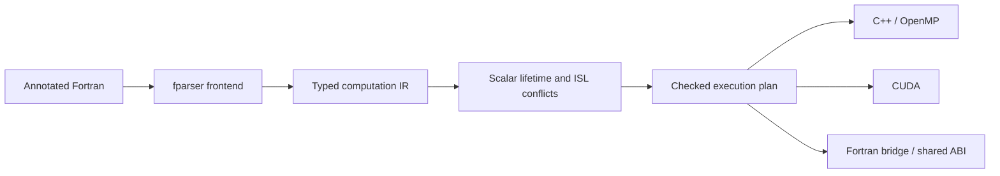

# Fortran-to-CUDA/C++ compiler

The compiler lowers annotated Fortran into an immutable computation IR, proves
that each loop nest can execute independently with `islpy`, and emits C++, CUDA,
and a Fortran bridge from the same ordered execution plan.



Each source nest remains a separate region. Scalar host blocks and regions retain
source order. There is no fusion, tiling, automatic scheduling, persistent device
storage, legacy pipeline switch, or sequential fallback for rejected regions.
See [CODE_MAP.md](CODE_MAP.md) for the implementation and extension points.

## Quick start

Run from the repository root with Python 3.10 or newer:

```bash
python -m pip install -r requirements.txt
python -m compiler --input fortran-stencils/elmm_cdu.f90 --kernel CDU --output-dir out --verbose
```

Runtime dependencies include `fparser` and **`islpy==2026.2.2`**. Generated C++ uses
C++17; add `-fopenmp` to enable its verified OpenMP loops. Compile without that
flag for serial execution of the same generated implementation. CUDA uses one
kernel per accepted source nest, 256 threads per block, and maps the innermost
index first. Empty domains skip the launch. CDU, CDV, and CDW each produce four
CUDA kernels.

## CLI and outputs

```bash
python -m compiler --input FILE --kernel NAME [options]
```

| Option | Default | Meaning |
| --- | --- | --- |
| `--input`, `-i` | required | Annotated Fortran source file |
| `--kernel`, `-k` | required | Entry subroutine, matched case-insensitively |
| `--output-dir`, `-o` | current directory | Destination directory |
| `--cuda-output` | `generated_code.cu` | CUDA kernels and host C wrapper |
| `--cpp-output` | `generated_cpp_impl.cpp` | C++ implementation with OpenMP annotations |
| `--fortran-output` | `generated_interface.f90` | Original module/procedure interface using `iso_c_binding` |
| `--common-header` | `common_functions.cuh` | Shared indexing and timing header |
| `--no-common-header` | off | Use a separately supplied shared header |
| `--verbose`, `-v` | off | Normalized IR, region boundaries, scalar privacy, ISL relations, and legality results |

The ABI preserves the original dummy argument order, public names, and
`cpp_<procedure>` C symbol. Array extents follow their array pointer in dimension
order. The generated bridge keeps `knd` mapped to binary64 and retains
`start_hot`/`finish_hot` timing hooks. These three public names are reserved for
that generated API. All sources are generated and validated before destination
files are written; an unsupported or unsafe input leaves existing outputs intact.

CUDA allocates device arrays, uploads `intent(in)` and `intent(inout)` data,
executes ordered launches, downloads outputs, and frees device arrays on each
wrapper call. `USE_PINNED_MEMORY` retains the existing optional pinned-memory
mode. Unwritten `intent(inout)` cells are preserved. Unwritten portions of
`intent(out)` arrays have no promised values.

## Supported Fortran subset

The first line must be `! kernels`. Each reachable subroutine must be annotated
with `! kernel` in the same module:

```fortran
! kernels
module example
  implicit none
  integer, parameter :: knd = kind(1.0d0)
contains
  ! kernel
  subroutine scale(a, factor, n)
    real(knd), intent(inout) :: a(:)
    real(knd), intent(in) :: factor
    integer, intent(in) :: n
    integer :: i
    real(knd) :: tmp
    do i = 1, n
      tmp = a(i) * factor
      a(i) = tmp
    end do
  end subroutine scale
end module example
```

- Default `integer` and `real(knd)` scalars; scalar dummy arguments require
  `intent(in)`.
- Rank 1–3 `real(knd)` dummy arrays with assumed shape `(:)`, `(:,:)`, or
  `(:,:,:)`, and explicit `intent(in/out/inout)`. `contiguous` is accepted.
- Perfect rectangular loop nests of depth 1–3, with omitted or explicit literal
  `+1` stride and straight-line innermost assignments.
- Scalar host assignments before, between, or after nests, and proven private
  per-iteration temporaries. Every private read must follow a definition in that
  iteration; its value must be unused after the region.
- Grouped arithmetic `+`, `-`, `*`, `/`, unary signs, integer/real literals, and
  `SIZE(array, literal_dimension)`. Default real literals retain their single
  precision; `D` exponent and `_knd` literals use binary64.
- Affine bounds/subscripts built from constants, invariant integers, array
  extents, and constant coefficients; only subscripts may use loop indices.
  A host-computed integer such as `limit = n / 2` can be captured as an invariant
  parameter. Direct non-affine bounds or per-iteration non-affine indices reject.
- Positional calls with whole-variable arguments to annotated helpers. Inlining
  creates fresh local identities per call and resolves formal arguments to the
  caller's existing storage. Fortran names are case-insensitive.

Branches, reductions, carried scalars, scalar live-outs, final induction values,
non-unit strides, nonrectangular or changing bounds, indirect indexing, local
arrays, writable scalar arguments, recursion, slices/expression call arguments,
other intrinsics/operators, explicit lower array bounds, and unsupported
specification statements reject with a source location. Arrays can be accessed
only inside loop regions; host blocks contain scalar computations.

## Legality and caller contract

For each region the analyzer constructs statement iteration domains,
multidimensional read/write access maps, and the original lexical schedule. It
composes access maps to find ordered read-after-write (RAW), write-after-read
(WAR), and write-after-write (WAW) conflicts. Every conflicting pair must have
identical **complete iteration coordinates**, including all dimensions mapped to
CUDA threads. Ordered same-cell updates within one iteration are accepted;
neighbor-dependent in-place updates and inner-loop recurrences reject.

A dependence error includes source/call provenance, affected accesses, the
symbolic conflict relation, and a concrete conflicting-iteration witness.
Independent regions execute in original order, honoring cross-region dependencies.

Distinct array arguments must not overlap whenever either is written. The
compiler does not perform runtime overlap checks. Repeated actual arguments in
an inlined helper retain shared identity and are analyzed as aliases. Callers
must provide valid extents and sufficient storage for every accessed index;
general bounds checking and broader Fortran semantics are outside this subset.

## Development and validation

```bash
python -m venv .venv
source .venv/bin/activate
python -m pip install --upgrade "pip>=25.1"
python -m pip install --group ./compiler/pyproject.toml:dev

python -m pytest compiler/tests
python -m ruff check compiler
python -m ruff format --check compiler
```

Tests cover lowering, source ordering, inline aliases, scalar lifetimes, ISL
relations against brute-force ordered accesses, rejection without publication,
and deterministic generation. Native tests compile and compare original Fortran,
generated serial C++, OpenMP, and CUDA using deterministic nonuniform inputs and
absolute tolerance `1e-10`. They cover fill/scale, non-cubic/singleton/empty
domains, sentinel halos, and CDU/CDV/CDW. Native compiler absence skips the
corresponding capability; CUDA compilation requires `nvcc`, and execution also
requires a usable device. Once those capabilities are available, build or runtime
failures fail the tests. All builds and outputs use temporary directories.

```bash
# Parser/analysis checks without native builds:
python -m pytest compiler/tests -m "not native and not cuda"
```
