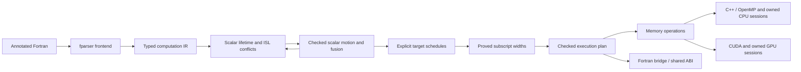

# Fortran-to-CUDA/C++ compiler

The compiler lowers annotated Fortran into immutable computation IR, validates
types and definite definitions, proves loop independence with `islpy`, and emits C++, CUDA,
and a Fortran bridge from checked execution, scheduling, addressing, and memory plans.



Proved scalar motion and loop fusion are enabled by default. Equal rectangular
loop domains fuse only when fresh dependence analysis proves the combined region
independent; inconclusive candidates retain their original passes. A rectangular
perfect prefix maps to parallel iterations; its remaining ordered body can contain
assignments, conditionals, and sequential inner loops. `--opt-level 0` retains the
source regions, source indexing, and source axis order unless overridden by
`--indexing` or `--schedule`. Automatic
axis ordering favors Fortran locality; spatial tiling is explicit through
`--tile-sizes`. Strict parallelization is the default; `--fallback host` executes
valid regions whose independence is unproved sequentially on the host. Explicit
sessions retain owned storage across calls, using the same Fortran interface for
CPU and CUDA backends.
See [CODE_MAP.md](CODE_MAP.md) for the implementation and extension points.

## Implementation layout

The only Python modules at the package root are the package marker and
`python -m compiler` entry point. Implementation code is grouped by pipeline stage:

```text
compiler/
├── driver/                  CLI, pipeline orchestration, output publication
├── frontend/                Fortran parsing and lowering
├── ir/                      Immutable computation nodes and execution plans
├── analysis/                Semantics, effects, dependence proofs, execution policy
├── transforms/              Checked scalar setup motion and greedy loop fusion
├── scheduling/              Locality ordering and explicit spatial tile plans
├── addressing/              Static integer ranges and proved subscript widths
├── memory/                  Explicit acquisition, coherence, and lifecycle plans
├── runtime/                 Numeric helpers, profiling, owned buffers, token registry
├── emission/
│   ├── driver.py            Generate all sources from one shared ABI
│   ├── common/              ABI, expressions, loops, session glue, runtime header
│   ├── c/                   C declarations and serial/OpenMP C++ generation
│   ├── cuda/                Device kernels, launches, memory-plan execution
│   └── fortran/             C bindings, public bridge, workspace procedures
├── tests/                   Python and native acceptance tests
└── debugging/               Standalone fparser tree viewer
```

The frontend and analyzer depend on the IR. Emitters consume the IR and checked
plans without importing fparser or ISL. `emission/driver.py` derives the memory plan
after scheduling and addressing, and shared session glue renders buffer ownership through the
runtime. Shared emission helpers do not import backends; each backend owns its language-specific rendering. The runtime
header combines the template under `emission/common/templates/` with numeric,
profiling, and storage units in `runtime/`, preserving a single distributable
support header and `--common-header` behavior.

Package entry points remain `compiler.frontend.lower_file`,
`compiler.analysis.build_execution_plan`, and `compiler.emission.generate_sources`.
`compiler.driver.pipeline.prepare_function(function, *, options=CompilerOptions())`
returns the optimized function and freshly checked plan with schedules and addressing decisions. The immutable
`CompilerOptions` in `compiler.driver.options` is shared by this pipeline and the
CLI; direct calls to `build_execution_plan` keep their existing analysis behavior.
Emitters accept these unscheduled plans using source axis order and source indexing. Schedule and addressing records
remain independent of fparser and ISL.

## Quick start

Run from the repository root with Python 3.10 or newer:

```bash
python -m pip install -r requirements.txt
python -m compiler --input fortran-stencils/elmm_cdu.f90 --kernel CDU --output-dir out --verbose
```

Runtime dependencies include `fparser` and **`islpy==2026.2.2`**. Generated C++ uses
C++17; add `-fopenmp` to enable its verified OpenMP loops. Compile without that
flag for serial execution of the same generated implementation. CUDA uses one
kernel per accepted region and 256 threads per block. Axis order comes from the
schedule; bounded grids use grid-stride iteration to cover larger domains. Empty
domains skip the launch. CDU, CDV, and CDW each produce one CUDA kernel by default
and four with `--opt-level 0`.

## CLI and outputs

```bash
python -m compiler --input FILE --kernel NAME [options]
```

| Option | Default | Meaning |
| --- | --- | --- |
| `--input`, `-i` | required | Annotated Fortran source file |
| `--kernel`, `-k` | required | Entry subroutine, matched case-insensitively |
| `--output-dir`, `-o` | current directory | Destination directory |
| `--cuda-output` | `generated_code.cu` | CUDA kernels and host C wrapper |
| `--cpp-output` | `generated_cpp_impl.cpp` | C++ implementation with OpenMP annotations |
| `--fortran-output` | `generated_interface.f90` | Original module/procedure interface using `iso_c_binding` |
| `--common-header` | `common_functions.cuh` | Shared indexing, numeric, storage, and timing header |
| `--no-common-header` | off | Use a separately supplied shared header |
| `--opt-level {0,1}` | `1` | Enable proved scalar motion, fusion, and wide addressing; `0` retains source passes |
| `--schedule {source,auto}` | `auto` at level 1, `source` at level 0 | Select axis ordering independently of fusion |
| `--indexing {source,auto}` | `auto` at level 1, `source` at level 0 | Select source INTEGER addressing or statically proved wide subscripts independently of fusion and scheduling |
| `--tile-sizes N[,N...]` | untiled | Positive tile sizes in scheduled fastest-to-slowest order; omitted axes use 1 |
| `--fallback {error,host}` | `error` | Reject unproved regions or run them sequentially on the host |
| `--verbose`, `-v` | off | Normalized IR, applied/skipped transformations, schedules, indexing decisions and reasons, region boundaries, scalar privacy, ISL relations, legality results, and memory operations |

The ABI preserves the original dummy argument order, public names, and
`cpp_<procedure>` C symbol. Array extents follow their array pointer in dimension
order. The generated bridge keeps `knd` mapped to binary64 and retains
`start_hot`/`finish_hot` timing hooks. Profiling starts disabled: `start_hot` resets
and enables collection, and `finish_hot` reports and disables it. Ordinary
execution creates no profiling events or phase-by-phase profiling barriers.
Profiled public CUDA calls serialize through a shared profiling lock. Unprofiled
calls do not take that lock. The timing hooks delimit quiescent batches: start
profiling before starting concurrent callers and join them before finishing it.
`calls` counts entry runs, including empty and host-only runs; `kernel_launches`
counts actual launches. Kernel time excludes host execution and transfers.
These three public names are reserved for that generated API. All sources are generated and validated before destination
files are written; an unsupported or unsafe input leaves existing outputs intact.

The ordinary CUDA wrapper creates private owned state, uploads `intent(in)` and
`intent(inout)` data, executes the memory plan, downloads outputs, and releases the
state on each call. Ordinary calls do not use the session token registry, so
independent concurrent callers have independent storage. Ordinary calls remain
synchronous and host-visible. On supported CUDA devices, a private memory pool
reuses device allocation backing across calls; each call still transfers fresh
inputs and outputs. `USE_PINNED_MEMORY`
enables optional pinned-memory support. Host array reads and writes between launches synchronize affected arrays:
a read sees previous device updates, and a partial host write preserves other
device-produced cells before uploading the changed array. Array-valued launch
bounds and strides also see previous device writes. These extra transfers are
included in timing hooks. Unwritten `intent(inout)` cells are preserved. Unwritten portions of
`intent(out)` arrays have no promised values.

## Memory planning and runtime

`compiler.memory.plan_memory(plan, parameters, *, acquisition_policy=None)` derives immutable acquisition,
caller uploads/downloads, host/device access, execution, write-invalidation, synchronization, and release
operations from an execution plan. It preserves conditional branches, counts
predicate and array-valued launch-bound reads, and requests current contents before
partial writes. `format_memory` describes these operations independently of
emission. Host/device access operations represent conditional transfers: a storage
runtime decides whether its current ownership state requires a copy.
Explicit uploads/downloads always transfer the selected caller arrays. Before
emission, `validate_memory` checks operation payloads, phase placement, array
ownership, and complete acquisition, input upload, output retrieval, and release.
Unsupported operations fail instead of being silently skipped.
Acquisition policy is `dedicated` or `pooled`; omitted metadata preserves dedicated
allocation. Default generation supplies dedicated session plans and pooled ordinary
CUDA plans. Explicit `generate_cuda(..., memory=...)` plans remain authoritative
for both APIs unless `ordinary_memory=` supplies a separate ordinary lifecycle.
Helpers are shared only when their operation sequences match.

`runtime/storage.hpp` provides owned fixed-shape CPU/CUDA buffers, lazy CUDA host
mirrors, selective updates, checked extent/byte products, scoped pinned-memory
registration, and a registry that diagnoses invalid or stale tokens. Buffers retain
no caller pointers. `runtime/allocation.hpp` owns dedicated and pooled CUDA
allocations separately from coherence state; `runtime/timing.hpp` contains opt-in
profiling. These units are assembled into the existing support header and tested
with instrumented CUDA calls.

Emission renders every lifecycle operation, including synchronization without an
array payload. State starts with empty buffer slots and fixed extent metadata;
planned acquisition constructs buffers and planned release destroys them, with
RAII as a cleanup backstop. Shared state helpers implement ordinary CUDA calls
and explicit sessions; the registry only owns states and validates tokens.
Host statements, branches, fallback regions, and array-valued launch bounds share
the coherence path. CPU sessions consume the same memory operations with both
address spaces mapped to owned host buffers; ordinary C++ calls use direct lowering.
Verbose output displays the
memory operations for both lifecycles; `FORT_RUNTIME_TRACE=1` logs successful GPU
allocation requests, transfers, kernel launches, and releases, with additional
events identifying pool operations. Allocation-request counts do not measure
physical backing allocations: native pool requests still occur on warm calls.

### Ordinary CUDA allocation reuse

Ordinary CUDA calls acquire exclusive allocations from a lazily created private
pool for the calling thread's current device. Generated entries share the pool,
but each call constructs fresh buffer state, shapes, and coherence flags. Host
mirrors and caller pointers are never cached. Explicit workspaces retain dedicated
allocations. Neither the application's current/default pool nor CPU allocation
behavior is changed.

`FORT_CUDA_POOL_BYTES` sets the pool release threshold in unsigned decimal bytes;
the default is `268435456` (256 MiB) per device. The setting is read once on first
pool use. `0` disables reuse and restores ordinary `cudaMalloc`/`cudaFree` behavior,
allowing comparisons with the same generated binary. Invalid or overflowing values
are diagnosed. The threshold is a retention target, not a hard memory limit;
newly freed memory can remain above it until another synchronization. Pooling is
independent of optimization level, schedules, and indexing mode. Toolkits before
CUDA 11.2, incompatible drivers, and devices without pool support use dedicated
allocation; other CUDA failures are not hidden by fallback.

Allocation uses `cudaMallocFromPoolAsync` on the existing default stream. Planned
destruction synchronizes before `cudaFree`, so completed storage can be reused
without adding a final asynchronous-free barrier. Exceptional pooled-buffer
cleanup synchronizes before freeing. Zero-sized buffers do not initialize a pool.

Each generated module also exports `<entry>_trim_cache()` (with the same collision
and length handling as workspace names). After joining ordinary callers, call it
to destroy this runtime's private pool on the current device. The next ordinary
call recreates the pool. It diagnoses outstanding pooled leases and is a no-op
for CPU implementations and absent pools. Sessions remain valid and no outputs
are retrieved. Release the cache before device reset, external context teardown,
or unloading generated code; the runtime performs no CUDA work in static
destructors. Pools otherwise remain available until process termination.

Profiling includes allocation/release requests and lazy pool setup under the
existing timing labels. `start_hot` and `finish_hot` do not clear the cache.
Measure cold and warm calls separately; use pool backing statistics or an
instrumented allocator to verify reuse, and wall-clock timings to measure its
effect. Unprofiled calls create no profiling events or profiling barriers.

## Persistent workspaces

Each entry gains an additive workspace API. For example, the CDU module exports:

```fortran
type(CDU_workspace) :: work
call CDU_create(work, U2, U, V, W)
do iteration = 1, niter
  call CDU_run(work, dxmin, dymin, dzmin, NX, NY, NZ)
end do
call CDU_update_host(work, U2=U2)
call CDU_destroy(work)
```

`create` takes all original arrays in dummy order, owns fixed-shape storage,
and copies only `in`/`inout` data. `run` takes the original scalar arguments in
dummy order. Neither retains caller addresses. `update_device(work, U=U)`
publishes a complete replacement for a selected slot; `update_host` retrieves
selected slots. Both accept optional array keywords, require matching shapes,
and complete borrowed-pointer transfers before returning. Ordinary host writes
are not automatically visible to resident execution.

CUDA runs may enqueue work on the default stream. Updates, destruction, and
profiling boundaries synchronize. Host blocks and fallback use lazy owned host
mirrors and the same coherence plan. C++ implements the same API using owned
host buffers, allowing the Fortran module to link with either backend.

Workspaces use validated opaque tokens. Assignment aliases a session; destroying
one alias invalidates the others. Creating into a live workspace and using stale
tokens are errors. Destroying an empty workspace is a no-op and does not retrieve
outputs. There is no automatic finalizer. Sessions are per entry, fixed-shape,
and exclude concurrent use or cross-entry buffer sharing. Long/colliding API names
receive deterministic shortened names in the generated interface.

Profiling starts disabled. `start_hot` synchronizes, clears measurements, and
enables recording; `finish_hot` synchronizes, prints the existing timing summary,
and disables recording. `FORT_RUNTIME_TRACE=1` separately logs successful CUDA
allocations, transfers, launches, and releases to stderr for validation.

## Supported Fortran subset

The first line must be `! kernels`. Each reachable subroutine must be annotated
with `! kernel` in the same module:

```fortran
! kernels
module example
  implicit none
  integer, parameter :: knd = kind(1.0d0)
contains
  ! kernel
  subroutine scale(a, factor, n)
    real(knd), intent(inout) :: a(:)
    real(knd), intent(in) :: factor
    integer, intent(in) :: n
    integer :: i
    real(knd) :: tmp
    do i = 1, n
      tmp = a(i) * factor
      a(i) = tmp
    end do
  end subroutine scale
end module example
```

- Default `integer` (signed 32-bit), default `real` (binary32), and `real(knd)` (binary64)
  scalars and assumed-shape dummy arrays. Array rank and loop nesting depth
  follow native Fortran language/compiler limits.
  Integer literal tokens must fit before applying unary signs: `-2147483648`
  rejects, while `(-2147483647-1)` is valid. Constant integer operations check
  every intermediate result, including division by zero and `ABS(INT_MIN)`.
  Unknown runtime values retain the existing arithmetic and ABI.
- Explicit `intent(in/out/inout)` arrays. Omitted array intent is conservatively
  treated as `inout`; omitted scalar intent is treated as read-only input. Scalar
  argument writes remain unsupported. `contiguous` and `target` are accepted;
  pointers remain unsupported.
- Counted `do` loops with positive or negative integer strides, including
  invariant runtime stride expressions. Constant zero strides reject; a runtime
  zero stride diagnoses at loop entry. Empty domains do not launch.
- Perfect and imperfect nests. The analyzer maps a rectangular perfect prefix;
  assignments and remaining inner loops execute in their original order within
  each parallel iteration. Bounds may depend on outer indices in retained loops.
  Fusion retains the ordered body of each original mapped iteration.
- Host scalar and array element assignments before, between, or after nests.
  Private temporaries must be defined before each read in the mapped iteration
  and unused after the region. Retained sequential loops may carry a scalar
  initialized within that iteration; their final induction values are available
  within the iteration too.
- Grouped arithmetic `+`, `-`, `*`, `/`, unary signs, integer/real literals,
  `SIZE(array, literal_dimension)`, and `SIZE(array)` total element counts.
  Default real literals retain single precision; `D` exponent and `_knd`
  literals use binary64.
- Affine access relations and constant-stride congruences are modeled exactly.
  Invariant non-affine bounds are captured as symbolic parameters. Unknown
  subscript coordinates are conservatively unconstrained, allowing read-only
  indirect gathers and writes whose other coordinates already distinguish
  parallel iterations. Identical squared affine subscripts, such as `a(i*i)`,
  receive a simple injectivity proof when every access shares that expression
  and its operand is proven nonnegative or nonpositive throughout the region.
- Positional whole-variable calls to annotated helpers. Inlining creates fresh
  locals per call and preserves actual storage identities and case-insensitive
  Fortran name resolution.

Local arrays, logical arrays, writable scalar arguments, recursion, slices/expression
call arguments, other intrinsics/operators, explicit lower array bounds, and
unsupported specification statements reject with a source location.
Parallel reductions remain unsupported. Initialized scalar recurrences, valid
scalar live-outs, final induction values, and otherwise unproved regions can
execute sequentially with `--fallback host`. General nonlinear or indirect writes
are parallelized only when conservative relations prove independence; no runtime
alias or index-uniqueness checks are introduced.

### Conditions and scalar intrinsics

Scalar `LOGICAL` values, logical literals/operators, numeric comparisons, block
and single-line `IF`, `ELSEIF`, and `ELSE` are supported. Definitions after a branch
must be valid on every path. Host branches use recursive execution plans, and
device predicates participate in conservative dependence analysis. CUDA preserves
host/device coherence when entering and leaving host branches. Logical scalar
arguments are explicitly converted to `logical(c_bool)` by the Fortran bridge.

Scalar `ABS`, `MIN`, `MAX`, and `SQRT` preserve supported numeric kinds and
arithmetic grouping. `MIN`/`MAX` require at least two arguments of the same type;
`SQRT` requires a real argument. Numeric helpers emit and evaluate each argument
once. Logical arrays and other intrinsics remain unsupported.

Semantic validation and definite definitions live in `analysis/semantics.py`;
structural effects live in `analysis/effects.py`; `analysis/planning.py` builds
execution plans according to the selected fallback policy. Intrinsic signatures
live in `ir/intrinsics.py`; `runtime/numeric.hpp` is assembled into the existing
shared support header.

## Legality and caller contract

For each region the analyzer constructs statement iteration domains,
multidimensional read/write access maps, and the original lexical schedule. It
composes access maps to find ordered read-after-write (RAW), write-after-read
(WAR), and write-after-write (WAW) conflicts. Every conflicting pair must have
identical **mapped iteration coordinates**, including every dimension assigned
to CUDA threads. Ordered same-cell updates and recurrences inside retained
sequential loops are accepted within one mapped iteration. Conflicts between
mapped iterations reject by default or select sequential host fallback when
requested. A perfect rectangular nest maps all its dimensions; an inner
recurrence in such a mapped nest requires host fallback.

A dependence error includes source/call provenance, affected accesses, the
symbolic conflict relation, and a conflicting-iteration witness. Embedded
single-line actions inherit their enclosing source span while retaining inline
call stacks. If unknown indices, variable-stride congruences, or branch effects
without predicate constraints widen the model, successful reports and conflict
diagnostics label the dependence model conservative. A conservative conflict
witness shows why independence could not be proved, rather than promising a
collision for every caller's runtime data.
Branch-free affine models remain exact; proofs do not split paths by predicates.
`--verbose` also displays exact/conservative modeling and retained loop counts.
Unfused regions execute in original order, honoring cross-region dependencies.

### Checked fusion

The pipeline first proves source regions independently. Greedy fusion then matches
equal rectangular domains with constant nonzero strides and scalar/extent-only
bounds, substituting iterator identities without regrouping expressions. Same-point
operations retain their order. Fresh analysis must prove that combining the bodies
introduces no conflicts between parallel iterations; shifted RAW, WAR, or WAW
conflicts keep the passes separate. Conservative non-affine models may prevent
fusion even when each original region is independently legal.

Intervening scalar setup can move before the first pass only when its inputs are
available and unchanged and its destinations are unused by the crossed loop. Array
accesses never move. Scalar lifetimes, bound snapshots, symbol identities, and
source provenance are preserved. Fusion stays inside each host branch. Invalid
source remains a compilation error; an inconclusive optimization keeps its original
form. Verbose reports explain each applied or skipped candidate.

### Scheduling and explicit tiles

Scheduling follows legality analysis and fusion. `RegionSchedule` records axis
order, optional tile sizes, and CUDA thread count; emitters render those choices.
Automatic ordering scores unit-stride accesses in Fortran storage order, weighting
writes twice as heavily as reads. Unknown accesses receive no locality credit,
and ties keep original innermost-first order. `--schedule source` preserves that
order; either explicit schedule choice overrides the optimization-level default.

For example, `--schedule auto --tile-sizes 32,4` sets sizes for the two fastest
scheduled axes; remaining axes use size 1. The compiler rejects specifications
longer than the maximum mapped rank. Omitting `--tile-sizes` keeps execution
untiled; no default tile size is selected.

Bounds are captured in source order, with inner bounds suppressed when an outer
loop is empty. The schedule reorders ordinal coordinates and reconstructs signed
Fortran indices. CPU emission parallelizes a flattened tile loop and executes
points sequentially inside each tile. CUDA maps tiles to blocks and distributes
points across threads, including tiles larger than a block, with guards for tile
tails. Flattened tile coordinates support arbitrary rank. Iteration products are
checked for overflow before launch, and zero factors suppress spurious overflow
errors for empty domains.

### Checked wide addressing

After scheduling, the addressing planner selects subscript arithmetic that can
use signed 64-bit loop coordinates directly. Static interval proofs must show
that every original intermediate result fits default INTEGER, including division
and integer `ABS`, `MIN`, and `MAX`. Unknown or unsafe arithmetic keeps its
existing lowering; expressions are never reassociated. This is separate from
dependence analysis and does not add runtime guards or additional kernels.

Only mapped iterator ranges are refined, using bounds and signed strides;
constant loops use their exact last executed index. Other integer values retain
the full signed 32-bit range. There is no branch-sensitive or assignment-based
refinement. Bound arithmetic without a safe range proof contributes an unknown
INTEGER snapshot. Neither array extents nor valid accesses imply tighter scalar
bounds. For example, a loop beginning at 2 with an unknown upper INTEGER bound
can use wide `i` and `i-1` subscripts, while `i+1` retains source arithmetic.

Each complete subscript is selected independently, including nested array
accesses. Shared C++/CUDA rendering consumes the plan and preserves scalar
INTEGER arithmetic, the ABI, `SIZE` conversions, and integer array-load values.
Loop-bound snapshots, retained-loop headers, host statements, and sequential
fallback remain unchanged. Source-order bound evaluation and empty-loop
suppression are preserved. No array bounds checks are introduced.

Use `--indexing source` and `--indexing auto` with the same optimization level,
schedule, and tiles to measure addressing independently. Both choices override
the optimization-level default. Plans constructed without addressing metadata
use source indexing. Verbose reports count promoted and retained subscript
occurrences and explain decisions; accesses in unchanged loop headers are excluded.

### Sequential host fallback

`--fallback error` keeps strict parallelization. `--fallback host` permits otherwise
valid regions with unproved independence, initialized recurrences, or scalar
live-outs to run in source order. Proved neighboring regions stay parallel, and
fusion never crosses a fallback region. Verbose output identifies each sequential
region and its proof-failure reason.

The execution plan represents these loops as `SequentialRegion` nodes. Shared
loop lowering preserves signed and runtime strides, empty domains, final induction
values, and scalar state. Analysis discards obsolete scalar substitutions before
proving later regions. CUDA synchronizes affected arrays before host execution and
uploads host writes before later device work; partial writes preserve other cells.

Fallback is an execution policy after semantic validation. Undefined scalar reads,
invalid types, unsupported constructs, zero-stride errors, and internal failures
remain errors. It does not implement parallel reductions.

Distinct array arguments must not overlap whenever either is written. The
compiler does not perform runtime overlap checks. Repeated actual arguments in
an inlined helper retain shared identity and are analyzed as aliases. Callers
must provide valid extents and sufficient storage for every accessed index;
general bounds checking and broader Fortran semantics are outside this subset.

## Development and validation

```bash
python -m venv .venv
source .venv/bin/activate
python -m pip install --upgrade "pip>=25.1"
python -m pip install --group ./compiler/pyproject.toml:dev

python -m pytest compiler/tests
python -m ruff check compiler
python -m ruff format --check compiler
```

Tests cover lowering, source ordering, inline aliases, scalar lifetimes, ISL
relations against brute-force ordered accesses, rejection without publication,
and deterministic generation. Fusion tests cover scalar motion, shifted conflicts,
unequal domains, conservative accesses, branch boundaries, and signed-stride small
domains compared with source execution. Scheduling tests execute serial/OpenMP
and simulated CUDA coordinate maps for signed strides, tile tails, oversized
tiles, and arbitrary rank; CUDA launches are also compiled with nvcc when available.
Native tests exercise both optimization
levels and compile and compare original Fortran,
generated serial C++, OpenMP, and CUDA using deterministic nonuniform inputs and
absolute tolerance `1e-10` for real values and exact comparison for integers.
Coverage includes fill/scale, non-cubic/singleton/empty domains, sentinel halos,
CDU/CDV/CDW, signed/runtime strides, rank-5 integer arrays, rank-15 bridge
compilation, imperfect nests, fresh host/device values, indirect gathers,
squared indices, and default-real arithmetic. Fallback tests cover recurrences,
scalar live-outs, final induction values, neighboring parallel regions, and CUDA
host/device transitions; invalid source is checked under both execution policies.
Runtime tests also check CPU ownership, selective host/device coherence, pinned
registration lifetimes, stale tokens, shape/size errors, and profiling events with
instrumented CUDA calls. Session tests cover temporary inputs, changed scalars,
selective updates, multiple workspaces, aliases, and lifecycle errors. Generated
CUDA sessions are also executed with a simulated runtime to check exact transfer
counts without a GPU. Resident fallback and logical arguments are compared with
original Fortran across serial C++, OpenMP, and simulated CUDA.
Pool tests distinguish allocation requests from backing reuse, exercise concurrent
callers on multiple simulated devices, and check fallback, cleanup failures,
retention settings, and unchanged transfers. Native pool tests compile both CUDA
default-stream modes; when hardware is available they check retained backing and
cache release/reset, and record cold/warm timings without performance thresholds.
Native compiler absence skips the corresponding capability;
CUDA compilation requires `nvcc`, and execution also requires a usable device. Once
those capabilities are available, build or runtime failures fail the tests. All builds and outputs use temporary directories.

```bash
# Parser/analysis checks without native builds:
python -m pytest compiler/tests -m "not native and not cuda"
```
