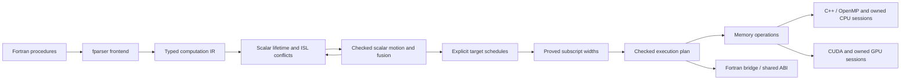

# Fortran-to-CUDA/C++ compiler

The compiler lowers selected Fortran procedures into immutable computation IR, validates
types and definite definitions, proves loop independence with `islpy`, and emits C++, CUDA,
and a Fortran bridge from checked execution, scheduling, addressing, and memory plans.



Proved scalar motion and loop fusion are enabled by default. Equal rectangular
loop domains fuse only when fresh dependence analysis proves the combined region
independent; inconclusive candidates retain their original passes. A rectangular
perfect prefix maps to parallel iterations; its remaining ordered body can contain
assignments, conditionals, and sequential inner loops. `--opt-level 0` retains the
source regions, source indexing, and source axis order unless overridden by
`--indexing` or `--schedule`. Automatic
axis ordering favors Fortran locality; spatial tiling is explicit through
`--tile-sizes`. Strict parallelization is the default; `--fallback host` executes
valid regions whose independence is unproved sequentially on the host. Explicit
sessions retain owned storage across calls, using the same Fortran interface for
CPU and CUDA backends.
See [CODE_MAP.md](CODE_MAP.md) for the implementation and extension points.

## Implementation layout

The only Python modules at the package root are the package marker and
`python -m compiler` entry point. Implementation code is grouped by pipeline stage:

```text
compiler/
├── driver/                  CLI, pipeline orchestration, output publication
├── frontend/                Fortran parsing and lowering
├── ir/                      Immutable computation nodes and execution plans
├── analysis/                Semantics, effects, dependence proofs, execution policy
├── transforms/              Checked scalar setup motion and greedy loop fusion
├── scheduling/              Locality ordering and explicit spatial tile plans
├── addressing/              Static integer ranges and proved subscript widths
├── memory/                  Explicit acquisition, coherence, and lifecycle plans
├── scopes/                  Bounded source scopes, native hooks, original-module clones
├── runtime/                 Numeric helpers, profiling, owned buffers, token registry
├── emission/
│   ├── driver.py            Generate all sources from one shared ABI
│   ├── common/              ABI, expressions, loops, session glue, runtime header
│   ├── c/                   C declarations and serial/OpenMP C++ generation
│   ├── cuda/                Device kernels, launches, memory-plan execution
│   └── fortran/             C bindings, public bridge, workspace procedures
├── tests/                   Python and native acceptance tests
└── debugging/               Standalone fparser tree viewer
```

The frontend and analyzer depend on the IR. Emitters consume the IR and checked
plans without importing fparser or ISL. `emission/driver.py` derives the memory plan
after scheduling and addressing, and shared session glue renders buffer ownership through the
runtime. Shared emission helpers do not import backends; each backend owns its language-specific rendering. The runtime
header combines the template under `emission/common/templates/` with numeric,
profiling, and storage units in `runtime/`, preserving a single distributable
support header and `--common-header` behavior.

Package entry points remain `compiler.frontend.lower_file`,
`compiler.analysis.build_execution_plan`, and `compiler.emission.generate_sources`.
`compiler.driver.pipeline.prepare_function(function, *, options=CompilerOptions())`
returns the optimized function and freshly checked plan with schedules and addressing decisions. The immutable
`CompilerOptions` in `compiler.driver.options` is shared by this pipeline and the
CLI; direct calls to `build_execution_plan` keep their existing analysis behavior.
Emitters accept these unscheduled plans using source axis order and source indexing. Schedule and addressing records
remain independent of fparser and ISL.

## Quick start

Run from the repository root with Python 3.10 or newer:

```bash
python -m pip install -r requirements.txt
python -m compiler --input fortran-stencils/elmm_cdu.f90 --kernel CDU --output-dir out --verbose
```

`! kernels` and `! kernel` markers are optional. Select a module subroutine with
`--kernel NAME`, or `--kernel MODULE::NAME` when several modules contain the same
name. Reachable helpers in the same module are discovered and inlined without
markers; unrelated unsupported routines remain untouched. The input must still
parse as Fortran 2008. Use `--require-markers` for the previous strict selection
contract, including markers on every reachable helper.

Inspect candidates without generating files:

```bash
python -m compiler --input ordinary.f90 --list-candidates --json
```

The list reports every module subroutine, its marker status, and either successful
generation eligibility or a rejection reason with source location. It runs the
same semantic, dependence, scheduling, and emission checks as normal compilation,
under the selected options. A rejected procedure is not a promise of automatic
host fallback; the application integration must retain its native implementation.
The Python `discover_file(path)` API reports the narrower frontend result in
`ProcedureCandidate.lowerable`; callers must still run `prepare_function` and
`generate_sources`. `lower_file(path, entry, require_markers=False)` preserves
explicit entry selection and supports the same module qualification.

Normal generation also accepts `--json`:

```bash
python -m compiler --input ordinary.f90 --kernel advance --fallback error \
  --output-dir out --json
```

Its stdout is one object with `kernel`, `supported`, `reason`, and `outputs`.
Successful generation additionally reports `parallel_regions` (including kernels
in conditional branches), `execution_plan`, and the ordinary pooled-call
`memory_plan`. The last two fields reuse the existing human-readable plan reports;
they are explanatory text, not serialized compiler IR. `outputs` lists the files
published in the output directory. Compilation rejection returns
`supported: false`, a diagnostic `reason`, an empty output list, and a nonzero exit
status; existing output files remain unchanged. With both `--verbose` and `--json`,
verbose diagnostics go to stderr so stdout remains valid JSON. Candidate-list
JSON retains its existing array format.

`supported` describes successful generation under the requested fallback policy.
Integrations that require GPU work should select `--fallback error` and require
`parallel_regions` greater than zero. The compiler proves each parallel region
separately and preserves dependence order between kernels; callers should not
require independent accesses across the entire entry.

Runtime dependencies include `fparser` and **`islpy==2026.2.2`**. Generated C++ uses
C++17; add `-fopenmp` to enable its verified OpenMP loops. Compile without that
flag for serial execution of the same generated implementation. CUDA uses one
kernel per accepted region and 256 threads per block. Axis order comes from the
schedule; bounded grids use grid-stride iteration to cover larger domains. Empty
domains skip the launch. CDU, CDV, and CDW each produce one CUDA kernel by default
and four with `--opt-level 0`.

## CLI and outputs

```bash
python -m compiler --input FILE --kernel NAME [options]
```

| Option | Default | Meaning |
| --- | --- | --- |
| `--input`, `-i` | required | Fortran source file |
| `--kernel`, `-k` | required except when listing | Entry subroutine or `module::name`, matched case-insensitively |
| `--require-markers` | off | Require legacy file and routine markers |
| `--list-candidates` | off | Report each module procedure's generation eligibility; write no files |
| `--json` | off | Machine-readable candidate list or generation result; verbose diagnostics use stderr |
| `--output-dir`, `-o` | current directory | Destination directory |
| `--cuda-output` | `generated_code.cu` | CUDA kernels and host C wrapper |
| `--cpp-output` | `generated_cpp_impl.cpp` | C++ implementation with OpenMP annotations |
| `--fortran-output` | `generated_interface.f90` | Original module/procedure interface using `iso_c_binding` |
| `--common-header` | `common_functions.cuh` | Shared indexing, numeric, storage, and timing header |
| `--no-common-header` | off | Use a separately supplied shared header |
| `--opt-level {0,1}` | `1` | Enable proved scalar motion, fusion, and wide addressing; `0` retains source passes |
| `--schedule {source,auto}` | `auto` at level 1, `source` at level 0 | Select axis ordering independently of fusion |
| `--indexing {source,auto}` | `auto` at level 1, `source` at level 0 | Select source INTEGER addressing or statically proved wide subscripts independently of fusion and scheduling |
| `--tile-sizes N[,N...]` | untiled | Positive tile sizes in scheduled fastest-to-slowest order; omitted axes use 1 |
| `--fallback {error,host}` | `error` | Reject unproved regions or run them sequentially on the host |
| `--gpu-policy {always,sections,auto,chunked,hybrid}` | `always` | Select the ordinary-call transfer and execution prototype |
| `--calibration-profile FILE` | none | Explicit reusable hardware calibration for automatic decisions |
| `--memory-model {call,scoped}` | `call` | Shared-buffer numerical entry prototype with `scoped`; requires sections/auto |
| `--analyze-effects` | off | Bounded native source effects without requiring GPU lowering; writes no artifacts |
| `--form-scopes` | off | Emit bounded serial source scopes, original-module helpers, and public source/build manifests |
| `--scope-facts FILE` | none | Source-hash-bound capture, initialization, and caller facts; requires `--form-scopes` |
| `--source-file FILE` | none | Additional effect-analysis source; repeat for separate modules |
| `--effect-contracts FILE` | none | Versioned explicit contracts for opaque native calls; requires effect analysis |
| `--host-threads N` | `4` | Total host thread budget, including hybrid GPU coordination |
| `--gpu-collective` | off | Require every thread of one existing OpenMP team to call the entry |
| `--verbose`, `-v` | off | Normalized IR, applied/skipped transformations, schedules, indexing decisions and reasons, region boundaries, scalar privacy, ISL relations, legality results, and memory operations |

### Opt-in CPU/GPU policies

`always` keeps the existing whole-array implementation. The alternatives apply
to ordinary calls; explicit-session coherence is unchanged. `sections` copies
physical rectangular read/write footprints synchronously, preserving separate
opposite faces and values in partially written outputs. Unknown sections use
whole-array transfers. Device storage retains the original logical layout.
Contiguous sections use flat copies; pitched rectangles use 2D or 3D copies.
An interior 3D rectangle takes one runtime copy call instead of one per plane;
higher ranks use one 3D copy per remaining coordinate. Transfer estimates count
these same calls. Disjoint faces stay separate and copyback never fills gaps.
Overlapping sections are reduced to an exact disjoint union when worthwhile,
with at most 32 rectangles and 1,024 intersection checks per array/direction.
The same rectangles feed execution, cost estimates, and transfer traces.
Without calibration, deduplication must reduce bytes without adding copy calls.
With calibration, extra calls are allowed only when saved transfer time exceeds
their latency cost. Ties, uncertain arithmetic, and excessive fragmentation
retain the original rectangles; no bounding volume replaces holes or faces.

`auto` compares native units with GPU intervals of up to four adjacent units
and the complete legal group. It retains units before optional fusion, respects
source control flow and synchronization boundaries, and requires a modeled 20% advantage
for GPU work. Dependent intervals execute in order, with host-visible outputs
at interval boundaries. Missing, uncertain, overflowing, or incompatible cost
estimates select native execution.
Conditional work whose count is only an upper bound currently selects native
execution as well; the compiler does not assume that every branch runs.
Entries mixing empty and active units also retain the original native block:
an empty unit can protect an undefined inner bound from the numerical value ABI.
Scalar inputs used only inside conditional branches or potentially empty retained
loops also keep the entry native, as do entirely unused scalar parameters. This
conservative rule applies to the forced `sections` and `chunked` controls too:
their numerical value ABI would otherwise read inputs that native execution can
leave untouched. Conditional holes using constants, indices, or scalar inputs
already required unconditionally remain supported.
For `sections` and `auto`, entries with host preparation additionally admit
local scalar assignments and host branches. Preparation may read scalar inputs,
descriptors, and arrays proved unchanged throughout the entry. Selected GPU
intervals retain their storage across these approved host nodes: inputs transfer
once for the union of active physical sections, and written sections return
before the following CPU interval. Host statements and branches still execute
in source order; each worker receives its current local scalar values.

The public query evaluates only the checked INTEGER/LOGICAL slice needed for
predicates, bounds, and footprints. It checks integer intermediates and immutable
array indices, preserves nested guards, and never computes numerical REAL setup.
REAL-dependent decision expressions, host array writes, preparation reading
arrays written by the entry, and sequential fallback regions remain native.
LOGICAL query conversion is permitted only for inputs unconditionally readable
at entry. Structured queries prove that every live by-value scalar is consumed
on their selected source path before accepting execution; unknown read coverage
retains the original native call. Completely unused scalars receive typed zeros
in the generated numerical bridge, preserving its public signature without
reading the original argument. This structured proof can admit inactive branches
alongside active kernels without exposing protected bounds. The original flat
policy guard rules and chunked/hybrid eligibility remain unchanged.
Public `offload.preparation` reports eligibility and reasons; decision traces
include `FORT_OFFLOAD_ACTIVE` with the ordered original region identities.
GPU intervals execute on the device checked during selection, restoring the
executing host thread's previous device afterward.

These prototypes currently retain unfused source units. The default whole-array
path retains normal compiler fusion, so comparisons can differ in kernel count
as well as transferred bytes.

`chunked` provides an asynchronous GPU-only control. `hybrid` additionally
selects a CPU/GPU split from fixed candidates using the same calibration. Only
entries with proven independent slabs across all grouped kernels qualify;
immutable input halos are allowed. Two pinned/device slots and non-default
streams keep upload, computation, and download ordered per slot. The initial
total pinned-memory budget is 64 MiB. Hybrid reserves one host thread to manage
GPU work, while remaining workers process disjoint CPU slabs. All work and
copyback complete before return. Cross-entry residency and dependent chunk
pipelines remain outside these prototypes.
The runtime retains one completed pair of slots, streams, and events between
calls, reusing sufficient capacity on the same device. Inputs are packed and
uploaded afresh on every call, including after host edits, shape changes, or
reallocation. This is scratch reuse, not cross-entry data residency. Concurrent
calls lease separate pairs; active and idle pinned capacity together remain
within 64 MiB. An incompatible idle pair is evicted before allocating or waiting
for budget. Allocation failure before execution selects native work once.
`FORT_RUNTIME_TRACE=1` reports `scratch_reuse` and its retained capacity.
Compact slabs retain
their complete nonslab dimensions; uploads preserve untouched halo elements
that share those slabs. Synchronous section transfers can omit uploads of
rectangles proved to be completely overwritten.

Create calibration independently of any application:

```bash
python -m compiler.offload.calibrate --output hardware.json \
  --threads 4 --precision 64 --cuda-host-cxx g++-14
python -m compiler --input ordinary.f90 --kernel advance --output-dir out \
  --gpu-policy auto --calibration-profile hardware.json --host-threads 4 --json
```

Calibration records launch, transfer, and packing costs, CPU/GPU compute and
memory rates, and CPU worker rates with the coordination thread reserved.
Runtime compatibility requires the calibrated CPU model, GPU UUID/compute
capability, GCC and NVCC version triples, CUDA runtime/driver versions, precision,
and thread budget. Unrecognized toolchain identity disables automatic selection.
No application profile or online timing tunes decisions.
Throughput is an approximation measured with the recorded calibration build
flags (`-O3` and host `-fopenmp`, matching the supplied benchmark workers).
Different application flags and instruction mixes can change realized
rates; retain the recorded flags and validate complete application time before
promoting a policy.

Non-default JSON includes an `offload` contract with analysis availability,
physical footprints, work and launch estimates, eligible intervals/strategies,
and a `native_fallback_query` name. Integrations import that generated Fortran
logical function and pass the original arguments only after allocation checks
and collective synchronization. A false result executes the original native
block and is a successful policy decision. The compiler owns placement and
scheduling; callers need not inspect compiler IR or CUDA text. Query scalar
arguments use references so guarded inner bounds are read only when needed.
Callers with protected inputs must honor a false query and execute their original
native block rather than call the numerical entry directly.
`FORT_OFFLOAD_TRACE=1` records placement decisions separately from CUDA activity;
disable tracing and phase profiling for timing and overlap measurements.

REAL precision is resolved from declarations rather than the spelling of a kind
name. The target kind model supports `REAL(4)`, `REAL(8)`, default `REAL`,
`DOUBLE PRECISION`, INTEGER parameter aliases and arithmetic, and `KIND` of
numeric or logical literals.
Intrinsic `iso_fortran_env` (`real32`, `real64`) and `iso_c_binding` (`c_float`,
`c_double`) kind imports are recognized, including `ONLY` renames. Unknown or
unsupported kinds are rejected. Local INTEGER kind parameters are allowed, but
general constant folding and external module resolution remain unsupported.

The ABI preserves the original dummy argument order, public names, and
`cpp_<procedure>` C symbol. Array extents follow their array pointer in dimension
order. The generated bridge keeps `knd` mapped to binary64 and retains
`start_hot`/`finish_hot` timing hooks. Profiling starts disabled: `start_hot` resets
and enables collection, and `finish_hot` reports and disables it. Ordinary
execution creates no profiling events or phase-by-phase profiling barriers.
Profiled public CUDA calls serialize through a shared profiling lock. Unprofiled
calls do not take that lock. The timing hooks delimit quiescent batches: start
profiling before starting concurrent callers and join them before finishing it.
`calls` counts entry runs, including empty and host-only runs; `kernel_launches`
counts actual launches. Kernel time excludes host execution and transfers.
These three public names are reserved for that generated API. All sources are generated and validated before destination
files are written; an unsupported or unsafe input leaves existing outputs intact.

The ordinary CUDA wrapper creates private owned state, uploads `intent(in)` and
`intent(inout)` data, executes the memory plan, downloads outputs, and releases the
state on each call. Ordinary calls do not use the session token registry, so
independent concurrent callers have independent storage. Ordinary calls remain
synchronous and host-visible. On supported CUDA devices, a private memory pool
reuses device allocation backing across calls; each call still transfers fresh
inputs and outputs. `USE_PINNED_MEMORY`
enables optional pinned-memory support. Host array reads and writes between launches synchronize affected arrays:
a read sees previous device updates, and a partial host write preserves other
device-produced cells before uploading the changed array. Array-valued launch
bounds and strides also see previous device writes. These extra transfers are
included in timing hooks. Unwritten `intent(inout)` cells are preserved. Unwritten portions of
`intent(out)` arrays have no promised values.

## Memory planning and runtime

The [shared ownership and coherent memory scope plan](MEMORY_MODEL_PLAN.md)
extends call-local transfers to shared buffers and section coherence across GPU
entries and native CPU operations. It records current limitations, public
interfaces, staged delivery, and complete-application validation gates. The
common runtime foundation is available; automatic source scopes and their
application evaluation are still in progress.

`compiler.memory.plan_memory(plan, parameters, *, acquisition_policy=None)` derives immutable acquisition,
caller uploads/downloads, host/device access, execution, write-invalidation, synchronization, and release
operations from an execution plan. It preserves conditional branches, counts
predicate and array-valued launch-bound reads, and requests current contents before
partial writes. `format_memory` describes these operations independently of
emission. Host/device access operations represent conditional transfers: a storage
runtime decides whether its current ownership state requires a copy.
Explicit uploads/downloads always transfer the selected caller arrays. Before
emission, `validate_memory` checks operation payloads, phase placement, array
ownership, and complete acquisition, input upload, output retrieval, and release.
Unsupported operations fail instead of being silently skipped.
Acquisition policy is `dedicated` or `pooled`; omitted metadata preserves dedicated
allocation. Default generation supplies dedicated session plans and pooled ordinary
CUDA plans. Explicit `generate_cuda(..., memory=...)` plans remain authoritative
for both APIs unless `ordinary_memory=` supplies a separate ordinary lifecycle.
Helpers are shared only when their operation sequences match.

`runtime/storage.hpp` provides owned fixed-shape CPU/CUDA buffers, lazy CUDA host
mirrors, selective updates, checked extent/byte products, scoped pinned-memory
registration, and a registry that diagnoses invalid or stale tokens. Buffers retain
no caller pointers. `runtime/allocation.hpp` owns dedicated and pooled CUDA
allocations separately from coherence state; `runtime/timing.hpp` contains opt-in
profiling. These units are assembled into the existing support header and tested
with instrumented CUDA calls.

Emission renders every lifecycle operation, including synchronization without an
array payload. State starts with empty buffer slots and fixed extent metadata;
planned acquisition constructs buffers and planned release destroys them, with
RAII as a cleanup backstop. Shared state helpers implement ordinary CUDA calls
and explicit sessions; the registry only owns states and validates tokens.
Host statements, branches, fallback regions, and array-valued launch bounds share
the coherence path. CPU sessions consume the same memory operations with both
address spaces mapped to owned host buffers; ordinary C++ calls use direct lowering.
Verbose output displays the
memory operations for both lifecycles; `FORT_RUNTIME_TRACE=1` logs successful GPU
allocation requests, transfers, kernel launches, and releases, with additional
events identifying pool operations. Allocation-request counts do not measure
physical backing allocations: native pool requests still occur on warm calls.

### Shared memory runtime foundation

Export the independently compiled runtime and its versioned manifest:

```bash
python -m compiler --emit-scoped-runtime --json --output-dir out/scoped
```

The output contains `scoped_runtime.h`, `scoped_entry.hpp`, `section_copy.hpp`,
`scoped_regions.hpp`, `scoped_planning.hpp`,
`scoped_runtime.cu`, `fort_scoped_memory.f90`, and `scoped-runtime.json`. Compile and link the CUDA
runtime once per executable with host OpenMP support (`-Xcompiler=-fopenmp`) and compile the common Fortran interface before its
users. The manifest identifies the ABI, source hashes, source languages, and
build ordering. No input procedure is required for this operation.

The public C/Fortran API provides explicit contexts, canonical buffer handles,
host/device access begin/end, completion, and close. Buffers borrow stable
contiguous host allocations; host storage must remain valid until unregister or
close. Registrations use explicit identities and allocation generations, validate
layouts, and reject independently registered overlapping storage. Sections use
zero-based physical coordinates with exclusive upper bounds. Access descriptors
separate reads, possible writes, and proven overwrites.

`fort_scope_register_sections` accepts partially initialized host coverage.
`fort_scope_forget_definition` discards old defined/current coverage while
retaining the device allocation, preserving procedure-entry `INTENT(OUT)` events.
Neither re-registering a pointer nor keeping its allocation defines its contents.
`fort_scope_set_device_budget` limits live full-layout device payload bytes; set
it before CUDA initialization. Resource exhaustion before an operation starts
permits native continuation, including after earlier completed operations.

CPU reads retain device validity. CPU writes invalidate only affected sections;
GPU writes similarly invalidate host sections. On excess fragmentation, the
runtime reconciles current pieces before coarsening. Excess fragmented partial
initialization requests a boundary before execution. Contexts initialize CUDA
lazily, use one non-default stream and private pool where supported, and wait at
host boundaries. All-native and empty accesses initialize no CUDA resources.
Execution failures poison the context, preventing unsafe replay; abandoning a
failed context releases resources without claiming valid host results.

Emit a numerical entry that borrows common buffer handles:

```bash
python -m compiler --input input.f90 --kernel advance --gpu-policy sections \
  --memory-model scoped --json --output-dir out/scoped-entry
```

The additional shared CUDA source and Fortran interface are identified by public
JSON, including argument order, array types, execution modes, and runtime build
artifacts. Independently generated entries link one common runtime and borrow
handles registered by their caller. Existing ordinary and owned-session outputs
are preserved. Shared entries currently require a serial coordinator and read-only
scalar parameters. Native, forced GPU, and calibrated automatic execution are
available. Planning ABI version 1 exports side-effect-free `plan` queries and a
`choose` selector. Queries record physical effects and checked control values;
mode 2 consumes the resulting worker decisions in source order. Unknown work,
unsafe preparation, or absent/incompatible calibration selects native execution.
Shared numerical entry ABI version 2 accepts scalar pointers through its C
interface, with matching Fortran reference arguments. Binding those references
does not read their values. A scalar used only behind a conditional or possibly
empty retained loop keeps that worker native, preserving the original protection
before CUDA would capture its value. Other safe workers in the same entry can
still execute on the GPU. Public `region_execution` metadata explains each such
choice; the common memory runtime remains ABI version 1.
Protected CPU reads retain their original guards under host optimization. If a
physical section offset also uses a protected scalar, its native access uses
conservative whole-resource effects without evaluating that offset early.

Explicit entries and the initial source scopes below remain opt-in. Complete
application evaluation and remaining lifetime/effect integration are tracked in
[the memory-model plan](MEMORY_MODEL_PLAN.md).

### Compiler-owned source scopes

```bash
python -m compiler --input application.f90 --kernel application::advance \
  --source-file helpers.f90 --form-scopes --scope-facts captures.json \
  --memory-model scoped --gpu-policy sections --json --output-dir out/scopes
```

The capture document has `schema_version: 1`, `participation: "serial"`, and
`sources` mapping every supplied absolute source path to its SHA-256 hash.
`captures` maps canonical identities such as `argument::a` or `module::field`
to `storage: "stable"`, `escapes: false`, `allocation_changes: false`, and
`initialized: "whole"`, `"none"`, or `"sections"`. Partial initialization adds
`sections`, a bounded list of `lower`/exclusive `upper` physical coordinates.
These are storage and source-definition assertions; they do not specify GPU
leaves or transfer recipes. An optional `device_budget_bytes` defaults to 256 MiB.

The compiler selects consecutive call spans, generates source helpers in their
original modules, and passes explicit context/root handles down call-only helper
paths. Original native procedures remain available. Native operations execute
behind compiler-generated access hooks; numerical leaves retain physical section
transfers and borrow the same registered buffers. CPU reads retain a current GPU
mirror. Unknown calls, recursion, lifetime changes, uncertain effects, writable
aliases, and unsupported mappings are boundaries. Source guards remain outside
their original call spans. Active OpenMP teams select the original native span
before descriptors are inspected; a runtime without OpenMP support also selects
native execution because caller participation is unknown.

The public `scopes` JSON and saved `scope-manifest.json` identify approved source
replacements, original hashes, artifact hashes, runtime identity, and build roles.
Each scope publishes its synthetic owner parameters with canonical resources and
original actual names. Capture dummies use private generated names so original
USE associations and re-exported module fields retain their source bindings.
After the caller and contiguity checks, contiguous pointer views bind the original
storage. Context-aware helper calls use those views so `CONTIGUOUS` dummies do not
introduce array temporaries that diverge from the registered host buffers. Native
whole-span fallback retains the original arguments and their normal semantics.
Stable allocatable owning arrays can be borrowed through ordinary assumed-shape
helpers. A guard at the original caller checks serial participation, then
`ALLOCATED`, before associating synthetic owner arguments or querying their
descriptors. Unallocated and collective paths retain the exact original span;
original outer guards stay in place. Empty allocated arrays remain valid, and
the owning context closes before return or later reallocation. The guard forces
the intrinsic in its own block; conflicting captured/call names remain boundaries.
Context-aware clone array dummies also declare `TARGET`, making their association
with runtime access through the registered address explicit.
An adapter verifies these artifacts, applies replacements to an application copy,
and links the common runtime once. It does not inspect compiler IR or CUDA text.
No accepted scopes is a successful unchanged/native result.
The independent pipeline exposes this path through opt-in
`--memory-model scoped`, an explicit scope entry/source selection, and a capture
facts file. It exports configured and normalized source packages and consumes
these public build roles; it does not infer initialization from argument intents.
See [the pipeline interface](../elmm-pipeline/README.md) for its options.

Independent source extractors may add `--numerical-sources package.json` to offer
normalized numerical leaves without selecting scopes or execution policies. The
compiler validates the package against the original sources and lowers each
offered leaf through its ordinary numerical frontend. This allows capture-safe
OpenMP removal and coordinate normalization performed by an independent adapter.
The original procedure remains the native fallback, and its `INTENT(OUT)`
definition events remain at the original call position.

The package contains `schema_version: 1`, `source_inputs` (the same original
path/hash mapping as the capture document), and an `entries` list. Each entry
provides the original qualified `procedure` and `source_sha256`, the absolute
normalized source `path`, its `sha256` and qualified `entry`, and these facts:
`normalization: "whole_storage_rebased_v1"`,
`participation: "serial_coordinator"`, `capture_safe: true`, and
`preserves_source_order: true`. These are extractor assertions of equivalence and
capture safety; hashes bind them to source contents, rather than proving a
transformation equivalent by themselves.

Each entry's `parameters` maps normalized arguments in signature order to original
canonical resources. For example:

```json
[
  {"name": "a", "resource": "argument::a", "physical_origin": [0]},
  {"name": "weights", "resource": "settings::weights", "physical_origin": [0]},
  {"name": "coefficient", "resource": "settings::coefficient"},
  {"name": "a_lower", "resource": "argument::a", "lower_bound_dimension": 1}
]
```

Array arguments use the complete physical storage with normalized lower bound 1;
their origins contain one zero per dimension. Types, kinds, ranks, resource
identity, write access intents and parameter order are checked. Arrays use access
intent `in` or `inout`; external scalars are read-only. Lower-bound parameters are
INTEGER(4), with original declared bounds initially required to be statically
representable in that ABI. Their values are queried inside the original helper,
so an empty assumed-shape dimension correctly has `LBOUND=1` even when its
declared bound is negative. The public manifest records the normalized source
identities/hashes, which are checked again before artifacts are published.

Configured builds may also supply `--analysis-sources configured.json` with
`--analyze-effects` or `--form-scopes`. It keeps preprocessed analysis text separate
from original edit targets. The document has `schema_version: 1`, matching
`source_inputs`, `preserves_source_order: true`, a `configuration` object recording
the preprocessing/build configuration, and `dependencies` mapping absolute include
paths to hashes. Every original input has one `entries` record containing `source`
(the original absolute path), `path` (prepared absolute path), `sha256`, and
`line_map`. The map has one entry per prepared line: an original 1-based line
number or `null` for included/unmapped text. The extractor asserts preprocessing
equivalence; the application must be built with that recorded configuration.

The compiler checks source/include/prepared hashes and line-map order, analyzes
the configured declarations and active code, and emits edits against original
lines. Inactive branches and includes stay in the original source. Unmapped
statements and preprocessor control between sibling calls are edit boundaries.
The manifest publishes these facts for independent adapters to validate again
before applying changes. Public precision constants can resolve through multiple
module reexports; private constants remain unavailable outside their module.

Native effect summaries also report `definition_diagnostics`. Specification expressions are analyzed at procedure entry: descriptor inquiries
need no payload transfer, array-element bounds require native coherence, and
unknown specification functions are source boundaries. An array payload
read before any source write in an `INTENT(OUT)` leaf prevents captured scope
execution, including through its caller closure. Original native calls remain
available. This diagnostic does not establish a complete definition proof for
reads after partial or conditional writes; that analysis remains required.
Native helpers with `INTENT(OUT)` arrays remain scope boundaries when their
whole-resource effects require preserving undefined holes or reading values
defined inside the helper. Complete write-only overwrites remain supported.
Nested native procedure-entry definition changes also remain boundaries.
Numerical workers retain their separate physical access and definition handling.

Initial support is serial, contiguous whole-array bindings, numerical leaves,
call-only wrapper clones, registered hidden module arrays (including visible
reexports), and conservative whole-resource native effects.
Allocatable callee formals and scalar captures, direct hidden allocatable effects,
array-valued actuals and scalar array-element actuals,
explicit dummy extents without a proved whole-storage shape mapping,
general opaque-call hooks, physical native-section refinement, and collective
offload require further integration. Automatic source scopes require an explicit
profile with costs calibrated for the exact common runtime:

```bash
python -m compiler.offload.calibrate --output hardware.json --threads 4 \
  --precision 64 --cuda-host-cxx g++-14 --scoped-costs
python -m compiler --input application.f90 --kernel application::advance \
  --form-scopes --scope-facts captures.json --memory-model scoped --gpu-policy auto \
  --calibration-profile hardware.json --host-threads 4 --json --output-dir out/scopes
```

The optional calibration block preserves ordinary profiles and measures cold
startup separately from the warm GPU context lifecycle (setup and teardown), allocation/release, access hooks, launch
queueing, waits, and bounded planner work. It covers a recorded allocation-size
range and rejects larger GPU alternatives. Queries preserve source definition
positions and require immutable control scalars/payload arrays across the complete
scope. Dynamic specification expressions retain original native execution.
Missing calibration or unsafe queries select the original span before creating a
context. A valid zero-GPU decision closes untouched metadata before native work.
Host CPU, compiler, precision, and thread-budget compatibility are checked without
CUDA initialization; GPU identity is checked only for a candidate requiring it.

The compiler considers native workers, GPU intervals of up to four adjacent units,
and complete legal worker blocks. A bounded 16-state frontier retains distinct
coherence states; at most 128 complete alternatives are compared. The same region
algebra and physical copy plan drive execution and simulation, including retained
full-array allocation peaks, CPU mirror reads/writes, waits, and final publication.
Each GPU interval requires an estimated 20% advantage. A proven startup lower bound
avoids searching GPU schedules when even their unavoidable fixed cost exceeds
all modeled native work. No online timing or application-specific recipes are used.

`FORT_RUNTIME_TRACE=1` publishes decisions, modeled bytes, launches, waits, and
planning work. Its versioned `FORT_SCOPED evidence` JSON records show current and
required physical rectangles, preservation reads, planned copies, final exports,
and the selected intervals' cost gates. The public scope manifest maps registration
identities to source resources. Evidence is bounded to 4,096 detail records, with
explicit truncation; tracing adds no CUDA work or synchronization. Keep tracing
off during performance measurements and compare modeled copies with actual events.
Fixed native helper computation is an equally omitted common term,
so estimates are not absolute application wall time. Zero-GPU estimates
conservatively include coherent CPU-worker hooks, whereas source fallback runs
original native procedures. This prototype has correctness evidence, but has not
established complete ELMM speedups; planner overhead remains part of evaluation.
Indexed actuals remain source boundaries because their array coherence and private
capture mapping must be established before evaluation. Completed GPU scopes restore
host-visible values before these original calls. Whole scalar variables and literal
actuals remain supported.

### Native source effects

Analyze native routines that do not satisfy numerical GPU lowering:

```bash
python -m compiler --input input.f90 --kernel application::advance \
  --source-file helpers.f90 --analyze-effects --json
```

Provide source after preprocessing with the application's actual configuration.
Effect budgets apply independently to each requested proof; unrelated candidate
procedures and rejected branches do not consume a later proof's budget. A formed
source span additionally checks the combined distinct call closure against the
same limits and publishes its procedure, operation, and depth counts. Cached
effects cannot bypass a deeper call path's depth limit. Effect reports contain
only the requested closure.

The compiler resolves bounded direct module calls and unambiguous generic
overloads by type/kind/rank. The public report contains source hashes, formal/root
mappings, original guards, descriptor reads, memory reads/writes, procedure-entry
definition changes, persistent state, OpenMP directives, and boundary reasons.
Array effects are currently conservative whole-resource effects, with a separate
must-write proof for whole-array assignments and complete unit-stride sweeps.
Conditional holes, strided writes, uncertain bounds, and early exits supply no
whole-array overwrite proof. Retained source
subscripts are evidence, not physical transfer coordinates. Unknown effects,
storage lifetime, recursion, or analysis-budget exhaustion make the corresponding
summary incomplete. Mutable saved state and OpenMP directives prevent cloning.

Optional `--effect-contracts` input has `schema_version: 1` and a `procedures`
object keyed by a qualified imported call name. Each contract explicitly declares
an `identity`, `complete: true`, `lifetime: "stable"`, `escapes: false`,
`descriptor_changes: false`, and `ordering: "serial"`. Its `effects` list contains
`kind` (`read`, `write`, or `overwrite`) and `section: "whole"`, plus either a
zero-based `argument` position or a source-available hidden `resource` identity.
The compiler records a contract hash and rejects malformed contracts. A contract
is an explicit assertion about the complete native call, not inferred from INTENT.

Effect completeness is separate from scope legality and GPU eligibility. The
analysis does not rewrite calls or evaluate guards/bounds. Compiler source scope
generation consumes these facts; adapters must not turn source strings into
coherence hooks or placement decisions themselves.

### Ordinary CUDA allocation reuse

Ordinary CUDA calls acquire exclusive allocations from a lazily created private
pool for the calling thread's current device. Generated entries share the pool,
but each call constructs fresh buffer state, shapes, and coherence flags. Host
mirrors and caller pointers are never cached. Explicit workspaces retain dedicated
allocations. Neither the application's current/default pool nor CPU allocation
behavior is changed.

`FORT_CUDA_POOL_BYTES` sets the pool release threshold in unsigned decimal bytes;
the default is `268435456` (256 MiB) per device. The setting is read once on first
pool use. `0` disables reuse and restores ordinary `cudaMalloc`/`cudaFree` behavior,
allowing comparisons with the same generated binary. Invalid or overflowing values
are diagnosed. The threshold is a retention target, not a hard memory limit;
newly freed memory can remain above it until another synchronization. Pooling is
independent of optimization level, schedules, and indexing mode. Toolkits before
CUDA 11.2, incompatible drivers, and devices without pool support use dedicated
allocation; other CUDA failures are not hidden by fallback.

Allocation uses `cudaMallocFromPoolAsync` on the existing default stream. Planned
destruction synchronizes before `cudaFree`, so completed storage can be reused
without adding a final asynchronous-free barrier. Exceptional pooled-buffer
cleanup synchronizes before freeing. Zero-sized buffers do not initialize a pool.

Each generated module also exports `<entry>_trim_cache()` (with the same collision
and length handling as workspace names). After joining ordinary callers, call it
to destroy this runtime's private pool and release any idle chunked/hybrid
scratch slots on the current device. The next ordinary call recreates resources
as needed. It diagnoses outstanding pooled leases and is a no-op
for CPU implementations and absent pools. Sessions remain valid and no outputs
are retrieved. Release the cache before device reset, external context teardown,
or unloading generated code; the runtime performs no CUDA work in static
destructors. Pools otherwise remain available until process termination.

Profiling includes allocation/release requests and lazy pool setup under the
existing timing labels. `start_hot` and `finish_hot` do not clear the cache.
Measure cold and warm calls separately; use pool backing statistics or an
instrumented allocator to verify reuse, and wall-clock timings to measure its
effect. Unprofiled calls create no profiling events or profiling barriers.

## Persistent workspaces

Each entry gains an additive workspace API. For example, the CDU module exports:

```fortran
type(CDU_workspace) :: work
call CDU_create(work, U2, U, V, W)
do iteration = 1, niter
  call CDU_run(work, dxmin, dymin, dzmin, NX, NY, NZ)
end do
call CDU_update_host(work, U2=U2)
call CDU_destroy(work)
```

`create` takes all original arrays in dummy order, owns fixed-shape storage,
and copies only `in`/`inout` data. `run` takes the original scalar arguments in
dummy order. Neither retains caller addresses. `update_device(work, U=U)`
publishes a complete replacement for a selected slot; `update_host` retrieves
selected slots. Both accept optional array keywords, require matching shapes,
and complete borrowed-pointer transfers before returning. Ordinary host writes
are not automatically visible to resident execution.

CUDA runs may enqueue work on the default stream. Updates, destruction, and
profiling boundaries synchronize. Host blocks and fallback use lazy owned host
mirrors and the same coherence plan. C++ implements the same API using owned
host buffers, allowing the Fortran module to link with either backend.

Workspaces use validated opaque tokens. Assignment aliases a session; destroying
one alias invalidates the others. Creating into a live workspace and using stale
tokens are errors. Destroying an empty workspace is a no-op and does not retrieve
outputs. There is no automatic finalizer. Sessions are per entry, fixed-shape,
and exclude concurrent use or cross-entry buffer sharing. Long/colliding API names
receive deterministic shortened names in the generated interface.

Profiling starts disabled. `start_hot` synchronizes, clears measurements, and
enables recording; `finish_hot` synchronizes, prints the existing timing summary,
and disables recording. `FORT_RUNTIME_TRACE=1` separately logs successful CUDA
allocations, transfers, launches, and releases to stderr for validation.

## Supported Fortran subset

Module subroutines are selectable without annotations. Legacy markers remain
accepted, and `--require-markers` makes them mandatory:

```fortran
! kernels
module example
  implicit none
  integer, parameter :: knd = kind(1.0d0)
contains
  ! kernel
  subroutine scale(a, factor, n)
    real(knd), intent(inout) :: a(:)
    real(knd), intent(in) :: factor
    integer, intent(in) :: n
    integer :: i
    real(knd) :: tmp
    do i = 1, n
      tmp = a(i) * factor
      a(i) = tmp
    end do
  end subroutine scale
end module example
```

- Default `integer` (signed 32-bit), default `real` (binary32), and resolved REAL kinds 4 and 8
  scalars and assumed-shape dummy arrays. Array rank and loop nesting depth
  follow native Fortran language/compiler limits.
  Integer literal tokens must fit before applying unary signs: `-2147483648`
  rejects, while `(-2147483647-1)` is valid. Constant integer operations check
  every intermediate result, including division by zero and `ABS(INT_MIN)`.
  Unknown runtime values retain the existing arithmetic and ABI.
- Explicit `intent(in/out/inout)` arrays. Omitted array intent is conservatively
  treated as `inout`; omitted scalar intent is treated as read-only input. Scalar
  argument writes remain unsupported. `contiguous` and `target` are accepted;
  pointers remain unsupported.
- Counted `do` loops with positive or negative integer strides, including
  invariant runtime stride expressions. Constant zero strides reject; a runtime
  zero stride diagnoses at loop entry. Empty domains do not launch.
- Perfect and imperfect nests. The analyzer maps a rectangular perfect prefix;
  assignments and remaining inner loops execute in their original order within
  each parallel iteration. Bounds may depend on outer indices in retained loops.
  Fusion retains the ordered body of each original mapped iteration.
- Host scalar and array element assignments before, between, or after nests.
  Private temporaries must be defined before each read in the mapped iteration
  and unused after the region. Retained sequential loops may carry a scalar
  initialized within that iteration; their final induction values are available
  within the iteration too.
- Grouped arithmetic `+`, `-`, `*`, `/`, unary signs, integer/real literals,
  `SIZE(array, dimension)`, and `SIZE(array)` total element counts.
  Default real literals retain single precision; `D` exponent literals use
  binary64. Explicit kind suffixes use their declared numeric precision.
- Affine access relations and constant-stride congruences are modeled exactly.
  Invariant non-affine bounds are captured as symbolic parameters. Unknown
  subscript coordinates are conservatively unconstrained, allowing read-only
  indirect gathers and writes whose other coordinates already distinguish
  parallel iterations. Identical squared affine subscripts, such as `a(i*i)`,
  receive a simple injectivity proof when every access shares that expression
  and its operand is proven nonnegative or nonpositive throughout the region.
- Positional whole-variable calls to same-module helpers. Inlining creates fresh
  locals per call and preserves actual storage identities and case-insensitive
  Fortran name resolution.

Local arrays, logical arrays, writable scalar arguments, recursion, slices/expression
call arguments, other intrinsics/operators, explicit lower array bounds, and
unsupported specification statements reject with a source location.
Parallel reductions remain unsupported. Initialized scalar recurrences, valid
scalar live-outs, final induction values, and otherwise unproved regions can
execute sequentially with `--fallback host`. General nonlinear or indirect writes
are parallelized only when conservative relations prove independence; no runtime
alias or index-uniqueness checks are introduced.

### Conditions and scalar intrinsics

Scalar `LOGICAL` values, logical literals/operators, numeric comparisons, block
and single-line `IF`, `ELSEIF`, and `ELSE` are supported. Definitions after a branch
must be valid on every path. Host branches use recursive execution plans, and
device predicates participate in conservative dependence analysis. CUDA preserves
host/device coherence when entering and leaving host branches. Logical scalar
arguments are explicitly converted to `logical(c_bool)` by the Fortran bridge.

The following intrinsics support scalar expressions in both C++ and CUDA:

- Numeric functions: `ABS`, `MIN`, `MAX`, `SQRT`, `EXP`, `LOG`, `LOG10`, `SIN`,
  `COS`, `TAN`, `ASIN`, `ACOS`, `ATAN`, `ATAN2`, `SINH`, `COSH`, `TANH`, `MOD`,
  `MODULO`, `SIGN`, and `DIM`.
- Conversions and rounding: `REAL`, `INT`, `NINT`, `FLOOR`, `CEILING`, and `DBLE`.
  `REAL` defaults to binary32 and accepts constant `KIND=4` or `KIND=8`; `DBLE`
  returns binary64. Integer results use the default signed 32-bit kind, including
  explicit `KIND=4`. `INT` truncates toward zero; `NINT` rounds ties away from zero.
- Type/model inquiries: `KIND`, `EPSILON`, `TINY`, and `HUGE`. These use the
  declared type of a scalar or whole array without reading its value. `HUGE`
  supports INTEGER and REAL; `EPSILON` and `TINY` require REAL.
- Array inquiries: `SIZE`, `LBOUND`, and `UBOUND` on whole assumed-shape dummy
  arrays, with constant or runtime INTEGER `DIM` and optional `KIND=4`. `SIZE`
  without `DIM` returns the total element count. `LBOUND` and `UBOUND` require
  `DIM` because array-valued results are unsupported. Dummy lower bounds are 1,
  and upper bounds are their extents, including 0 for an empty dimension. Runtime
  dimensions must lie within the array rank.
- Selection: `MERGE` with matching numeric or logical scalar sources and a
  logical mask.

Positional and standard keyword arguments are accepted. Numeric functions preserve
supported argument kinds and arithmetic grouping; `MIN`/`MAX` require at least
two arguments, and multi-argument numeric functions require matching types and
kinds. Transcendental functions require REAL arguments. `MOD` follows the dividend's
sign and `MODULO` follows the divisor's sign. Numeric runtime helpers evaluate each
argument once. Logical arrays, array-valued elemental calls, other result kinds,
and unlisted intrinsics remain unsupported.

Semantic validation and definite definitions live in `analysis/semantics.py`;
structural effects live in `analysis/effects.py`; `analysis/planning.py` builds
execution plans according to the selected fallback policy. Intrinsic signatures
live in `ir/intrinsics.py`; `runtime/numeric.hpp` is assembled into the existing
shared support header.

## Legality and caller contract

For each region the analyzer constructs statement iteration domains,
multidimensional read/write access maps, and the original lexical schedule. It
composes access maps to find ordered read-after-write (RAW), write-after-read
(WAR), and write-after-write (WAW) conflicts. Every conflicting pair must have
identical **mapped iteration coordinates**, including every dimension assigned
to CUDA threads. Ordered same-cell updates and recurrences inside retained
sequential loops are accepted within one mapped iteration. Conflicts between
mapped iterations reject by default or select sequential host fallback when
requested. A perfect rectangular nest maps all its dimensions; an inner
recurrence in such a mapped nest requires host fallback.

A dependence error includes source/call provenance, affected accesses, the
symbolic conflict relation, and a conflicting-iteration witness. Embedded
single-line actions inherit their enclosing source span while retaining inline
call stacks. If unknown indices, variable-stride congruences, or branch effects
without predicate constraints widen the model, successful reports and conflict
diagnostics label the dependence model conservative. A conservative conflict
witness shows why independence could not be proved, rather than promising a
collision for every caller's runtime data.
Branch-free affine models remain exact; proofs do not split paths by predicates.
`--verbose` also displays exact/conservative modeling and retained loop counts.
Unfused regions execute in original order, honoring cross-region dependencies.

### Checked fusion

The pipeline first proves source regions independently. Greedy fusion then matches
equal rectangular domains with constant nonzero strides and scalar/extent-only
bounds, substituting iterator identities without regrouping expressions. Same-point
operations retain their order. Fresh analysis must prove that combining the bodies
introduces no conflicts between parallel iterations; shifted RAW, WAR, or WAW
conflicts keep the passes separate. Conservative non-affine models may prevent
fusion even when each original region is independently legal.

Intervening scalar setup can move before the first pass only when its inputs are
available and unchanged and its destinations are unused by the crossed loop. Array
accesses never move. Scalar lifetimes, bound snapshots, symbol identities, and
source provenance are preserved. Fusion stays inside each host branch. Invalid
source remains a compilation error; an inconclusive optimization keeps its original
form. Verbose reports explain each applied or skipped candidate.

### Scheduling and explicit tiles

Scheduling follows legality analysis and fusion. `RegionSchedule` records axis
order, optional tile sizes, and CUDA thread count; emitters render those choices.
Automatic ordering scores unit-stride accesses in Fortran storage order, weighting
writes twice as heavily as reads. Unknown accesses receive no locality credit,
and ties keep original innermost-first order. `--schedule source` preserves that
order; either explicit schedule choice overrides the optimization-level default.

For example, `--schedule auto --tile-sizes 32,4` sets sizes for the two fastest
scheduled axes; remaining axes use size 1. The compiler rejects specifications
longer than the maximum mapped rank. Omitting `--tile-sizes` keeps execution
untiled; no default tile size is selected.

Bounds are captured in source order, with inner bounds suppressed when an outer
loop is empty. The schedule reorders ordinal coordinates and reconstructs signed
Fortran indices. CPU emission parallelizes a flattened tile loop and executes
points sequentially inside each tile. CUDA maps tiles to blocks and distributes
points across threads, including tiles larger than a block, with guards for tile
tails. Flattened tile coordinates support arbitrary rank. Iteration products are
checked for overflow before launch, and zero factors suppress spurious overflow
errors for empty domains.

### Checked wide addressing

After scheduling, the addressing planner selects subscript arithmetic that can
use signed 64-bit loop coordinates directly. Static interval proofs must show
that every original intermediate result fits default INTEGER, including division
and integer `ABS`, `MIN`, and `MAX`. Unknown or unsafe arithmetic keeps its
existing lowering; expressions are never reassociated. This is separate from
dependence analysis and does not add runtime guards or additional kernels.

Only mapped iterator ranges are refined, using bounds and signed strides;
constant loops use their exact last executed index. Other integer values retain
the full signed 32-bit range. There is no branch-sensitive or assignment-based
refinement. Bound arithmetic without a safe range proof contributes an unknown
INTEGER snapshot. Neither array extents nor valid accesses imply tighter scalar
bounds. For example, a loop beginning at 2 with an unknown upper INTEGER bound
can use wide `i` and `i-1` subscripts, while `i+1` retains source arithmetic.

Each complete subscript is selected independently, including nested array
accesses. Shared C++/CUDA rendering consumes the plan and preserves scalar
INTEGER arithmetic, the ABI, `SIZE` conversions, and integer array-load values.
Loop-bound snapshots, retained-loop headers, host statements, and sequential
fallback remain unchanged. Source-order bound evaluation and empty-loop
suppression are preserved. No array bounds checks are introduced.

Use `--indexing source` and `--indexing auto` with the same optimization level,
schedule, and tiles to measure addressing independently. Both choices override
the optimization-level default. Plans constructed without addressing metadata
use source indexing. Verbose reports count promoted and retained subscript
occurrences and explain decisions; accesses in unchanged loop headers are excluded.

### Sequential host fallback

`--fallback error` keeps strict parallelization. `--fallback host` permits otherwise
valid regions with unproved independence, initialized recurrences, or scalar
live-outs to run in source order. Proved neighboring regions stay parallel, and
fusion never crosses a fallback region. Verbose output identifies each sequential
region and its proof-failure reason.

The execution plan represents these loops as `SequentialRegion` nodes. Shared
loop lowering preserves signed and runtime strides, empty domains, final induction
values, and scalar state. Analysis discards obsolete scalar substitutions before
proving later regions. CUDA synchronizes affected arrays before host execution and
uploads host writes before later device work; partial writes preserve other cells.

Fallback is an execution policy after semantic validation. Undefined scalar reads,
invalid types, unsupported constructs, zero-stride errors, and internal failures
remain errors. It does not implement parallel reductions.

Distinct array arguments must not overlap whenever either is written. The
compiler does not perform runtime overlap checks. Repeated actual arguments in
an inlined helper retain shared identity and are analyzed as aliases. Callers
must provide valid extents and sufficient storage for every accessed index;
general bounds checking and broader Fortran semantics are outside this subset.

## Development and validation

```bash
python -m venv .venv
source .venv/bin/activate
python -m pip install --upgrade "pip>=25.1"
python -m pip install --group ./compiler/pyproject.toml:dev

python -m pytest compiler/tests
python -m ruff check compiler
python -m ruff format --check compiler
```

Tests cover lowering, source ordering, inline aliases, scalar lifetimes, ISL
relations against brute-force ordered accesses, rejection without publication,
and deterministic generation. Fusion tests cover scalar motion, shifted conflicts,
unequal domains, conservative accesses, branch boundaries, and signed-stride small
domains compared with source execution. Scheduling tests execute serial/OpenMP
and simulated CUDA coordinate maps for signed strides, tile tails, oversized
tiles, and arbitrary rank; CUDA launches are also compiled with nvcc when available.
Native tests exercise both optimization
levels and compile and compare original Fortran,
generated serial C++, OpenMP, and CUDA using deterministic nonuniform inputs and
absolute tolerance `1e-10` for real values and exact comparison for integers.
Coverage includes fill/scale, non-cubic/singleton/empty domains, sentinel halos,
CDU/CDV/CDW, signed/runtime strides, rank-5 integer arrays, rank-15 bridge
compilation, imperfect nests, fresh host/device values, indirect gathers,
squared indices, and default-real arithmetic. Fallback tests cover recurrences,
scalar live-outs, final induction values, neighboring parallel regions, and CUDA
host/device transitions; invalid source is checked under both execution policies.
Runtime tests also check CPU ownership, selective host/device coherence, pinned
registration lifetimes, stale tokens, shape/size errors, and profiling events with
instrumented CUDA calls. Session tests cover temporary inputs, changed scalars,
selective updates, multiple workspaces, aliases, and lifecycle errors. Generated
CUDA sessions are also executed with a simulated runtime to check exact transfer
counts without a GPU. Resident fallback and logical arguments are compared with
original Fortran across serial C++, OpenMP, and simulated CUDA.
Pool tests distinguish allocation requests from backing reuse, exercise concurrent
callers on multiple simulated devices, and check fallback, cleanup failures,
retention settings, and unchanged transfers. Native pool tests compile both CUDA
default-stream modes; when hardware is available they check retained backing and
cache release/reset, and record cold/warm timings without performance thresholds.
Native compiler absence skips the corresponding capability;
CUDA compilation requires `nvcc`, and execution also requires a usable device. Once
those capabilities are available, build or runtime failures fail the tests. All builds and outputs use temporary directories.

```bash
# Parser/analysis checks without native builds:
python -m pytest compiler/tests -m "not native and not cuda"
```
